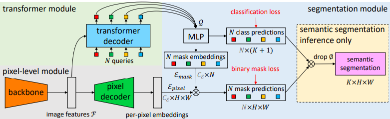
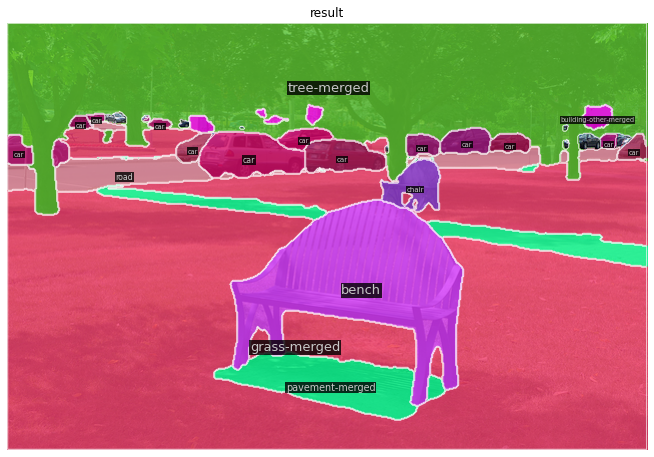
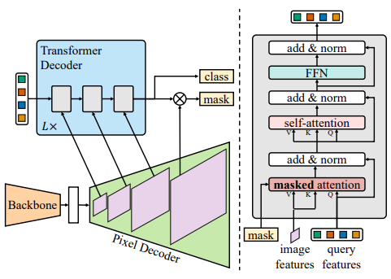
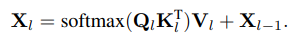
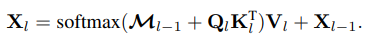
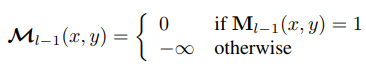
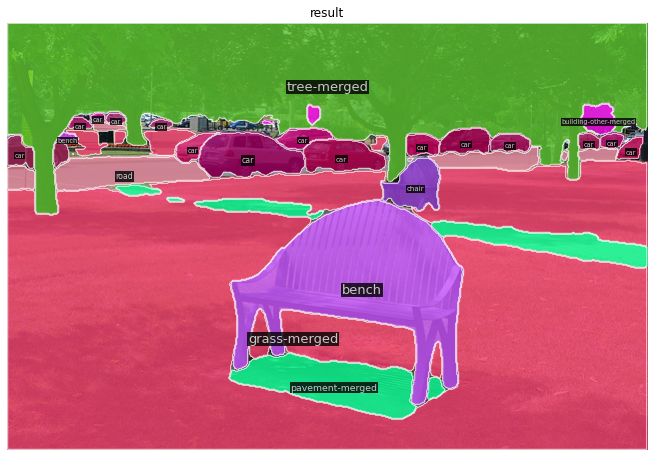

> This block is a brief introduction of your project. You can put your abstract here or any headers you want the readers to know.

<!--more-->
{: class="table-of-content"}

* TOC
{:toc}

## Introduction

In 2019, a team from Facebook AI Research ([FAIR](https://ai.facebook.com/)) published a paper that defined a new field of computer vision called **Panoptic Image Segmentation** that combines detections of *stuff* and *things* [[1](#ref1)]. However, before we can understand what panoptic segmentation is, we must understand some background.

{: style="width: 400px; max-width: 100%;"}
*Fig \#. Example cat image* [[2](#ref2)].

### Stuff & Things

Stuff
:   amorphous and uncountable regions of similar texture or material such as grass, sky, road defined by simply assigning a class label to each pixel in an image  [[1](#ref1)]

Things
:   Items in an image that could possess more than 1 countable instance defined by detecting each object and delineating it with a bounding box or segmentation mask [[1](#ref1)]

Although identifying stuff and things sound like similar problems, the deep learning models that perform the task vary substansially in datasets, details, and metrics[[1](#ref1)]

### Semantic Segmentation

Semantic segmentation is a task that indentifies stuff. **Description of how it works**

{: style="width: 400px; max-width: 100%;"}
*Fig \#. Semantic Segmentation on the cat image* [[3](#ref3)].

### Instance Segmentation

Description of how it works

{: style="width: 400px; max-width: 100%;"}
*Fig \#. Instance Segmentation on the cat image* [[3](#ref3)].

### Panoptic Segmentation

The paper sets the groundwork for the panoptic image segmenation problem to reconcile the dichotomy between *stuff* and *things* by combining semantic and instance segmentation

{: style="width: 400px; max-width: 100%;"}
*Fig \#. Panoptic Segmentation on the cat image* [[3](#ref3)].

Kirillov et al. defines a $$PS$$ *(Panoptic Score)* and the requirements for a model to be considered a "panoptic segmentation model." This task metric was designed because the standard metrics used for instance segmentation and semantic segmentation are best suited for stuff *or* things,
respectively, but not both [[1](#ref1)].

$$
PS= \frac{ \sum_{ (p,g) \in TP} IoU(p,g) }{ |TP| + \frac{1}{2}|FP| + \frac{1}{2}|FN| }
$$

$$PS$$ is composed of the count of three sets: true positives ($$TP$$), false positives ($$FP$$), and false negatives ($$FP$$), representing matched pairs of segments, unmatched predicted segments, and unmatched ground truth segments, respectively [[1](#ref1)].

Intuitively, $$PS$$ is the average intersection over union ($$IoU$$) of matched segments divided by a penalty for segments without matches:

$$\frac{1}{2}|FP| + \frac{1}{2}|FN|$$

[[1](#ref1)].

Kirillov et al. defines the panoptic segmentation format algorithm to map each pixel to an semantic class and an optional instance class. **Continue explanation**

$$
IoU(p_i,g)=\frac{|p_i\cap g|}{|p_i\cup g|}
$$


We will be evaluating and comparing multiple panoptic segmentation models on the COCO2017 dataset using MMDetection and attempt to use the results to build a new model with equal or greater Panoptic Quality.  **continue with what we are going to do** (COCO-2017 dataset)

## MMDetection Setup

We will be evaluating and modifying the panoptic segmentation models from the [MMDetection ModelZoo](https://github.com/open-mmlab/mmdetection#overview-of-benchmark-and-model-zoo) using Google Colab for development and a GCP for longer training. Therefore, we will need to install MMdetection and download the COCO-2017 dataset.

### Install MMDetection in Google Colab

Luckily, a student group from the Winter2022 quarter of CS188 did most of the hard work with setting up MMDetection for Google Colab. They downloaded MMdetection and the COCO-2017 dataset to their Google Drive. [MMDetecton Project](https://ucladeepvision.github.io/CS188-Projects-2022Winter/2022/02/20/team09-MMDetection.html#2-mmdetection-setup-and-data-preparation)

Unfortunately, we can't just copy-and-paste the entire setup since there have been changes to the installation steps and versions in Pytorch, mmcv, and Pillow. In addition, we need to download the additional panoptic segmentation labels.

To begin, we create a new Colab notebook that we will (hopfully) run only once to install MMDetection and download the COCO-2017 dataset. In our case, we named it `setup_mmdet_and_download_COCO.ipynb`.

First, mount your drive, and install mmcv in our colab environment. There is no need to install a special version of Pytorch or Pillow in this version of Colab.

```python
import os
from google.colab import drive
drive.mount('/content/drive', force_remount=True)

# install mmcv-full
!pip install mmcv-full==1.7.0 -f https://download.openmmlab.com/mmcv/dist/cu117/torch1.13/index.html
```

Make a directory in the drive called `MMDet1` and clone the MMDetection github repository into it and install with pip.

```python
!mkdir -pv /content/drive/MyDrive/MMDet1
%cd /content/drive/MyDrive/MMaDet1

# Install mmdetection
!rm -rf mmdetection
!git clone https://github.com/open-mmlab/mmdetection.git
%cd mmdetection

!pip install -e .    
```

MMdetection is now downloaded on your Google Drive and installed in your Colab session. You should **never** have to reclone the github repo!

### COCO-2017 Download

Now we will download the COCO-2017 dataset with the annotations for panoptic segmentation. First, make sure you are in the mmdetection folder in your drive, then use the `download_dataset.py` script to download the base COCO-2017 dataset. Then you will need to download the panoptic annotations. Next, unzip all the newly downloaded files into the `data/coco` directory.

The following code block will take about 5 hours to run fully. If you do not wish to wait all that time and would rather unzip in bursts, you can comment out all but the unzip command that your want to execute and run the cell for each unzip command. This allows you to unzip the files in chunks of time instead of all at once.

> **Note:** <br>
    1. You will need a GPU runtime to run the `download_dataset.py` python script. <br>
    2. Sometimes the dataset will not fully unzip and not let you know. Make sure to rerun this block until there are not outputs of newly extracted filenames.

```python
# suppose data/coco/ does not exist
!mkdir -pv data/coco/

# download the coco2017 dataset
!python3 tools/misc/download_dataset.py --dataset-name coco2017 

# Adjust the dataset to include panoptic annotations
!wget -P data/coco/ http://images.cocodataset.org/annotations/image_info_test2017.zip
!wget -P data/coco/ http://images.cocodataset.org/annotations/panoptic_annotations_trainval2017.zip

# unzip them
!unzip -u "data/coco/annotations_trainval2017.zip" -d "data/coco/"
!unzip -u "data/coco/test2017.zip" -d "data/coco/"
!unzip -u "data/coco/train2017.zip" -d "data/coco/"
!unzip -u "data/coco/val2017.zip" -d "data/coco/"

!unzip -u data/coco/image_info_test2017.zip -d data/coco/
!unzip -u data/coco/panoptic_annotations_trainval2017.zip -d data/coco/
!unzip -u data/coco/annotations/panoptic_train2017.zip -d data/coco/annotations
!unzip -u data/coco/annotations/panoptic_val2017.zip -d data/coco/annotations
```

Finally, convert the standard COCO annotations to the panoptic annotations with the `gen_coco_panoptic_test_info.py` script.

```python
!python tools/misc/gen_coco_panoptic_test_info.py data/coco/annotations
```

You are now ready to get started with working with MMDetection in Colab. Please make sure that you install `mmcv`, `cocodataset/panopticapi`, enter the mmdetection directory and run `pip install -e .` with each new document.

## PanopticFPN with MMDetection

### Background

The Panoptic FPN was designed as a single-network baseline for the panoptic segmentation task. They do this by starting from Mask R-CNN, a popular isntance segmentation model, with a Feature Pyramid Network (FPN) backbone based on ResNet. In parallel, they create a minimal semantic segmentation branch using the same features of the FPN to generate a dense-pixel output [[3](#ref3)]. The author's goal is to maintain top of the line performance for segementation quality ($$SQ$$) and recognition quality ($$RQ$$) [[3](#ref3)].

{: style="width: 400px; max-width: 100%;"}
*Fig \#. Instance Segmentation on the cat image* [[1](#ref1)].

#### Feature Pyramid Network

The FPN consists of a botton up pathway and a top-down pathway. The bottom-up pathway consists of feature maps of several scales with a scaling step of 2. Each step corresponds to a residual block stage from Resnet $$\{C2, C3, C4, C5\}$$. The output of each step is the output of the activation function of the residual block (except for $$C1$$ since it is so large). The stages have strides $$\{4, 8, 16, 32\}$$ in order to downsample the feature map.

{: style="width: 400px; max-width: 100%;"}
*Fig \#. Instance Segmentation on the cat image* [[4](#ref4)].

The top-down pathway starts from the deepest layer of the network and progressively upsamples it while adding in transformed versions of higher-resolution features from the bottom-up pathway. The higher stages of the top-down pathway are at a smaller resolution, but semantically stronger. The purpose of the top-down pathway is to use this information to make a spatially fine and semantically stronger feature map of the input. Finally, the output of each stage of the top-down pathway is the final output of the FPN (labeled predict in Fig. #).

#### Instance Segmentation Branch

Mask R-CNN is an extension on Faster R-CNN that adds an masking head branch to predict an binary mask for each bounding box prediction. Panoptic FPN uses the Mask R-CNN with the ResNet FPN as a backbone from [#] since it has been used as a foundation for all top entries in recent recognition challenges [[3](#ref3)].

#### Semantic Segmentation Branch

The semantic segmentation branch also builds on the FPN in parallel with the instance segmentation branch. This semantic segmentation branch was designed to be as simple as possible and so it only upsamples each output of the FPN layers to 1/4th total size, add each together, and perform a 1x1 conv with a 4x bilinear upsampling. Each upsampling layer consists of a 3x3 convolution, group norm, ReLU, and 2x bilinear upsampling. It is important to note that in addition to each of the stuff class of the dataset, the branch can also output a 'other' class for pixels that do not belong to any classes. This avoids the branch predicting the pixels belong to no class as a incorrect class [[1](#ref1)].

{: style="width: 400px; max-width: 100%;"}
*Fig \#. Instance Segmentation on the cat image* [[1](#ref1)].

### Setup

Before we do anything, let's make sure we have our Colab environment set up correctly. Mount you Google Drive, install `mmcv`, `cocodataset/panopticapi`, and install the mmdetection library in your Colab session.

```python
import os
from google.colab import drive
drive.mount('/content/drive', force_remount=True)

# Install mmcv-full
!pip install mmcv-full==1.7.0 -f https://download.openmmlab.com/mmcv/dist/cu117/torch1.13/index.html

# Install cocodataset/panopticapi
!pip install git+https://github.com/cocodataset/panopticapi.git

# Install mmdetection in colab environment
%cd /content/drive/MyDrive/MMDet1/mmdetection
!pip install -e .
```

### Run Test Script

MMDetection pretrained PanopticFPN Evaluation Results:
[Implementation Link](https://colab.research.google.com/drive/11MitSydv7qZ_xQkcLO4X2azTuGORjrQf#scrollTo=L-9pCPGHIkdo&uniqifier=2)

| Panoptic 1x ResNet50 Coco | PQ     | SQ     | RQ     | categories |
| :--------------- | :---: | :---: | :---: | :---: |
| All    | 40.248 | 77.785 | 49.312 | 133        |
| Things | 47.752 | 80.925 | 57.475 | 80         |
| Stuff  | 28.922 | 73.046 | 36.991 | 53         |

| Panoptic 3x ResNet50 Coco | PQ     | SQ     | RQ     | categories |
| :--------------- | :---: | :---: | :---: | :---: |
| All    | 42.457 | 78.118 | 51.705 | 133        |
| Things | 50.283 | 81.478 | 60.285 | 80         |
| Stuff  | 30.645 | 73.046 | 38.755 | 53         |

| {: style="width: 400px; max-width: 100%;"} | {: style="width: 400px; max-width: 100%;"} |  {: style="width: 400px; max-width: 100%;"} |

*Fig \#. Instance Segmentation on the cat image* [[1](#ref1)].

## Maskformer with MMDetection

### Background

Semantic segmentation is often approached as per pixel classification, while instance segmentation is approached as mask classification. The key insight of Cheng, Schwing, and Kirillov to create the MaskFormer model is that "mask classification is sufficiently general to solve both semantic- and instance-level segmentation tasks in a unified manner using the exact same model, loss, and training procedure." [5] Mask classification can be used to solve semantic, instance, and panoptic segmentation together.

MaskFormer is a mask classification model which predicts a set of binary masks, each associated with one global class prediction [5]. MaskFormer converts a per-pixel classification model into a mask classification model [5]. 


#### Maskformer Architecture


*Maskformer Architecture* [5]

Maskformer breaks down into three modules: a pixel level module, a transformer module, and a segementation module. The pixel level module extracts per-pixel embeddings to generate the binary mask predictions, the transformer module computes per-segment embeddings, and the segmentation module generate the prediction pairs [5]. 

The pixel-level module begins with a backbone to extract features from the input image. The features are then upsampled by a pixel decoder into per-pixel embeddings. This module can be changed for any per-pixel classification-based segmentation model [5].

The transfomer module uses a a Transformer decoder to compute the per-segment embeddings from the extracted image features and learnable positional embeddings [5].

The segmentation module uses a linear classifier followed by softmax on the per-segment embeddings to get the class probabilities of each segment. A 2 hidden layer Multi-Layer Perceptron gets the mask embeddings from the per-segment embeddings. To get the final binary mask predictions, the model takes a dot product between the ith mask embeddings and the per-pixel embeddings from the pixel-level module. This dot product is followed by a sigmoid activation to produce the output [5]. 

### Setup

MaskFormer follows the same setup steps as Panoptic FPN to set up MMDetection.

### Run Test Script

MMDetection pretrained MaskFormer Evaluation Results:
[Implementation Link](https://colab.research.google.com/drive/1UEj1DHPcbcxhIFO2ukt9QWSG-S1zVm5z?usp=sharing)


| MaskFormer Resnet | PQ     | SQ     | RQ     | categories |
| :--------------- | :---: | :---: | :---: | :---: |
| All    | 46.854 | 80.617 | 57.085 | 133        |
| Things | 51.089 | 81.511 | 61.853 | 80         |
| Stuff  | 40.463 | 79.269 | 49.888 | 53         |


*MaskFormer Sample Output*

## Mask2Former with MMDetection

### Mask2Former Background

While MaskFormer is a universal architecture for semantic, instance, and panoptic segmentation, it is expensive to train and does not outperform specialized segmentation models [6]. Masked-attention Mask Transformer, or Mask2Former, is a universal segmentation method that outperforms specialized architectures, and is simpler to train on each task. Mask2Former is similar to MaskFormer, but with several improvements. The first is using masked attention in the Transformer decoder rather than cross-attention [6]. This restricts the attention on localized features centered around the predicted segments [6]. Second is using "multi-scale high-resolution features", as well as optimization improvements and calculating mask loss on randomly sampled points to save training memory [6].

#### Mask2Former Architecture


*Mask2Former Architecture* [6]

Mask2Former follows the overall meta architecture from MaskFormer: a backbone to extract image features, a pixel decoder to upsample features into per-pixel embeddings, and a Transformer decoder to compute segments from the image features, but with the changes mentioned above [6]. 

##### Masked Attention

The first of these changes is using masked attention rather than cross attention in the Transformer decoder [6]. Masked attention is "a variant of cross-attention that only attends within the foreground region of the predicted mask for each query." [6] This is achieved by adding an "attention mask" to standard cross attention. [6] Cross attention computes: 


*Cross Attention Formula* [6]

l is the layer index, **X**~l~ denotes N C dimensional query features in the lth layer [6]. **X**~0~ are the input query features to the Transformer decoder [6]. **Q**~l~ is *f~Q~*(**X**~l~), where *f~Q~* is a linear transformation and **K**~l~ and **V**~l~ are the image features under transformations *f~K~* and *f~V~*. [6]

Masked attention alters this slightly by adding a modulation factor to the softmax. 


*Mask Attention Formula* [6]


*Attention Mask at Feature (x,y)* [6]

**M**~l-1~ is the mask prediction of the previous layer, converted to binary data with threshold 0.5. This is also resized to the same dimension as **K**~l~. 

##### High-resolution Features

Higher-resolution features boost model performance, especially for small objects, but also increase computation cost [6]. To gain the benefit of higher resolution images while also limiting computation cost increases, Mask2Former uses a feature pyramid of both high and low resolution features produced by the pixel decoder with resolutions 1/32, 1/16, and 1/8 of the original image [6]. Each of these different feature resolutions are fed to one layer of the Transformer decoder, as can be seen in the Mask2Former architecture image. This is repeated L times in the decoder, for a total of 3L layers in the Transformer decoder [6].

##### Optimization Improvements

Mask2Former makes three changes to the standard Transformer decoder design [6]. The first is that Mask2Former changes the order of the self-attention and cross-attention layers (mask-attention layer), starting with the mask-attention layer rather than the self-attention layer [6]. Next the query features (**X**~0~) are made learnable, which are supervised before being used to compute masks (**M**~0~) [6]. Lastly dropout is removed, as it was not found to help performance [6].

Finally to improve training efficienty, Mask2Former calculates the mask loss with samples of points rather than the whole image [6]. In matching loss, a set of K points is uniformly sampled for all the ground truth and prediction masks [6]. In the final loss, different sets of K points are sampled with importance sampling for each pair of predictions and ground truth [6]. This sampled loss calculation reduces required memory during training by 3x [6].

### Setup

Mask2Former follows the same setup steps as Panoptic FPN to set up MMDetection.

### Run Test Script

MMDetection pretrained Mask2Former Evaluation Results:
[Implementation Link](https://colab.research.google.com/drive/1P5NI9k6qnYz0G9tsCxZ446dKjvnkWVX4?usp=sharing)


*Mask2Former Sample Output*

## Evaluation

## Summary

## Conclusion

## Jan. 29 Submission

### Topic: Panoptic Segmentation

Andrew Fantino and Nicholas Oosthuizen will explore the topic of panoptic segmentation. They will describe the concepts behind it and assess several different models, describing their architectures and comparing their performance.

### Relevant Papers

1. [Panoptic Segmentation, Kirillov et al.(2019)](https://openaccess.thecvf.com/content_CVPR_2019/html/Kirillov_Panoptic_Segmentation_CVPR_2019_paper.html)
    * This paper sets the groundwork for the panoptic image segmenation problem by strictly defining the problem. It defines a $PS$ *(Panoptic Score)* and the requirements for a model to be considered a "panoptic segmentation model."

    $$
    PS= \frac{ \sum_{ (p,g) \in TP} IoU(p,g) }{ |TP| + \frac{1}{2}|FP| + \frac{1}{2}|FN| }
    $$

2. [Panoptic Feature Pyramid Networks, Kirillov et al. (2019)](https://openaccess.thecvf.com/content_CVPR_2019/papers/Kirillov_Panoptic_Feature_Pyramid_Networks_CVPR_2019_paper.pdf)
    * **Github:** [panoptic_fpn](https://github.com/open-mmlab/mmdetection/tree/master/configs/panoptic_fpn)
    * This paper is one of the first implementations of panoptic image segmentation from facebook research's paper above. This paper attempts to merge an semantic segmentation model and an instanse segmentation model using as little of a transformer network as possible. It is meant as a baseline evaluation of a panoptic segmentation model.
3. [Per-Pixel Classification is Not All You Need for Semantic Segmentation, Cheng et al. (2021)](https://arxiv.org/pdf/2107.06278.pdf)
    * **Github:** [maskformer](https://github.com/open-mmlab/mmdetection/tree/master/configs/maskformer)
    * This is an example of a panoptic segmentation model that is designed from the ground up for maximizing $PS$ that was included in MMDection.
4. [Masked-attention Mask Transformer for Universal Image Segmentation, Cheng et al. (2022)](https://arxiv.org/pdf/2112.01527.pdf)
    * **Github:** [mask2former](https://github.com/open-mmlab/mmdetection/tree/master/configs/mask2former)
    * This is a second version of the paper 3. It was also included in MMDetectoin

## References

<a name="ref1"></a>
[1] [Panoptic Segmentation, Kirillov et al.(2019)](https://openaccess.thecvf.com/content_CVPR_2019/html/Kirillov_Panoptic_Segmentation_CVPR_2019_paper.html)

<a name="ref2"></a>
[2] [What is Panoptic Segmentation and why you should care.](https://medium.com/@danielmechea/what-is-panoptic-segmentation-and-why-you-should-care-7f6c953d2a6a)

<a name="ref3"></a>
[3] [Panoptic Feature Pyramid Networks, Kirillov et al. 2019](https://arxiv.org/pdf/1901.02446.pdf)

<a name="ref4"></a>
[4] [FPN Paper](https://arxiv.org/pdf/1612.03144.pdf)

<a name="ref5"></a>
[5] [MaskFormer Paper](https://arxiv.org/pdf/2107.06278.pdf)

<a name="ref6"></a>
[6] [Mask2Former Paper](https://arxiv.org/pdf/2112.01527.pdf)


<!-- ## Main Content

Your survey starts here. You can refer to the [source code](https://github.com/lilianweng/lil-log/tree/master/_posts) of [lil's blogs](https://lilianweng.github.io/lil-log/) for article structure ideas or Markdown syntax. We've provided a [sample post](https://ucladeepvision.github.io/CS188-Projects-2022Winter/2017/06/21/an-overview-of-deep-learning.html) from Lilian Weng and you can find the source code [here](https://raw.githubusercontent.com/UCLAdeepvision/CS188-Projects-2022Winter/main/_posts/2017-06-21-an-overview-of-deep-learning.md)

## Basic Syntax

### Image

Please create a folder with the name of your team id under /assets/images/, put all your images into the folder and reference the images in your main content.

You can add an image to your survey like this:

{: style="width: 400px; max-width: 100%;"}
*Fig 1. YOLO: An object detection method in computer vision* [1].

Please cite the image if it is taken from other people's work.

### Table

Here is an example for creating tables, including alignment syntax.

|             | column 1    |  column 2     |
| :---        |    :----:   |          ---: |
| row1        | Text        | Text          |
| row2        | Text        | Text          |

### Code Block

```python
# This is a sample code block
import torch
print (torch.__version__)
```

### Formula

Please use latex to generate formulas, such as:

$$
\tilde{\mathbf{z}}^{(t)}_i = \frac{\alpha \tilde{\mathbf{z}}^{(t-1)}_i + (1-\alpha) \mathbf{z}_i}{1-\alpha^t}
$$

or you can write in-text formula $$y = wx + b$$.

### More Markdown Syntax

You can find more Markdown syntax at [this page](https://www.markdownguide.org/basic-syntax/).

## Reference

Please make sure to cite properly in your work, for example:

[1] Redmon, Joseph, et al. "You only look once: Unified, real-time object detection." *Proceedings of the IEEE conference on computer vision and pattern recognition*. 2016.

--- -->
