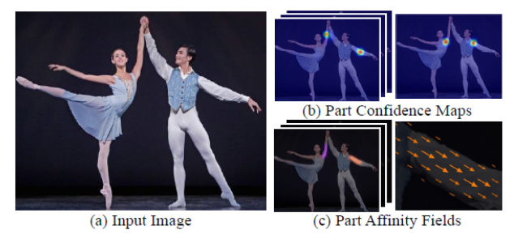
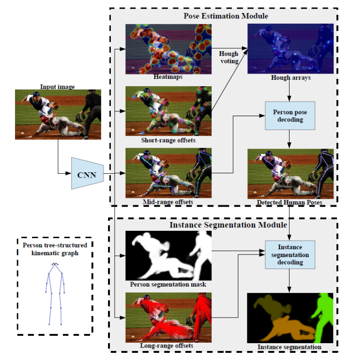
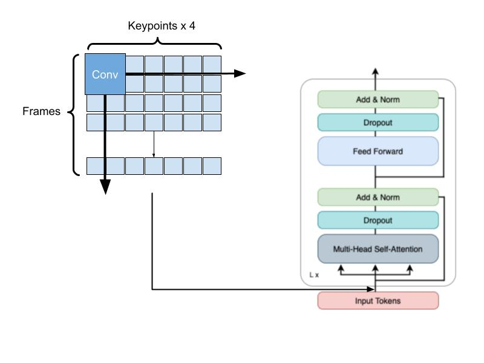
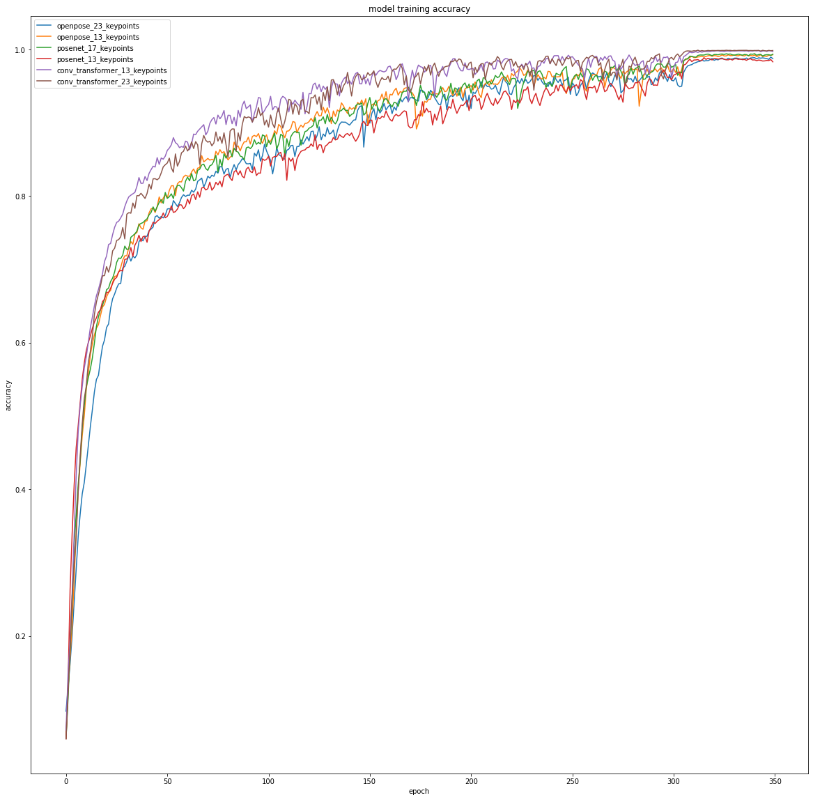
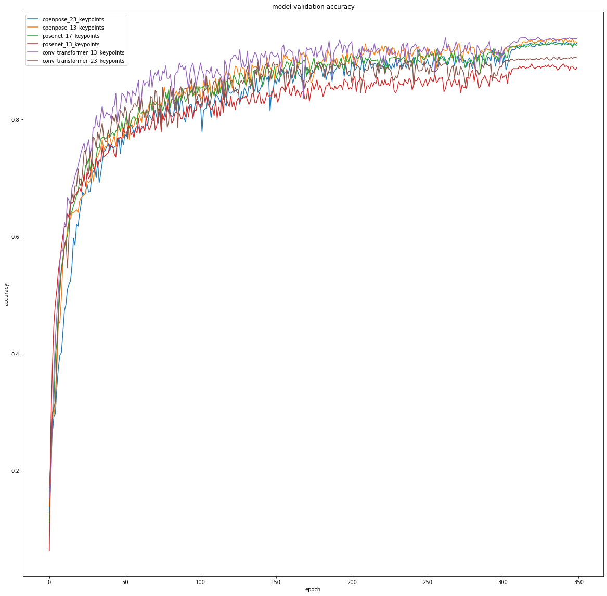

> This post is a review of different models for pose estimation and their applications to human action recognition (HAR) when combined with Transformers.


<!--more-->
{: class="table-of-content"}
* TOC
{:toc}

## Introduction

Human Action Recognition(HAR) is a computer vision problem that involves classifying human actions based on some visual inputs like RBG images or human poses in terms of joint key points/frames. This problem exists in real world scenarios such as autonomous driving where vehicles not only need to detect static objects on the street, but also need to detect dynamic objects like humans and recognize their current action, whether they are moving across the street or remaining still. A human action sample is usually expressed as a sequence of images or poses across time domain. HAR models can use data samples in terms of sequence of images directly, or they can take a two-stage approach by first converting the sequence of images into sequence of poses in the time domain and classify its corresponding action from there.

In our project, we attempt to explore some of the recent works that take the second approach by utilizing existing pose estimation classifiers like OpenPose and PoseNet, and combine them with a human action recognizer like Action Transformer.

## Details on the Techniques involved

### Pose Estimation

The first stage involves detecting human poses from RGB images, and generating corresponding key points. In real life cases, a scene may often involve multiple people. There are two main approaches to this problem: one is a top down approach, and the other is a bottom up approach. In the top down approach, a human detector is used to identify the bounding boxes of human characters on the image, and then the pose estimation is performed on each of the cropped bounding areas. This kind of architecture can utilize known object detectors to identify the bounding boxes of humans, and then scale up single human pose estimators for multiple people in a scene. However, a known issue with this approach is that it does not generalize well in a scene where human figures are occluded either by each other or by environmental objects because if the human detectors fail to find bounding boxes, the pose estimator would stop short.


### Open Pose

In contrast to the top-down approach, OpenPose by Cao et al, is a real-time human pose estimator that implements a bottom-up approach. OpenPose does not attempt to first use some human detectors to identify each human characters’ bounding box. Instead, it first directly passes the input image through a feedforward convolutional neural network to search for body parts such as heads, feet and limbs across the image and encode them in part-confidence heat maps. Then, input image features are concatenated with the output. In the next stage, through another feedforward convolutional neural network, unstructured pairwise relationships between body parts are identified in a 2d vector field which the authors call Part Affinity Fields. Then Finally, with these two sets of information, body parts are pieced together in a greedy inference approach to generate human poses. There are several advantages to OpenPose’s bottom up approach. One is that it does not require fully visible human figures to estimate their poses, and therefore unlike top down approach, pose estimation does not stop short if the human figure is not fully present. Also, by its nature of being bottom-up, it can work on images with multiple human figures at the same time without having to first identify and crop in on them using an object detector.




### PoseNet

Posenet by Papandreou et al is a model that attempts to solve human pose estimation and human instance segmentation at the same time. Similar to OpenPose, it tackles pose estimation in a bottom up approach. It involves a part-based pose estimation method that first tries to identify the locations of each keypoint in a set of heatmaps which are essentially disks around each found keypoint. Then instead of using the association between body parts like OpenPose, it first finds a set of short offset vectors for each keypoint type that shoot from pixels in a keypoint disk to the nearest person’s keypoint of that type. These short offset vectors are panelized in the loss to help better locate the keypoints. The heatmaps and the short offset vectors are used in a Hough voting to localize the keypoints. To help piece the found keypoints together, posenet then creates another vector field output called Mid-range pairwise offsets, which encode edges between every pair of keypoints. Finally, the keypoint heatmaps and the offset vectors are passed to a person pose decoder to greedily parse together the keypoints and keypoint edges into full human poses.



## Action Transformer (AcT)

### Input

AcT takes input with dimensions B x T x K x C with the following definitions:

- B = Batch Size 
- T = # of frames per video clip
- K = # of pose keypoints per frame
- C = # of channels per keypoint

The input is generated by taking RGB video clips, extracting frames, and running pose estimation inference to get the keypoints for each frame.


### Tokenization Layer

Once the input keypoints have been generated, they are tokenized.

For a single video sequence, the data has the dimension T x K x C. Either as part of the model, or while preparing the input, the features need to be flattened. This gives a new dimension T x P where P = K * C.

In AcT, tokens are generated temporaly, mapping each frame to a single token. The first step of converting the frames into the input tokens for the Transformer Encoder is to increase the dimension from P to a higher dimension D<sub>model</sub>. Then two embeddings are added to the input.

1. CLS Token

    Like ViT and other Transformer models, a CLS token is prepended to the input sequence. This CLS token is a learnable parameter that will represent the classification of the entire sequence of tokens. In this case, the CLS token will represent the classification of the sequence of frames (video).

2. Positional Embeddings

    To capture positional/temporal information for each token, we add positional information to the input tokens. This is done by creating a learnable parameter matrix with dimensions (T+1) x D<sub>model</sub>. The matrix is then added to the input tokens.

Following these steps, we get the tokens:

$X = \text{pose input mapped to dimension } D_{model}$

$CLS = \text{Class Token}$ 

$PE = \text{Positional Embedding}$

$\text{Input Tokens} = [CLS, X] + PE$


### Transformer Encoder


Once the input tokens have been created, they are fed into the Transformer Encoder. The Transformer consists of L repeated layers, each with 2 blocks: 

- A Muti-Head Self-Attention Block
- A Feed Forward Block

First, the input tokens are passed to the Multi-Head Self-Attention block. This block is responsible for incorporating the layer's self-attention scores into the input tokens. After this, dropout is applied. Finally, we have a residual connection that adds back the original input to the block and does a normalization.

After this block, the output is fed into a Feed Forward Block. The first step passes the received output through a Feed Forward Network that processes the attention output from the previous block. After this, dropout is applied and the input into the block is added back and normalized.

### Generating a Classification

Once the input tokens have successfully passed through the L layers of the Transformer Encoder, we apply a final MLP layer to produce the output logits. Before passing the output of the Transformer to the final MLP layer, we extract the CLS token from the Transformer output. As this CLS token represents the entire frame sequence, we want to perform the linear classification only on it and not the other tokens corresponding to individual frames.

The final MLP layer is a simple linear classifier that outputs predictions values for each of the possible classes.

## Improvement: Blending token sequences with a Convolutional AcT 

Like most Transformer models, AcT splits the frames into tokens where one token maps to the keypoints in one frame in the video. Transformers learn global features well, but CNNs can help extract local features better. Here, by extracting the pose keypoints, we essentially have a preprocessing step in AcT that extracts the skeletal features of each frame. Our hypothesis is that we may be able to further extract local features before passing it through the Transformer architecture to improve accuracy, especially with a short training period.

One problem is that the keypoints that are extracted are not nearly as dense as the original images. Each frame consists of just (# keypoints x 4 channels). For the largest dataset in terms of keypoints (OpenPose 23 Keypoints), that means each frame is only of size (4 x 23) = 92. As a result, performing convolutions may not be able to extract much benefit. CNNs operate on the concept of extracting local features, primarily in the spatial domain. However, by applying these convolutions across frames, we may be able to extract both spatial and temporal local features from the image sequences. 

We added a single convolutional layer at the start of the AcT model. This convolutional layer uses ReLU activation and consists of 10 filters with parameters (K = 2, S = 1) with bias. The kernel size of 2 essentially learns features across two consecutive frames in the input sequence.



### Modified AcT construction

```
shape = (self.config[self.config['DATASET']]['FRAMES'] // self.config['SUBSAMPLE'], self.config[self.config['DATASET']]['KEYPOINTS'] * self.config['CHANNELS'])
inputs = tf.keras.layers.Input(shape=shape)

############ Begin Convolution ############
x = tf.keras.layers.Lambda(lambda x: tf.expand_dims(x, axis=-1))(inputs)
x = tf.keras.layers.Conv2D(10, 2, activation='relu', padding='same', input_shape=(*shape, 1))(x)
x = tf.keras.layers.Reshape((x.get_shape()[1], x.get_shape()[2] * x.get_shape()[3]))(x)
############ End Convolution ############

x = tf.keras.layers.Dense(self.d_model)(x)
x = PatchClassEmbedding(self.d_model, self.config[self.config['DATASET']]['FRAMES'] // self.config['SUBSAMPLE'], pos_emb=None)(x)
x = transformer(x)
x = tf.keras.layers.Lambda(lambda x: x[:,0,:])(x)
x = tf.keras.layers.Dense(self.mlp_head_size)(x)
outputs = tf.keras.layers.Dense(self.config[self.config['DATASET']]['CLASSES'])(x)
return tf.keras.models.Model(inputs, outputs)
```

## Experiments

### Training Data Methodology

OpenPose and PoseNet can generate varying amounts of keypoints, merging and reducing keypoints for the head and feet. We explored the effect of these keypoint counts on the accuracy of the AcT classifications. Using the MPOSE2021 dataset, a dataset contained preprocessed pose keypoints for 30 FPS videos, we constructed 4 dataset variations:

- OpenPose pose estimations with  23 keypoints
- OpenPose pose estimations with 13 keypoints
- PoseNet pose estimations with 17 keypoints
- PoseNet pose estimations with 13 keypoints

With the 4 datasets, we train 4 different AcT models. The models are trained with the following parameters:

- Optimizer: AdamW
- Number Epochs: 350
- Batch Size: 512
- Learning Rate
	- Warm Up Steps: number of batches * number of epochs * 0.3
	- Decay Steps: number of batches * number of epochs * 0.8
- Weight Decay: 0.0001

The datasets are split following a train-val-split. The training data is split into 90% training and 10% validation.

### Training and Testing the Convolution AcT

After running the baseline AcT model on each of the 4 datasets, we took the dataset that yielded the best model: OpenPose with 13 keypoints. Using this dataset, we trained the modified Convolution AcT model with the same optimizer and hyperparameter.

### Results

#### Training Accuracy Curves



#### Validation Accuracy Curves



#### Test Accuracy

| Model | Test Accuracy |
| - | - |
| OpenPose 23 Keypoints | 0.8845483064651489 |
| OpenPose 13 Keypoints | 0.8939658403396606 |
| PoseNet 17 Keypoints | 0.867806077003479 |
| PoseNet 13 Keypoints | 0.8235089182853699 | 
| **Convolutional AcT Improvement with OpenPose 23 Keypoints Dataset** | **0.8705964684486389** |
| **Convolutional AcT Improvement with OpenPose 13 Keypoints Dataset** | **0.8814091682434082** |

### Discussion

Our hypothesis was somewhat confirmed. Although the Convolutional AcT achieves a lower test accuracy, it is able to reach a higher accuracy much faster than the other models. Looking at the training accuracy curve, the Convolutional AcT regularly has a training accuracy several percent higher than the rest of the models after the initial 10-20 epochs. This same trend holds when looking at the validation accuracy curve, the only difference is that the gap between the Convolutional AcT model and the base models is not as significant.

The stark difference between the validation accuracies and the test accuracy for the Convolutional AcT likely indicates that the model is overfitted to the training data. This makes sense as the convolutional layer adds additional learnable parameters, increasing the model complexity. However, if it is not possible to train the model for a large amount of epochs (350 epochs in the experiment), the Convolutional AcT is a good choice.

Overall, it appears that the Convolutional AcT allows for better performance with short training periods. This is something that is seen with CNNs, when compared with other Transformer models, as their convolutional layers allow it to learn quickly.

Comparing the baseline models, it is also interesting to observe the performance differences between different datasets. It appears that OpenPose datasets yield the best performing baseline models. Within the OpenPose-based models, it is surprising to see that the 13 keypoint dataset performs better. This indicates that the additional head and feet keypoints may be redundant features. However, this is somewhat contradicted by the performance of the PoseNet-based models as the 17 keypoint dataset performs significantly better than the 13 keypoint model. The difference between the PoseNet and OpenPose dataset models may also indicate that OpenPose provides better/more consistent pose estimations.


## Code

[For now we've added just the colab notebooks, but will add a setup process once it is more streamlined]

Convolutional AcT Implementation: https://github.com/michael1yu/AcT/blob/master/utils/conv_transformer_trainer.py

Experimentation: https://colab.research.google.com/drive/16mOY7WruSWIbGEAlU3i5Dr4f72TuHeEa?usp=sharing


## Three Relevant Research Papers

1. ##### PersonLab: Person Pose Estimation and Instance Segmentation with a Bottom-Up, Part-Based, Geometric Embedding Model
  - [Paper] https://arxiv.org/abs/1803.08225
  - [Code] https://github.com/tensorflow/tfjs-models/tree/master/pose-detection/src/posenet
2. ##### OpenPose: Realtime Multi-Person 2D Pose Estimation using Part Affinity Fields
  - [Paper] https://arxiv.org/abs/1812.08008
  - [Code] https://github.com/CMU-Perceptual-Computing-Lab/openpose
  - [Dataset] http://human-pose.mpi-inf.mpg.de/
3. ##### Action Transformer: A Self-Attention Model for Short-Time Pose-Based Human Action Recognition
  - [Paper] https://arxiv.org/abs/2107.00606
  - [Code] https://github.com/PIC4SeR/AcT
  - [Dataset] https://github.com/PIC4SeR/MPOSE2021_Dataset

## Reference

[1] G. Papandreou, T. Zhu, L.-C. Chen, S. Gidaris, J. Tompson, and K. Murphy, PersonLab: Person Pose Estimation and Instance Segmentation with a Bottom-Up, Part-Based, Geometric Embedding Model. arXiv, 2018.

[2] Z. Cao, G. Hidalgo, T. Simon, S.-E. Wei, and Y. Sheikh, OpenPose: Realtime Multi-Person 2D Pose Estimation using Part Affinity Fields. arXiv, 2018.

[3] V. Mazzia, S. Angarano, F. Salvetti, F. Angelini, and M. Chiaberge, ‘Action Transformer: A self-attention model for short-time pose-based human action recognition’, Pattern Recognition, vol. 124, p. 108487, Apr. 2022.

[4] Wang Z, He X, Li Y, Chuai Q. EmbedFormer: Embedded Depth-Wise Convolution Layer for Token Mixing. Sensors. 2022; 22(24):9854. https://doi.org/10.3390/s22249854

---
