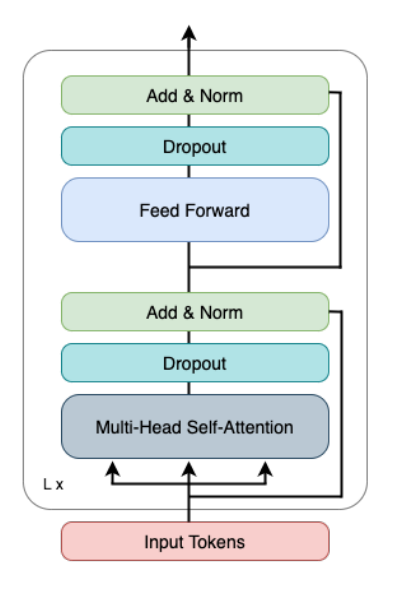

> This post is a review of different ideas and techniques related to post estimation and detection

<!--more-->
{: class="table-of-content"}
* TOC
{:toc}

## Action Transformer (AcT)

### Input

AcT takes input with dimensions B x T x K x C with the following definitions:

- B = Batch Size
- T = # of frames per video clip
- K = # of pose keypoints per frame
- C = # of channels per keypoint

The input is generated by taking RGB video clips, extracting frames, and runnning pose estimation inference to get the keypoints for each frame.

### Tokenization Layer

Once the input keypoints have been generated, they are tokenized.

For a single video sequence, the data has the dimension T x K x C. Either as part of the model, or while preparing the input, the features need to be flattened. This gives a new dimension T x P where P = K * C.

In AcT, tokens are generated temporaly, mapping each frame to a single token. The first step of converting the frames into the input tokens for the Transformer Encoder is to increase the dimension from P to a higher dimension Dmodel. Then two embeddings are added to the input.

1. CLS Token

    Like ViT and other Transformer models, a CLS token is prepended to the input sequence. This CLS token is a learnable parameter that will represent the classification of the entire sequence of tokens. In this case, the CLS token will represent the classification of the sequence of frames (video).

2. Positional Embeddings

    To capture positional/temporal information for each token, we add positional information to the input tokens. This is done by creating a learnable paramater matrix with dimensions (T+1) x Dmodel. The matrix is then added to the input tokens.

Following these steps, we get the tokens:

$X = \text{pose input mapped to dimension } D_{model}$

$CLS = \text{Class Token}$ 

$PE = \text{Positional Embedding}$

$\text{Input Tokens} = [CLS, X] + PE$

### Transformer Encoder

Once the input tokens have been created, they are fed into the Transformer Encoder. The Transformer consists of L repeated layers, each with 2 blocks: 

- A Muti-Head Self-Attention Block
- A Feed Forward Block

First, the input tokens are passed to the Multi-Head Self-Attention block. This block is responsible for incorporating the layer's self-attention scores into the input tokens. After this, dropout is applied. Finally, we have a residual connection that adds back the original input to the block and does a normalization.

After this block, the output is fed into a Feed Forward Block. The first step passes the received output through a Feed Forward Network that processes the attention output from the previous block. After this, dropout is applied and the input into the block is added back and normalized.

### Generating a Classification

Once the input tokens have successfully passed through the L layers of the Transformer Encoder, we apply a final MLP layer to produce the output logits. Before passing the output of the Transformer to the final MLP layer, we extract the CLS token from the Transformer output. As this CLS token represents the entire frame sequence, we want to perform the linear classification only on it and not the other tokens corresponding to individual frames.

The final MLP layer is a simple linear classifier that outputs predictions values for each of the possible classes.

## Three Relevant Research Papers

1. ##### Learning 3D Human Dynamics from Video 
  - [Paper] https://arxiv.org/abs/1812.01601
  - [Code] https://github.com/akanazawa/human_dynamics/tree/master
2. ##### OpenPose: Realtime Multi-Person 2D Pose Estimation using Part Affinity Fields
  - [Paper] https://arxiv.org/abs/1812.08008
  - [Code] https://github.com/CMU-Perceptual-Computing-Lab/openpose
  - [Dataset] http://human-pose.mpi-inf.mpg.de/
3. ##### Deep High-Resolution Representation Learning for Human Pose Estimation
  - [Paper] https://arxiv.org/abs/1902.09212
  - [Code] https://github.com/leoxiaobin/deep-high-resolution-net.pytorch

## Reference

[1] A. Kanazawa, J. Y. Zhang, P. Felsen, and J. Malik, ‘Learning 3D Human Dynamics from Video’. arXiv, 2018.

[2] Z. Cao, G. Hidalgo, T. Simon, S.-E. Wei, and Y. Sheikh, ‘OpenPose: Realtime Multi-Person 2D Pose Estimation using Part Affinity Fields’. arXiv, 2018.

[3] K. Sun, B. Xiao, D. Liu, and J. Wang, ‘Deep High-Resolution Representation Learning for Human Pose Estimation’. arXiv, 2019.

---
