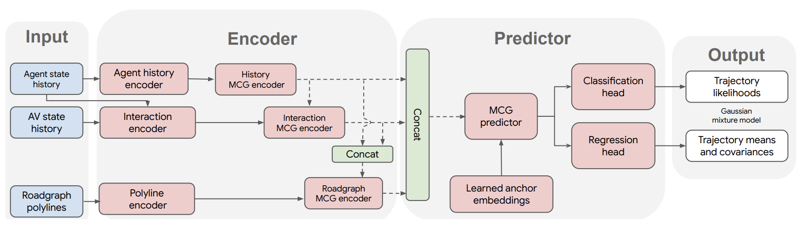
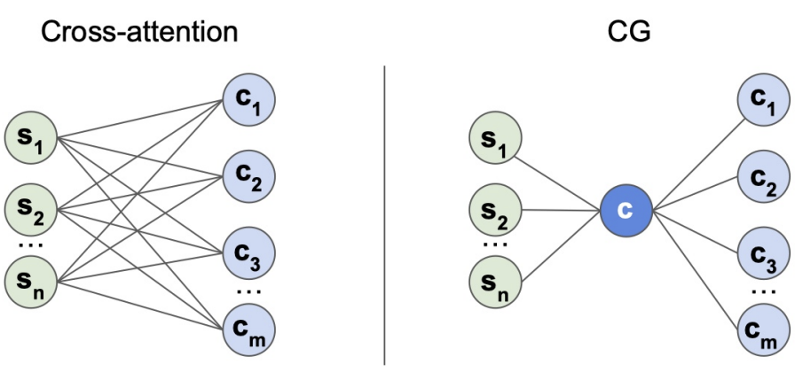
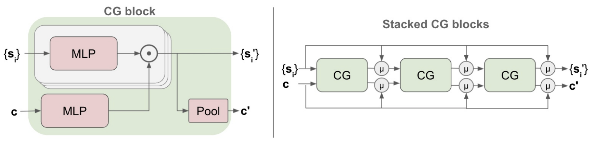
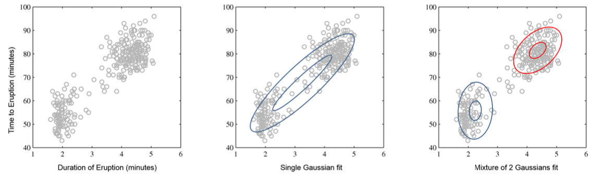

## Introduction
In recent years, the computer vision community has became more involved in automonomous vehicle. With evergrowing hardware support on modeling more complicated interactions between agents and street objects, trajectory prediction of traffic flows is yielding more promising results. The introduction of Transformer technique also galvanized the deep learning community, and our team will explore the application of Transformer in trajectory prediction. Specifically, we will modify an established architecture to replace its original encoders with transformers for latent feature representations. We will benchmark our model against established ones for performance analysis.

## Existing Works

A typical autonomous vehicle pipeline can be divided into three stages: perception, prediction, and planning. In this work, we will focus primarily on the first two stages, and we dived into three neural network architectures that tackle these two challenges. 

**TrafficGen:**
This paper first trains a generator from the Waymo data to generate longer training data. In the trajectory prediction task, TrafficGen uses vectorization and Multi-Context Gating (MCG) as the encoder. To decode the information, TrafficGen first uses MLP layers to decide the region of the vehicle, then uses log-normal distribution to generate the vehicle features (i.e. position in region, speed, etc.). After all vehicle are generated, TrafficGen uses the Multipath++ to predict future trajectory. To scale prediction to a longer horizon, TrafficGen only uses global features as input for trajectory prediction.

**Multipath++**
Multipath++ first transform the road features into polylines and agent history as a sequence of states encoded by LSTM. It uses a Gaussian Mixture Model as the prior to preserve the multi-modality of trajectory prediction task. Multipath++ proposes the MCG architecture, which is similar to cross-attention by allowing vehicle to communicate with road elements and vice versa. Finally, Multipath++ sets anchor in the latent space to guide the vehicles.

**LaneGCN**
LaneGCN is one of the earlier works that proposes using vectorized input instead of pixel input. Different from the VectorNet paper, LaneGCN extends graph convolutions with multiple adjacency matrices and along-lane dilation and only uses sparse connection between elements.

## Model Selection

While works such as TrafficGen and LaneGCN are both also popular in the community, we decide to work with **Multipath++** in this project. The reasons are:

1. Multipath++ shows strong performance in the [Waymo 2021 Open Prediction Challenge](https://waymo.com/open/challenges/2021/motion-prediction/), ranking the 1st among all other models.
2. Multipath++ designs an attention-like and transformer-like architecture, which has the advantage to scale up. Details are described in the section below.
3. The predecessor of Multipath++ is [Multipath](https://arxiv.org/abs/1910.05449), which is also highly cited and servers an important role in the community. Together, they show the impact of this series of work. Compared to Multipath that uses pixel inputs, Multipath++ uses vectorized inputs (i.e. objects and roads are represented as points or lines instead of images). Vectorization naturally serve as a feature engineering step and helps with the model training speed.

## Data Preparation

We leverage the Waymo Open Motion Dataset v1.1 to replicate and improve our model. In this dataset release in 2021, individual driving scenarios in bird-eye view is stored in TFRecord file. Each file contains physicl properties(position, velocity, etc.) of the background(roadmap, etc.) and agents(participants in the background traffic). For one such TFRecord, the original Multipath++ project prerenders it into sets of npz files, each redescribing the same scene from one agent's perspective. These npz files are the raw forms of the input embeddings. 

## Multipath++
### Data Representation
Unlike previous models such as [Multipath](https://arxiv.org/abs/1910.05449) that use pixel inputs, recent models including Multipath++ start to favor **vectorized inputs**(prerendered into numpy arrays). The vectorized inputs are denser. Furthermore, it carries richer information by allowing **heterogenous features** such as object speed and accelration.

Consider moving cars as agents, the multimodal data are as listed with description:
1. Agent State History: represented by a sequence of inputs for a fixed time frame. Each timestep includes position, velocity, 3D bounding box, heading angle, and object type information.
a. Autonomous Vehicles (AV) are represented separately.
2. Roads: represented as a set of piecewise linear segments or polylines.
3. Agent Interactions: are represented as relative orientation, distance, speed, and historical track.

### Architecture Glimpse

Here is the architecture for Multipath++. Here, we want to explain the work flow and terms and the important designs will be introduced later. In the *Encoder* part, we can see that it uses multiple encoders to transformer and allows interactions in-between. For the *Predictor* part, we can see it uses Multi-Context Gating (MCG) predictor and regression and classification heads that work similar to a transformer.

Finally, the learned anchor embeddings represents a target point or check point in the middle-way in the *latent* space. This inherently helps with long-frame prediction.

### Context Gating (CG)
CG is one of the key innovation of Multipath++. It works like an attention block and empirically enables communication between different road objects. First, let's look at a CG block:

The inputs of a CG block include **both** n states and m contexts. A CG block passes input states and context information respectively through MLP. Eventually, it aggregates the element-wise multiplication through mean or max pooling.
In comparison to Cross-Attention on the left, CG is computationally cheaper by summarizing the two kinds of inputs first, then aggregating the summarized value.

### Multi-Context Gating (MCG)

As a single CG Block is comparable to attention, the MCG blocks are comparable to transformer, which simply involves *many* stacked CG Blocks. However, MCG keeps the **running mean** or residual network information.

### Encoders
We introduce the encoders network architectures:
1. Agent History Encoder includes two LSTM networks and one MCG Block.
    * One LSTM encodes position data while the other encodes position difference data.
    * The MCG blocks that encodes the set of history elements.
    * Empirically, two LSTM might help to capture velocity *and* accelration.
2. Agent Interaction Encoder uses the exactly same architecture as the History Encoder with different specifications. More importantly, the input data are the interaction embedding instead of single-agent representation.
3. Roadgraph Encoder consists only of MCG Blocks. The input features are line segments, which has features such as starting point, ending point, and road type (crosswalk, yellowline, etc.)

### Substitution for Encoders
In this work, we will replace the LSTM blocks used in **Agent History Encoder** and **Agent Interaction Encoder** with transformers. Specifically, we want to leverage self-attention mechanism to capture the dependencies among agents from the same thing. We also hypothesize performance gain from the original architecture due to the sequential bottleneck that's inevitable in any RNN block. 

### Predictors
A decoder unit is primarily MCG Blocks. To make final prediction, the embeddings are passed through multiple decoders units sequentially. In the last decoder unit, an additional MLP is applied to output the soft prediction of future trajectories distribution.

Finally, a Expectation Maximization (EM) algorithm with Gaussian Mixure Model (GMM) prior is trained on the distribution parameters including mean, covariance matrix, and probability.

Notice the GMM naturally has multiple local nodes. Therefore, it is similar to how there multiple possible future paths in reality.

The picture below illustrate Multipath++'s predictions for different WOMD scenes(ablation study). Note that hue indicates time horizon while
transparency indicates predicted probability.

### Training Objective
During training, first few seconds contexts are given to Multipath++ to find the GMM. Then, the future path predictions are compared with the groud-truth. Essentially, the training objective is to **maximize the likehood of groud-truth**. Numerical metrics include **Minimum Distance Error**, **Minimum Average Distance Error**, etc.

### Our Evaluation
We will compare the aforementioned training objectives between the original Multipath++ model and our Transformer-Multipath++. Specifically, we will compare the convergence rate and training cost(times, and monetary cost since we are using paid computation platform) between the two versions.

### Anchor Training

### Bootstrap Aggregation

## Reference

[1] Feng, Lan, et al. "TrafficGen: Learning to Generate Diverse and Realistic Traffic Scenarios." ArXiv, 2022,  https://doi.org/10.48550/arXiv.2210.06609. Accessed 29 Jan. 2023.

[2] Varadarajan et al. "MultiPath++: Efficient Information Fusion and Trajectory Aggregation for Behavior Prediction." ArXiv, 2022,  https://arxiv.org/abs/2111.14973. Accessed 29 Jan. 2023.

[3]Liang, Ming, et al. "Learning Lane Graph Representations for Motion Forecasting." ArXiv, 2020,  https://doi.org/10.48550/arXiv.2007.13732. Accessed 29 Jan. 2023.

[4] Shi, Shaoshuai, et al. "Motion Transformer with Global Intention Localization and Local Movement Refinement." ArXiv, 2022,  https://doi.org/10.48550/arXiv.2209.13508. Accessed 29 Jan. 2023.

## Code Bases
[1] TrafficGen: https://github.com/metadriverse/trafficgen
[2] MultiPath++: https://github.com/stepankonev/waymo-motion-prediction-challenge-2022-multipath-plus-plus
[3] LaneGCN: https://github.com/uber-research/LaneGCN

---