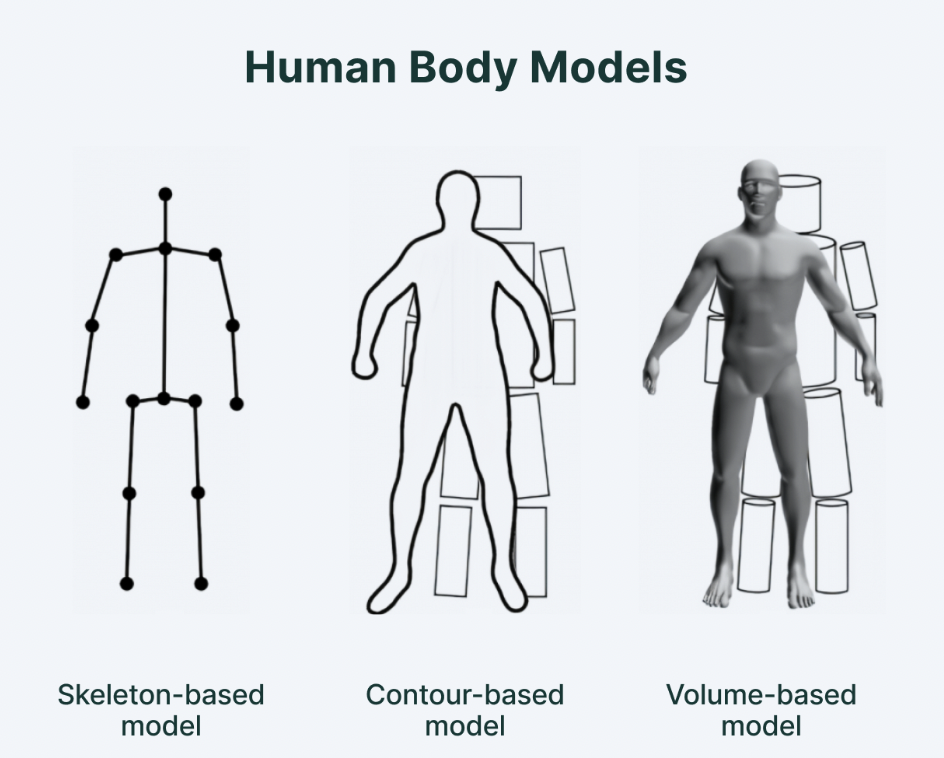

> This project explores the latest technology behind pose estimation. Pose estimation uses machine learning
to estimate the pose of a person or animal by looking at key joint positions in the body.

<!--more-->
{: class="table-of-content"}
* TOC
{:toc}

## Background
Pose estimation works by detecting and tracking the position and orientation of human body parts in images or videos.

This section will go over the background applications of pose estimation, terminology, and modeling techniques.

### Bottom Up vs Top Down
All approaches for pose estimation are either bottom-up or top-down methods

* **Bottom-up** methods of pose estimates each body joint first before grouping them together to form a unique pose. 
* **Top-down** methods of pose esimtation runs a person detector first and then estimates body joints within the detected bounding boxes

### Instance Segmentation
Instance segmentation plays an important role in pose estimation. Instance segmentation is a technique that  uses bounding boxes to seperate different objects in an image or a video. After seperating out objects, instance segementation assigns each box a unique label which can be helpful because different objects may have different poses which needs seperate algorithims.

### Human Body Model

* Skeleton-based model (Kinematic model)
    * Used for 2D and 3D representations
    * Most flexible reprentation
    * Consists of a set of joints (ankles, knees, shoulders, elbows, wrists and limb orientations)
* Contour-based model (Planar model)
    * Used for 2D applications
    * Contour is detected in an image/video using image processing techniques like edge detection or region based segmentatoin
    * Contour can be represented as a set of coordinates. Polygonal approximations can be used applied to these coordinates to create the contour
* Volume-based model (Volumetric model)
    * Pose estimation algorithim estimates 3D position and orientation of the object directly in 3D space instead of a 2D space
    * Photogrammetry or laser scanning can be used to create a 3D model which is used to generate the volumetric representation of the object
    * Can be computationally expensive to compute and manimpulate and may require special hardware/software for processing 3D volumetric data

### Challenges
There are several different factors that can make pose estimation difficult. Some of these include:
* **Occlusion:** Some objects or body parts may be fully or partially occluded making it difficult to estimate their position and orientation
* **Illusion:** Lighting changes can affect what an object/person looks like making it hard for pose estimation to detect the object and estimate their pose
* **Scale and viewpoint variation:** Objects can appear in different scales and points of view. It is difficult to create a robust model that can handle these different inputs
* **Noise:** There may be noise in the image/video which can affect the accuracy of pose estimation

### Datasets
Some commonly used datasets for pose estimation include but are not limited to:
* **COCO (Common Objects in Context) Keypoints:** contains over 200,000 annotated images for objects and people. 17 keypoints for each person: nose, eyes, shoulders, elbows, wrists, hips, knees, and ankles
* **MPII Human Pose:** Contains around 25,000 images of people in everyday situations. Annotated keypoints for 16 body joints such as head, neck, shoulders, elbows, wrists, hips, knees, and ankles
* **Human3.6M:** contains 3.6 million images with 3D pose annotations for 15 body points captured by a motion capture system

## Models
Now that we have some intutition and background on how pose estimation works, we will now look at how some pose estimation models.

### OpenPose
OpenPose was the first ever open-source realtime system for mult-person 2D pose dectection. OpenPose was developed by CVC at the Autonomous University of Barcelona (UAB) in collaboration with the Perception team at Carnegie Melon University.

Although OpenPose is no longer the cutting edge model of pose estimation, it's still important to understand how OpenPose works in order to understand successive models, as well as understand how to approach pose estimation.

#### Method
OpenPose is a bottom up model. The below figure, illustrates the overall pipeline of the OpenPose method. 

* (a) system takes an input which is a color image of size *w x h*.
* (b) feedforward network predicts a set of 2D confidence maps of body part locations
* (c) degress of association between parts is encoded into part affinity fields (PAFs) (c)
* (d) greedy inference parses the confidence maps and PAFS and bipartite matching is used to associate body part candidates
* (e) 2D anatomical keypoints for all people in the image are produced

#### Network Architecture
Now that we have a general idea of the pipeline of OpenPose, we can now delve into the technical details of the architecture.

The architecture is shown above. Affinity fields are iteratively predicted with intermediate supervision at each stage. The affinity fields encode part-to-part association (shown in blue) and detection confidence maps (shown in begie) such that the PAFs are a set of 2D vectors that show the orinetation and location of limbs over the image domain.  

The convolution block in the above image is comprised of 3 consectuvie 3x3 kernels. The output of each of these 3 convolutional kernels is also concatenated.

#### Simultaneous Detection and Association
Before the first stage, feature extraction is performed by the VGG-19 CNN which generates a set of feature maps **F** which is used as input to the first stage.

At the first stage, the network produces a set of PAFs *L1 = Φ 1(F)* where *L1* refers to the PAFs at stage 1 and Φ 1 refers to the CNN at stage 1. In each subsequent stage, the predictions of the previous stage and the original image features F are concatenated in order to refine the predictions.
 
 
Lt = Φ t(F, Lt-1), for all 2 ≤ t ≤ T P

Where Φ t refers to the CNNs for inference at Stage t and Tp refers to the total number of PAF stages. A similar process is repeated to create confidence maps after Tp iterations.

STp = ρt(F,LTp) for all t = Tp 

St = ρt(F,LTp, St-1) for all TP < t ≤ TP + TC 

where ρt refers to the CNNs for inference at Stage t and TC refers to the total number of confidence map stages

The refinement of the affinity fields across stages is shown above. Initially, there is confusion between the left and right body parts and limbs in the early stages However, the estimates become increasingly refined through global inference in later stages.

Now, we can take a look at the loss function. To guide the network to iteratively predict  PAFs of body parts and confidence maps, we apply a loss function at the end of each stage. An L2 loss is used between the estimated predictions and the groundtruth maps and fields. The loss function of the PAF branch at stage ti and loss function of the confidence map branch at stage tk are

Intermediate supervision at each stage replenishes the gradient periodically in order to prevent vanishing gradients.

The eventual goal is

## Application
In traditional object detection, people are only perceived as a square bounding box. However, using pose estimation allows computers to develop an understanding of human body language.

Some applications of pose estimation include:
* Human activity estimation - tracking and mesuring human activity and movement
    * Can analyze dance techniques (ex. hip hop)
    * Asses quality of surgieres in medical applications
    * Fitness applications to detect form of exercises and count repetitions
    * Full body/sign language communication (ex. ASL, traffic policemen signals, etc)
* Augmented Reality and Virtual Reality
    * users can virtually learn how to play games like tenis via virtual tutors
    * augmented reality - US army uses pose estimation with AR to model combat
* Training Robots with Human Pose Tracking
    * Pose estimation can be used to help robots learn to do certain things
* Gaming
    * Human subjects can auto-generate and inject poses into the game environment for an interactive gaming experience (ex: Microsft Kinect uses 3D pose estimation to track players' motion and uses it to render the actions of the characters in game)

## Google Colab Demo
[Pose Estimation Demo](https://colab.research.google.com/drive/1kCRVcCr9IRukDuI0K6OTRjjH1Afkuy4A#scrollTo=oNASdyyiO65I)

## Relevant Research Papers
OpenPose: Realtime Multi-Person 2D Pose Estimation using Part Affinity Fields
- [Paper] https://arxiv.org/abs/1812.08008
- [Code] https://github.com/CMU-Perceptual-Computing-Lab/openpose

Learning Delicate Local Representations for Multi-Person Pose Estimation
- [Paper] https://arxiv.org/abs/2003.04030
- [Code] https://github.com/caiyuanhao1998/RSN

Dynamics-Regulated Kinematic Policy for Egocentric Pose Estimation
- [Paper] https://arxiv.org/abs/2106.05969
- [Code] https://github.com/KlabCMU/kin-poly

CLIFF: Carrying Location Information in Full Frames into Human Pose and Shape Estimation
- [Paper] https://arxiv.org/pdf/2208.00571v2.pdf
- [Code] https://paperswithcode.com/paper/cliff-carrying-location-information-in-full#code

## Reference
[1] Dosovitskiy, A., Ros, G., Codevilla, F., Lopez, A. &amp; Koltun, V.. (2017). CARLA: An Open Urban Driving Simulator. <i>Proceedings of the 1st Annual Conference on Robot Learning</i>, in <i>Proceedings of Machine Learning Research</i> 78:1-16 Available from https://proceedings.mlr.press/v78/dosovitskiy17a.html.

[2]Li, Q., Peng, Z., Feng, L., Zhang, Q., Xue, Z., &amp; Zhou, B. (2022). MetaDrive: Composing diverse driving scenarios for generalizable reinforcement learning. IEEE Transactions on Pattern Analysis and Machine Intelligence, 1–14. https://doi.org/10.1109/tpami.2022.3190471 

[3] https://opendilab.github.io/DI-drive/

[4] Amin-Tgz. (n.d.). Amin-TGZ/awesome-carla: 👉 Carla Resources such as tutorial, blog, code and ETC https://github.com/carla-simulator/carla. GitHub. Retrieved January 29, 2023, from https://github.com/Amin-Tgz/awesome-CARLA 

---
