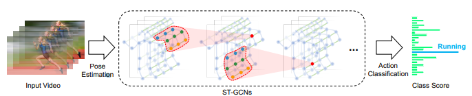

<!--more-->
<!-- {: class="table-of-content"}
* TOC
{:toc} -->

# Project Proposal
## Action Localization for Emergency Detection

What we want to expand on: Observe body language to be able to track what is happening and who is doing the action, such as in emergency situations where someone collapses, or to detect hostile behavior such as a thief committing a crime. This application will quicken the response time to the emergencies, which increases the rate of success in rescuing people.

---

## Relevant Papers
**End-to-end Temporal Action Detection with Transformer**

- [Paper](https://arxiv.org/pdf/2106.10271.pdf)
- [Code](https://github.com/xlliu7/TadTR)
  

**Low-Fidelity Video Encoder Optimization for Temporal Action Localization**

- [Paper](https://arxiv.org/pdf/2103.15233.pdf)
- [Code](NA) (NA)
  

**Spatial Temporal Graph Convolutional Networks for Skeleton-Based Action Recognition**
- [Paper](https://arxiv.org/pdf/1801.07455v2.pdf)
- [Code1](https://github.com/yysijie/st-gcn)
- [Code2](https://paperswithcode.com/paper/spatial-temporal-graph-convolutional-networks-1#code)
  

**BMN: Boundary-Matching Network for Temporal Action Proposal Generation**
- [Paper](https://arxiv.org/abs/1907.09702)
- [Code](https://github.com/JJBOY/BMN-Boundary-Matching-Network)
  
---

# Mid-term Report

## Model
Our model will be based off on the spatial temporal graph convolutional networks (ST-GCN) from **[1]**. ST-GCN, as the name suggests, has features that can record both spatial configuration and the temporal dynamics of the joints to fully understand the human body communication using the convolutional neural netoworks (CNN). The model will be focusing on the 18 key points of the body instead of the entire body to keep data points consistent and reliable as everyone has different body shapes. The 18 keypoints are:

> nose, left eye, right eye, left ear, right ear, left shoulder, right shoulder, left elbow, right elbow, left wrist, right wrist, left hip, right hip, left knee, right knee, left ankle, right ankle, and neck
>
As an overview of the model, ST-GCN will take joint coordinate vectors as inputs, apply spatial-temporal graph convlolution operations throughout the layers, and apply SoftMax at the end to obtain action category value. Inputs are gained from the dataset, which already constructed a spatial temporal graphs from the given videos of human actions using pose estimation. Operations that are applied thorughout the network includes sampling function, weight function, Spatial Graph Convolution equations, and Spatial Temporal Modeling equations. All details as to what exactly the functions and operations are well-described in **[1]** Below is an image that portrays the overview of the pipeline of the model:

> 

---

## Dataset

For our project, we'll make use of the **NTU RGB+D 120** Dataset from the *ROSE* Lab in Singapore. 
  
The dataset contains *114,480* video samples and *120* classes of various actions: 

> punching, wielding a knife, shooting a gun, falling down, staggering, etc.

We'll filter the dataset to extract class examples that fit our needs of identifying medical emergencies and hostile behavior such as those listed above.
  
The dataset contains video samples with multiple filters:

> RGB, depth maps, 3D skeletal data, and infrared (IR) videos 

which we can use use to train a robust model that has some invariance to video quality. Since the original dataset exceeds 2 TB, we requested a subset of the dataset to be under 1 TB at the most.

---

## Evaluation metrics

The provided annotaitons in the NTU RGB+D 130 Dataset include (x,y,z) coordinate values for each of the 18 joints in the skeletal outline and each clip is guaranteed to have at most 2 actors.

The authors of the dataset recommended 2 different evaluation benchmarks:

> (1) **cross-subject** where training clips come from one subset of actors and evaluation is done on the other actors

> (2) **cross-view** where training clips come from camera views 2 and 3 while evaluation is done on camera view 1

---

## Relevant Code

We will be basing off our code from **[1]** and develop further with our application. 
- [Code for **[1]**](https://github.com/yysijie/st-gcn)
---

## References
[1] Yan, Sijie, et al. “Spatial Temporal Graph Convolutional Networks for Skeleton-Based Action Recognition.” Department of Information Engineering, The Chinese University of Hong Kong, 25 Jan. 2018.

> *(Portions of) the research in this paper used the NTU RGB+D (or NTU RGB+D 120) Action Recognition Dataset made available by the ROSE Lab at the Nanyang Technological University, Singapore.*
