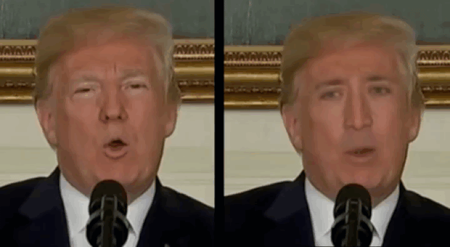
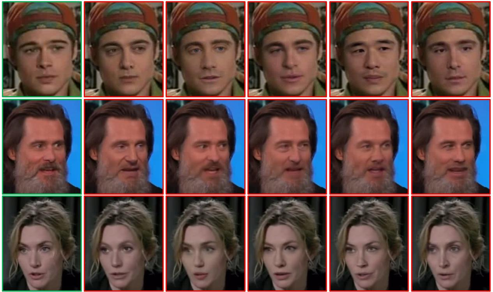
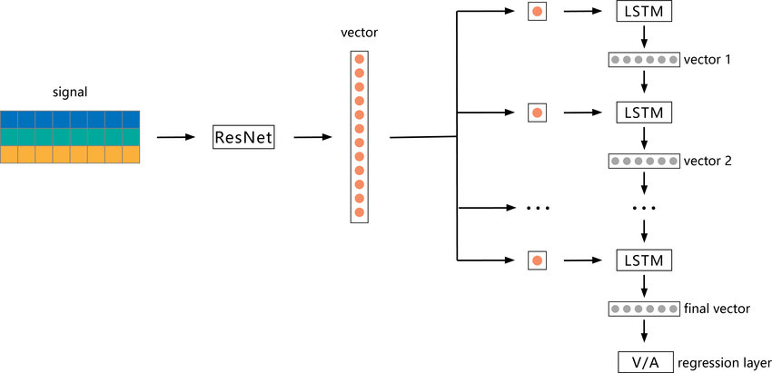
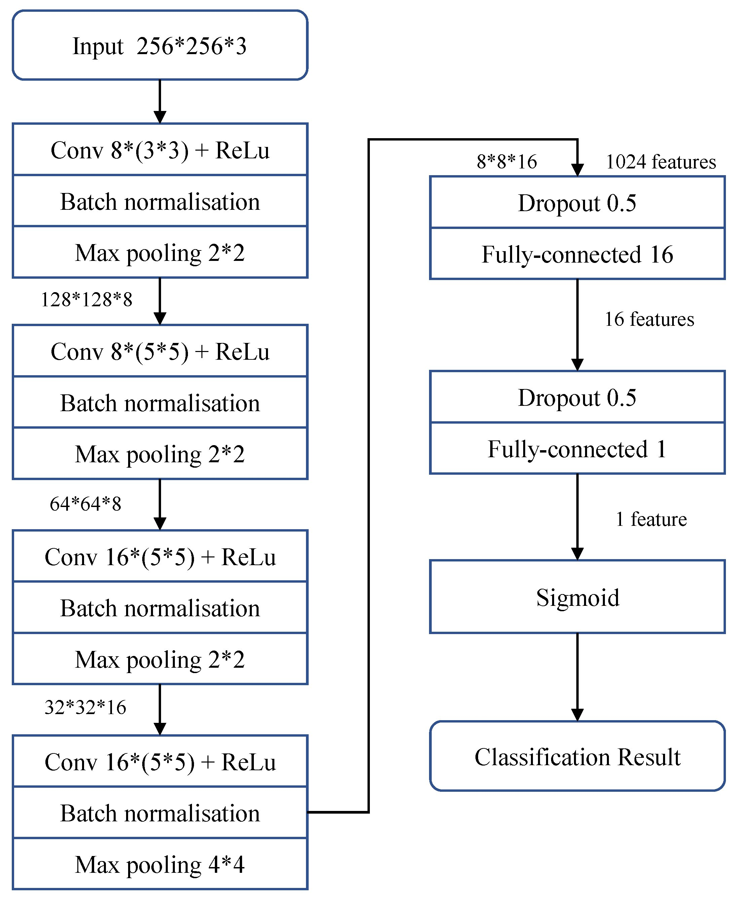

> Detecting synthetic media has been an ongoing concern over the recent years due to the increasing amount of deepfakes on the internet. In this project, we will explore the different methods and algorithms that are used in deepfake detection.
    
## Introduction: 
Deepfakes, or artificial intelligence-generated videos that depict real people doing and saying things they never did, have become a growing concern in recent years. This artificially generated content can be used to spread misinformation, manipulate public opinion, and even harm individuals. Therefore, the ability to detect deepfakes is crucial to ensure the integrity of information and protect people from potential harm.




## Proposal:
The main objective of this project is to experiment with existing advanced machine learning techniques for deepfake detection. Specifically, the project aims to investigate and analyze the current state-of-the-art deepfake detection methods, and evaluate the performance of the developed models using a dataset of deepfake videos. 

## Dataset Used:

### Celeb-DF

Celeb-DF is a dataset used for deepfake forensics. It includes 590 original videos collected from YouTube with subjects of different ages, ethnic groups and genders, and 5639 correspondingDeepFake videos. Unlike most other DeepFake datasets, Celeb-DF contains high visual quality videos that better resemble DeepFake videos circulated on the Internet. 



### Other notes
We also considered Facebook's Deepfake Detection Challenge (DFDC) dataset, which consists of more than 100,000 videos. It is the largest publicly available datset, but we stuck with Celeb-DF as the time for testing is faster due to the dataset being more than 470 GBs. 


## Architectures:

### ResNet LSTM

The first model we will explore is ResNetLSTM. ResNetLSTM is a combination of two deep learning architectures: Residual Neural Networks (ResNet) and Long Short-Term Memory (LSTM) networks. ResNet is a type of deep neural network that is specifically designed to address the problem of vanishing gradients that can occur in very deep networks. It does this by using residual connections to skip over certain layers in the network, which can help information flow more easily through the network. LSTM networks, on the other hand, are a type of recurrent neural network that are well-suited for processing sequential data, such as time-series data (in our case, video examples). The implementation of ResNetLSTM we will be evaluating consists of a Resnet50 + LSTM with 512 hidden units. The model was pretrained on the ImageNet dataset and will be fintuned on the CelebDF deepfake detection dataset.



### MesoNet 
MesoNet is a deep learning architecture designed for the detection of manipulated images. MesoNet is based on a combination of convolutional neural networks (CNNs) and long short-term memory (LSTM) networks. However, the specific MesoNet architecture we will be exploring, MesoInception4 (developed by Darius Afchar, Vincent Nozick, Junichi Yamagishi, Isao Echizen) does not implement an LSTM block.  Mesoinception4 is an extension of the Inception architecture, which is a family of deep neural networks that are commonly used for image classification and recognition tasks. It is based on a combination of Inception and Inception-ResNet blocks. These blocks use different types of convolutional layers, including 1x1, 3x3, and 5x5 convolutions, to extract features from the input image. The architecture also includes other notable neural network layers such as max pooling layers, which aggregates the features across the spatial dimensions of the image, and dropout layers to help regularize our model. The model was pretrained on the Mesonet dataset and will be fintuned on the CelebDF deepfake detection dataset.



### Other Notes
Other notable deepfake detection models that were considered include EfficientNet B1 LTSM and Xception architectures.


## Training
ResNetLSTM is pretrained on ImageNet, while Mesonet is pretrained on Mesonet. Both models apply transfer learning for deepfake detection. They are finetuned on CelebDF with the following procedure, settings, and results:

### Setup
1. Clone our repository into your environment: https://github.com/jchangz01/CS188-Project-Deepfake-Detection
2. Download `Celeb-DF`(v1) from https://github.com/yuezunli/celeb-deepfakeforensics (NOTE: It is quite large ~2GB)
3. Place `Celeb-DF` directory into `[yourpath]/CS188-Project-Deepfake-Detection/data`

### Training
The following code block shows how we train our models to the CelebDF dataset (exammple is ResNetLSTM specific):
```
import train 

dataset = 'celebdf'
data_path = root + 'CS188-Project-Deepfake-Detection/data/celebdf'
method = 'resnet_lstm_celebdf'
img_size = 224
normalization = 'imagenet'
data = label_data(dataset_path=data_path,
                      dataset=dataset, method=method, 
                      face_crops=True, test_data=False)
augs = df_augmentations(img_size, strength='weak')
folds = 5
epochs = 30
batch_size = 4
lr = 0.0001

model, average_auc, average_ap, average_acc, average_loss = train.train(dataset=dataset, data=data,
                                                                        method=method, img_size=img_size, normalization=normalization, augmentations=augs,
                                                                        folds=folds, epochs=cls.epochs, batch_size=cls.batch_size, lr=cls.lr
                                                                        )
```
                                                                                
### Hyperparameters and Train Results
We used the following hyperparameters and settings to train our models:
- **ResNetLSTM**: image_size = 224, normalization = 'imagenet', folds = 5 (20 val/80 train split) , epochs = 30, batch_size = 4, lr = 0.0001, optimizer: Adam
- **Mesonet**: image_size = 256, normalization = 'xception', folds = 5 (20 val/80 train split) , epochs = 20, batch_size = 32, lr = 0.0001, optimizer: Adam

The results received from training are as follows:
- **ResNetLSTM**: val_loss = 0.1415, val_acc = 0.9457, epochs until best model = 25
- **Mesonet**: val_loss = 0.4458, val_acc = 0.7994, epochs until best model = 20


## Testing

### Procedure
We wanted to observe the difference between 
We observed that further finetuning for Mesonet and ResNetLSTM on the CelebDF dataset did not increase validation accuracy compared to the model weights that were already finetuned to those datasets. Therefore, we used the given model weights rather than the weights we trained, as this gave us higher validation accuracies and reduced the needed computing units and time. To test the finetuned model, we ran the models through the CelebDF test dataset to see the final testing accuracies. The process for this is shown below:

```
import pandas as pd

data_path = root + '/data/celebdf' #use /augmented or /augmented2 for data augmented images
dataset = 'celebdf'
df = label_test_data(dataset_path=data_path, dataset=dataset)
print(df.iloc[[0]]['video'])
img_size = 256
face_margin = 0.3
num_frames = 20

print("test for MesoNet model without finetuning")
normalization = 'xception'
method = 'mesonet_celebdf'
auc, ap, loss, acc = test.inference(
                Mesonet, df, img_size, normalization, dataset=dataset, method=method, face_margin=face_margin, num_frames=num_frames)

print("test for MesoNet model finetuned on CelebDF")
auc, ap, loss, acc = test.inference(
                MesonetCelebDF, df, img_size, normalization, dataset=dataset, method=method, face_margin=face_margin, num_frames=num_frames)

print("test for ResNetLSTM model without finetuning")
img_size = 224
normalization = 'imagenet'
method = 'resnet_lstm_celebdf'
auc, ap, loss, acc = test.inference(
                Resnetlstm, df, img_size, normalization, dataset=dataset, method=method, sequence_model=True, face_margin=face_margin, num_frames=num_frames)

print("test for ResNetLSTM model with finetuning")
auc, ap, loss, acc = test.inference(
                ResnetlstmCelebDF, df, img_size, normalization, dataset=dataset, method=method, sequence_model=True, face_margin=face_margin, num_frames=num_frames)
```

### Data Augmentation
As we noticed that further finetuning of the models onto the datasets did not increase accuracies past already given finetuned model weights, we wanted to test the robustness of these models on newer data. To do this, we used Python cv2 and vidaug libraries to perform data augmentation on the test videos, and ran the models through the new data to observe the robustness of the models. We tested with different amounts of augmentation as shown below, initially starting with just rotations and flips, before adding other factors such as gaussian noise, grayscale, dropout, and augmentation factors.

```
from imgaug import augmenters as iaa

seq = iaa.Sequential([
      iaa.Multiply((0.5, 1.5)),
      iaa.GaussianBlur(sigma=(0.0, 3.0)),
      iaa.Dropout((0.0, 0.2)),
      iaa.AdditiveGaussianNoise(scale=(0, 0.1 * 255)),
      iaa.ContrastNormalization((0.5, 2.0)),
      iaa.Grayscale(alpha=(0.0, 1.0)),
      iaa.Flipud(flip),
      iaa.Affine(rotate=rotation_angle),
    ])
```

This resulted in three levels of data augmentation on the dataset. We have the original test videos, slightly rotated and/or flipped test videos, and heavily augmented videos. Examples of the three are shown below:

| No augmentation | Rotation/Flipping | Heavy Augmentation | 
| :------: | :-----------------: | :---------: |
|  |  |  | 

### Results
When testing the model weights on the CelebDF test dataset, we observed the following metrics. This is on the CelebDF test dataset with no data augmentation:

|          | Mesonet | Mesonet (finetuned) | ResNetLSTM | ResNetLSTM (finetuned) |
| :------- | :------: | -----------------: | ---------: | ---------------------: |
| Loss |   0.739   |               0.604 |       0.725 |                   0.145 |
| AUC      |   0.457   |               0.879 |       0.507 |                   0.997 |
| Accuracy   |   0.265  |               0.723 |       0.265 |                   0.928 |

After applying small rotations and flips to test images in the dataset, we ran the model through the videos again and got the following metrics:

|          | Mesonet | Mesonet (finetuned) | ResNetLSTM | ResNetLSTM (finetuned) |
| :------- | :------: | -----------------: | ---------: | ---------------------: |
| Loss |   0.739  |               0.901 |       0.725 |                   0.605 |
| AUC      |   0.464   |               0.804 |       0.423 |                   0.829 |
| Accuracy   |   0.268   |               0.622 |       0.268 |                   0.968 |

Finally, we tried applying large amounts of data augmentations and ran the model through the videos once again to get the following metrics:

|          | Mesonet | Mesonet (finetuned) | ResNetLSTM | ResNetLSTM (finetuned) |
| :------- | :------: | -----------------: | ---------: | ---------------------: |
| Loss     |   0.741   |               16.36 |       0.725 |                   0.948 |
| AUC      |   0.257   |               0.356 |       0.495 |                   0.465 |
| Accuracy  |  0.314   |               0.257 |       0.257 |                   0.486 |

## Conclusion

In conclusion, we experimented with two advanced deep learning models, ResNetLSTM and MesoInception4, for the purpose of deepfake detection using the Celeb-DF dataset. Our evaluation showed that ResNetLSTM outperformed MesoInception4 in terms of having higher overall accuracy, as well as having higher overall AUC which means less false positives, something that is definitely wanted in such model. A hypothesis for this is that ResNetLSTM has additional RNN units that allow it to learn temporal dependecies, which could be desired for video inputs. 

We also found that transfer learning, by leveraging pretraining on large datasets such as ImageNet and Mesonet, can significantly improve the performance of deepfake detection models on smaller datasets like Celeb-DF. Additionally, we observed that when applying data augmentation to the two models, we got mixed results. For adding simple rotations and flips, the models performed well, which shows they are robust and can be used on new data distributions. However, applying large amounts of augmentation with added noise and coloring made the model struggle to accurately detect deepfakes, which shows there still can be lots of work down to improve these models and ensure they can detect any deepfake.

Overall, our results suggest that ResNetLSTM is the most promising architecture for deepfake detection, but further research is needed to evaluate its performance on a wider range of datasets to further test its robustness. The development of more advanced deepfake techniques also highlights the importance of constantly improving deepfake detection methods to counteract malicious actors.

## Code and Demo
- [Google Colab](https://colab.research.google.com/drive/1VFP30CacdN8N8ncp4QjYg6YUHU4C74Vr#scrollTo=NpShPgOxt0Uz)
- [Github](https://github.com/jchangz01/CS188-Project-Deepfake-Detection)
- [Video Demo](https://drive.google.com/file/d/1DOaWGxxVRK8bFn0BaWFuLypfMwbHtMQb/view?usp=share_link)

## Related Works

-   Combining EfficientNet and Vision Transformers for Video Deepfake Detection
    -   [Paper](https://arxiv.org/abs/2107.02612)
    -   [Github](https://github.com/davide-coccomini/Combining-EfficientNet-and-Vision-Transformers-for-Video-Deepfake-Detection)
-   Do You Really Mean That? Content Driven Audio-Visual Deepfake Dataset and Multimodal Method for Temporal Forgery Localization
    -   [Paper](https://arxiv.org/abs/2204.06228v1)
    -   [Github](https://github.com/ControlNet/LAV-DF)
-   Video Face Manipulation Detection Through Ensemble of CNNs
    -   [Paper](https://arxiv.org/abs/2004.07676v1)
    -   [Github](https://github.com/polimi-ispl/icpr2020dfdc)
-   Celeb-DF: A Large-scale Challenging Dataset for DeepFake Forensics
    -   [Paper](https://arxiv.org/abs/1909.12962)
    -   [Github](https://github.com/yuezunli/celeb-deepfakeforensics)
-   MesoNet: a Compact Facial Video Forgery Detection Network
    -   [Paper](https://arxiv.org/abs/1809.00888)
-   DeepFake Detector Performance Model 
    -   [Github](https://github.com/CatoGit/Comparing-the-Performance-of-Deepfake-Detection-Methods-on-Benchmark-Datasets/blob/master/deepfake_detector)


## References

[1] Coccomini, Davide, et al. “Combining EfficientNet and Vision Transformers for Video Deepfake Detection.” ISTI-CNR, via G. Moruzzi 1, 56124, Pisa, Italy, 2022.

[2] Cai, Zhixi, et al. “Do You Really Mean That? Content Driven Audio-Visual Deepfake Dataset and Multimodal Method for Temporal Forgery Localization.” Monash University, 2022.

[3] Bonettini, Nicolo, et al. “Video Face Manipulation Detection Through Ensemble of CNNs.” Polytechnic University of Milan, 2020.

[4] Li, Yuezun, et al. “Celeb-DF: A Large-Scale Challenging Dataset for Deepfake Forensics.” ArXiv.org, 16 Mar. 2020, 

[5] “Deepfakes and Video Fraud: Should You Be Worried?” Media272, 16 Aug. 2018, https://media272.com/2018/08/16/deepfakes-and-video-fraud-should-you-be-worried/. 

[6] “Papers with Code - Celeb-DF Dataset.” Dataset | Papers With Code, https://paperswithcode.com/dataset/celeb-df. 

[7] ResNet-LSTM Model. the Signal Is First Fed into ResNet as a ... https://www.researchgate.net/figure/ResNet-LSTM-model-The-signal-is-first-fed-into-ResNet-as-a-three-channel-input-phasic_fig6_340715269. 

[8] Xia, Zhiming, et al. “Deepfake Video Detection Based on Mesonet with Preprocessing Module.” MDPI, Multidisciplinary Digital Publishing Institute, 5 May 2022, https://www.mdpi.com/2073-8994/14/5/939. 
