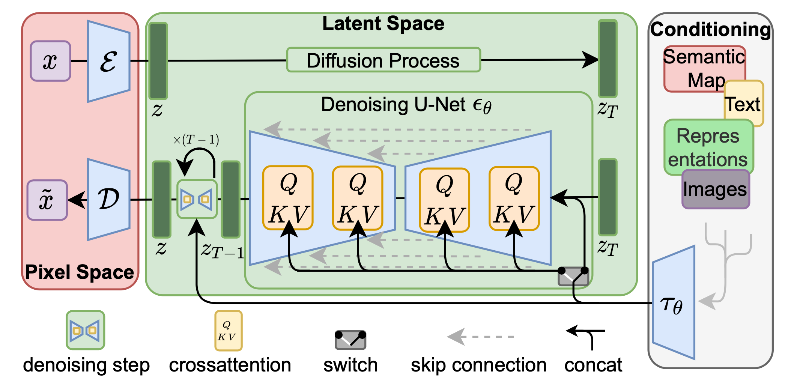
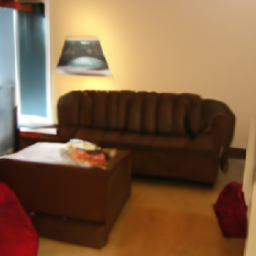
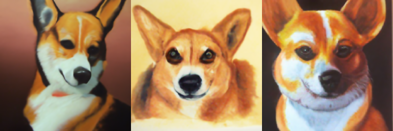
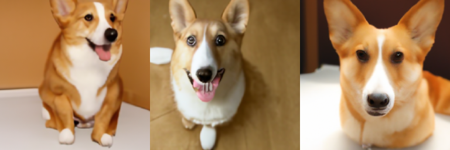
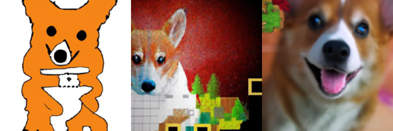
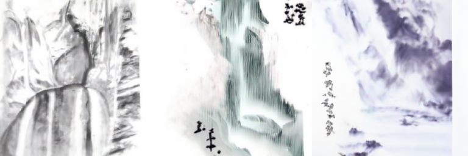
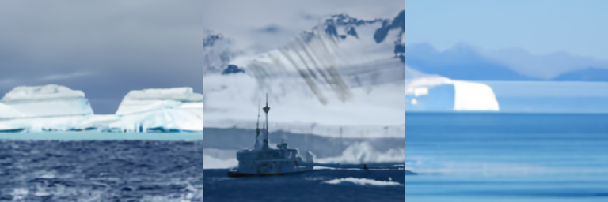
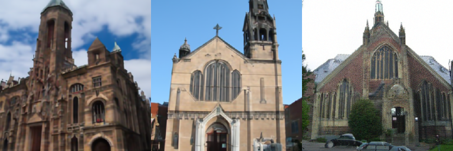
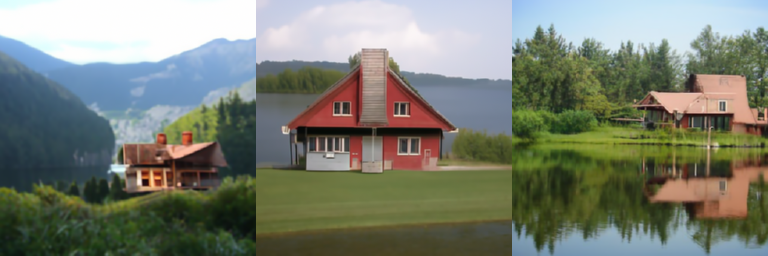
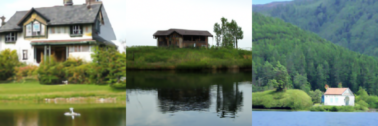

> My project investigates GLIDE, a state of the art text to image generation diffusion model by OpenAI that uses classifier-free model. I ran investigations on how a filtered version of this model performed by giving different kinds of text input and tuning different hyperparameters to observe the generated output. The results that I found is that while GLIDE definitely is quite powerful in generating images, there are still quite a numerb of issues including bias, image quality, novel images, and image types.


<!--more-->
{: class="table-of-content"}
* TOC
{:toc}


## Introduction

> Creating images like illustrations, paintings, and photographs can be time-consuming and require specialized skills. A tool that can generate realistic images from natural language can make it much easier for people to create a wide range of visual content. Additionally, being able to edit images using natural language makes it possible to make precise changes quickly, which is essential in practical applications. This post is a review of different techniques that relate to image generation from text inputs.

Text-guided image generation is an intersections between the fields of Natural Language Processing (NLP) and Computer Vision (CV). In particular, it uses an upstream discriminative model in NLP and applies it to a generative model in CV. Thus, a model takes a text description as input and generates an image that corresponds to the description. This approach has applications in various domains, such as creative art, virtual reality, design. Diffusion models are a popular approach to image generation that involves modeling the diffusion process of pixels in an image. These models use iterative sampling to generate high-quality images by allowing each pixel to diffuse information from its neighbors in a progressive manner. Diffusion models have shown impressive results in generating high-resolution and diverse images, and have been used in various applications, such as image editing and video synthesis. However, even within diffusion models, there are various types. In fact, GLIDE (Guided Language-to-Image Diffusion for Generation and Editing), a popular image generation diffusion model has different implementations with classifier-free guidence and CLIP-guidance. While there are merits to both, human evaluators have found to favor images generated by classifier-free guidance over CLIP-guidance, so I will be using that model in my investigations.


<p align="center">
  
  
  <br />
  <i>Two examples of generated images from the original GLIDE model [1]</i>
  <br />
  <i>Left: a fall landscape with a small cottage next to a lake</i>
  <br />
  <i>Right: a hedgehog using a calculator</i>
</p>


## Model Structure and Technical Details

In simple terms, the GLIDE framework comprises of three primary components. Firstly, an Ablated Diffusion Model (ADM) is utilized to create a 64 x 64 image. Secondly, a text model (transformer) influences the image generation process by using a text prompt. Lastly, an upsampling model (also a diffusionm model) is utilized to enlarge the image to 256 x 256 pixels, which enhances its interpretability. The ADM and text model collaborate to generate images that reflect the text prompt accurately, while the upsampling model is essential for creating more easily understandable images.

### Diffusion Models

Diffusion models are a kind of image generation model that works by learning the underlying distribution of the data. It does though throw a process called "diffusion" by starting out with data, and gradually adding noise to that data by defining a Markov chain of latent variables that adds noise based on a Gaussian distribution. Hence, based on a real data distribution: $\mathbf{x}_0 \sim q(\mathbf{x})$, we can produce a set of noisy samples $\mathbf{x}_1, \dots, \mathbf{x}_T$:

$$
q(\mathbf{x}_t \vert \mathbf{x}_{t-1}) = \mathcal{N}(\mathbf{x}_t; \sqrt{1 - \beta_t} \mathbf{x}_{t-1}, \beta_t\mathbf{I}) \quad
q(\mathbf{x}_{1:T} \vert \mathbf{x}_0) = \prod^T_{t=1} q(\mathbf{x}_t \vert \mathbf{x}_{t-1})
$$

where $\{\beta_t \in (0, 1)\}_{t=1}^T$ is a variance schedule that controls the step size. 

<p align="center">
  
  <br />
  <i>Diagram of the Markov chain for forward and reverse diffusion process [2]</i>
</p>


The end result is a new image that has been iteratively refined to closely match the distribution of the training data. 

### Guided Diffusion via Classifier Free Guidance

Guided Diffusion is a kind of diffusion model whereby the model conditions the diffusion process based on additional information of the target distribution. For example, if we wanted the final image to look a certain way, we may provide it a class label, or in my project, a string of descriptive string text to "guide" each layer of the Markov chain into the desired distribution. The resulting model is what is called an *Ablated Diffusion Model* (ADM) that is able to guide the diffusion sampling process towards the provided descriptive text.

Classifier Free Guidance is a method of guided diffusion that uses the scores obtained from both a conditional and an unconditional diffusion model, as demonstrated in a recent study by Ho and Salimans (2021). The unconditional denoising diffusion model is parameterized using a score estimator, while the conditional model is parameterized by the same conditional model. Both models can be learned using a single neural network. Specifically, a conditional diffusion model can be trained on paired data, where the conditioning information is periodically discarded at random, enabling the model to generate images unconditionally.

This guidance is represented by the equation below:

$$
\hat{\epsilon}_\theta(x_t|y) = \epsilon_\theta(x_t|\varnothing) + s \cdot(\epsilon_\theta(x_t|y) − \epsilon_\theta(x_t|\varnothing)) \medspace [1]
$$

where $y$ is the label or prompt, $\epsilon_\theta(x_t|y)$ is the class-conditional diffusion model, and $s \geq 1$ is a hyperparameter called the guidance scale that influences how much the model follows the prompt/label.


This classifier-free guidance is implented like the following:
```py
# From https://github.com/openai/glide-text2im

# Create a classifier-free guidance sampling function
def model_fn(x_t, ts, **kwargs):
    half = x_t[: len(x_t) // 2]
    combined = th.cat([half, half], dim=0)
    model_out = model(combined, ts, **kwargs)
    eps, rest = model_out[:, :3], model_out[:, 3:]
    cond_eps, uncond_eps = th.split(eps, len(eps) // 2, dim=0)
    half_eps = uncond_eps + guidance_scale * (cond_eps - uncond_eps)
    eps = th.cat([half_eps, half_eps], dim=0)
    return th.cat([eps, rest], dim=1)
```

A full visualizatin of the diffusion process can be seen in the diagram below:

<p align="center">
  
  <br />
  <i>A full visualization of the diffusion process [3]</i>
</p>

### Base Model

Hence, to create the GLIDE model, we simply need to create the model like so:

```py
# From https://github.com/openai/glide-text2im

# Create base model.
options = model_and_diffusion_defaults()
options['use_fp16'] = has_cuda
options['timestep_respacing'] = '100' # use 100 diffusion steps for fast sampling
model, diffusion = create_model_and_diffusion(**options)
model.eval()
if has_cuda:
    model.convert_to_fp16()
model.to(device)
model.load_state_dict(load_checkpoint('base', device))
print('total base parameters', sum(x.numel() for x in model.parameters()))
```

Note that the opensource GLIDE model provided by OpenAI is a smaller version trained on a filtered datasets, so results may not be as good as the ones in the paper.

### Upsampler

The upsampler is a model that is used to increase the spatial resolution of the input image. Specifically, transforms the low-resolution input image generated by the base model into a higher-resolution image, which can then be used for further processing or analysis. 

In GLIDE, the upsampler also uses a diffusion model. This makes sense, because in the forward pass the original image gets converted into noise, and then in the reverse diffusion process, the noise gets converted back into the image with higher resolution with a meaningful semantic distribution of the extra image pixels.

Hence, the upsampler model is defined quite similarly:

```py
# From https://github.com/openai/glide-text2im

# Create upsampler model.
options_up = model_and_diffusion_defaults_upsampler()
options_up['use_fp16'] = has_cuda
options_up['timestep_respacing'] = 'fast27' # use 27 diffusion steps for very fast sampling
model_up, diffusion_up = create_model_and_diffusion(**options_up)
model_up.eval()
if has_cuda:
    model_up.convert_to_fp16()
model_up.to(device)
model_up.load_state_dict(load_checkpoint('upsample', device))
print('total upsampler parameters', sum(x.numel() for x in model_up.parameters()))
```


### Generating Results

With all these tools combined, we can then generate (or sample) images from the model.

First, we defined our input and hyperparameters
```py
# From https://github.com/openai/glide-text2im

# Sampling parameters
prompt = "A house by the lake"
batch_size = 1
guidance_scale = 3.0

# Tune this parameter to control the sharpness of 256x256 images.
# A value of 1.0 is sharper, but sometimes results in grainy artifacts.
upsample_temp = 0.995
```

Then, we build the arguments to pass in to the model. This is done through a tokenizer to encode the prompt as tensors with positional encodings and masks.
```py
# From https://github.com/openai/glide-text2im

# Create the text tokens to feed to the model.
tokens = model.tokenizer.encode(prompt)
tokens, mask = model.tokenizer.padded_tokens_and_mask(
    tokens, options['text_ctx']
)

# Create the classifier-free guidance tokens (empty)
full_batch_size = batch_size * 2
uncond_tokens, uncond_mask = model.tokenizer.padded_tokens_and_mask(
    [], options['text_ctx']
)

# Pack the tokens together into model kwargs.
model_kwargs = dict(
    tokens=th.tensor(
        [tokens] * batch_size + [uncond_tokens] * batch_size, device=device
    ),
    mask=th.tensor(
        [mask] * batch_size + [uncond_mask] * batch_size,
        dtype=th.bool,
        device=device,
    ),
)
```

Finally, we sample the image from the base model:
```py
# From https://github.com/openai/glide-text2im

samples = diffusion.p_sample_loop(
    model_fn,
    (full_batch_size, 3, options["image_size"], options["image_size"]),
    device=device,
    clip_denoised=True,
    progress=True,
    model_kwargs=model_kwargs,
    cond_fn=None,
)[:batch_size]
```
<p align="center">
  
  <br />
  <i>Prompt: a living room with a couch</i>
</p>

After this image has been generated, we then pass it into the upsampler to increase the spatial resolution. We do this using a similar process. First, we build the arguments to pass into the upsampler. Note that opne difference we see here is that we pass in the generated sample image into the `low_res` argument.

```py
# From https://github.com/openai/glide-text2im

tokens = model_up.tokenizer.encode(prompt)
tokens, mask = model_up.tokenizer.padded_tokens_and_mask(
    tokens, options_up['text_ctx']
)

# Create the model conditioning dict.
model_kwargs = dict(
    # Low-res image to upsample.
    low_res=((samples+1)*127.5).round()/127.5 - 1,

    # Text tokens
    tokens=th.tensor(
        [tokens] * batch_size, device=device
    ),
    mask=th.tensor(
        [mask] * batch_size,
        dtype=th.bool,
        device=device,
    ),
)
```

Then, finally, we can then pass our arguments in to the upsampler model:

```py
# From https://github.com/openai/glide-text2im

up_shape = (batch_size, 3, options_up["image_size"], options_up["image_size"])
up_samples = diffusion_up.ddim_sample_loop(
    model_up,
    up_shape,
    noise=th.randn(up_shape, device=device) * upsample_temp,
    device=device,
    clip_denoised=True,
    progress=True,
    model_kwargs=model_kwargs,
    cond_fn=None,
)[:batch_size]
```

<p align="center">
  
  <br />
  <i>Prompt: a living room with a couch</i>
</p>

## Results and Analysis

Thus, I ran tests of the model with several different tests in mind. These include the ability of the model to generate different kinds of styles of images, novel prompts, different hyperparameters, and to see if it had any bias.

### Different Art Styles

<p align="center">
  
  <br />
  <i>Prompt: an oil painting of a corgi</i>
</p>

<p align="center">
  
  <br />
  <i>Prompt: photograph of a corgi</i>
</p>

<p align="center">
  
  <br />
  <i>Prompt: pixel art of a corgi</i>
</p>

<p align="center">
  
  <br />
  <i>Prompt: chinese ink painting of a waterfall</i>
</p>

As seen in these images, I tried to experiment with different art styles. From the different tests, we see that oil paintings, photographs, Chinese ink paintings performed quite well. It is worth mentioning that two of the ink paintings have calligraphy on them (although uneligible), which is a characteristic of Chinese ink paintings. However, we see that the pixel art performed the worst. It seems very apparent that there was most likely a lack of pixel art training data in the dataset. Which is interesting because in the paper, the original GLIDE was able to generate pixel just fine. This means that the filtered dataset that this model was used to train on likely did not contain any. 

Furthermore, for the photographs, we see that the images still look a bit off in that there are small details here and there that take away from the photo - a human evaluator would be able to tell instantly that this was generated. I think that this is to be expected because I am running a smaller version of GLIDE, where there are less parameters. So perhaps the model has weaker texture generating capabilities in both the base model and the upsampler.

> This is a common weakness that is seen in subsequent tests as well.

### Novel Prompts

<p align="center">
  
  <br />
  <i>Prompt: polar bear sailing a ship</i>
</p>

As seen in this prompt, the model was limited when it was dealing with novel prompts. Again, I think that this is a result of the limited dataset and parameter that it was trained in. For example, OpenAI removed all data that contained people in it (makes sense because we wouldn't people to be able to generated harmful content with it), so perhaps this version of the model did not know how to handle what it means to sail a ship.

### Bias

<p align="center">
  
  <br />
  <i>Prompt: a religious building</i>
</p>

This is a prime example of bias that exists in the GLIDE model. Despite being able to generate images of other religious buildings like mosque's, temples, and shrines perfectly fine, the model would keep generating churches given the prompt "a religious building". This is a bias that exists with the conditional guidance of the base diffusion model. There was most likely a disproportion of churches and other types of religious buildings in training data. Hence, the classifier-free guidance model, which learns directly from patterns in the training data.

### Different Hyperparameters

Here, I investigated two types of hyperparameters and see how it would affect the model's generation of the images. The first is **guidance scale**, which affects how much weight the prompt has during the diffusion process. The second is **upscale temp**, which affects the quality the generated images.

#### Guidance Scale

<p align="center">
  
  <br />
  <i>Prompt: A house by the lake</i>
  <br />
  <i>Guidance scale: (left: 1.0, middle: 3.0, right: 5.0)</i>
</p>

From the images, we see that guidance scale indeed have an effect on the generated images. In particular, there is a bigger emphasis on the "lake" token of the prompt. On the left, which has the smallest guidance, the lake is barely visible in the background. While on the right, which has the highest guidance, the lake takes up the majority of the image. This makes sense, and it seems that the GLIDE model usually has a word that it will deem as the "most important" token, and categories other tokens on varying levels of importance below it. For example, in this example, "house" is clearly the most important token while "lake" is not as important. Hence, from this I can conclude that with prompts of higher complexity, a larger guidance scale will be necessary to make sure that everything is factored in properly during the diffusion process.

#### Upscale Temp

<p align="center">
  
  <br />
  <i>Prompt: A house by the lake</i>
  <br />
  <i>Upscale temp: (left: 0.990, middle: 0.995, right: 1.000)</i>
</p>

From the images above, it is clear that upscale temp does have an effect on the quality of the images. On the left, which has the smallest upscale temp, the image generated is a lot more blurrier, while the one on the right is a lot sharper. Yet at the same time, the right most also has some grainy artifacts (in the mountain furthest back) generated, which is most likely due to the fact that by specifying a quality too high, the upsampler does not know how to fill in the missing details, which will result in the grainy artifact that it sees below.

## Discussion

From the results above, we see that while GLIDE has lots of promise as an image generation model that can generate high-quality images without the need for complex pre-training and fine-tuning, it still has many weakness. One major weakness is that its generated images still lack a lot of detail and texture. We see this from the generations of the images we see above. It is most apparent when it tries to generate a photograph, because we are much used to modern photographs which has much higher resolution and detail. Hence, perhaps this base model is much more suited for tasks like art generation instead of a general purpose generation. 

That being said, it should be noted that this version of GLIDE is a smaller model of the original GLIDE (which was able to generate extremely realistic images) that has less parameters and was trained on a filtered dataset. For example, the GLIDE paper notes that it filtered out any images with humans or human-like objects, violent objects, and hate symbols. Which was why I did not try to generate any kind of image with people in it. Moreover, the fact that the filtered GLIDE only has 300 million parameters, as compared to the original GLIDE in the research paper which has 3.5 billion parameters [1]. This means that the model is much less expressive as the open sourced version. The reason why is that the researchers at OpenAI wanted to mitigate the risk of misuse as much as possible by removing as much bias, violence, and people from the images. Hence, I conclude that in order for this open source version model to be more useful for more broader use cases, we need to finetune on our own training dataset so that it can become more robust and expressive.

On the other hand, while small, I was still able to find traces of bias in this open source version of the model, where the prompt "a religious building" generated images of churches. Hence, it is still important to realize that many kinds of biases exist and it is very difficult to completely erase it.

## Code and Video

**Code**:
- [Link to Colab Demo](https://colab.research.google.com/drive/1E9N_Ow06Ep3nEWX-5jO4U4YtAs5bs6EZ?usp=sharing)

**Video**
- [Link to spotlight video](https://drive.google.com/file/d/1uIbXPcaISCC9Y4yw_9yH8-8hqik4ia3e/view?usp=sharing)


## Reference
Please make sure to cite properly in your work, for example:

[1] Nichol, A., Dhariwal, P., Ramesh, A., Shyam, P., Mishkin, P., McGrew, B., Sutskever, I., & Chen, M. (2021). GLIDE: Towards Photorealistic Image Generation and Editing with Text-Guided Diffusion Models. ArXiv. https://doi.org/10.48550/arXiv.2112.10741

[2] Ho, J., Jain A., Abbeel, P. (2020). Denoising Diffusion Probabilistic Model. ArXiv. https://doi.org/10.48550/arXiv.2006.11239

[3] Rink, N. A., Paszke, A., Vytiniotis, D., & Schmid, G. S. (2022). Memory-efficient array redistribution through portable collective communication. ArXiv. http://arxiv.org/abs/2112.01075

---
