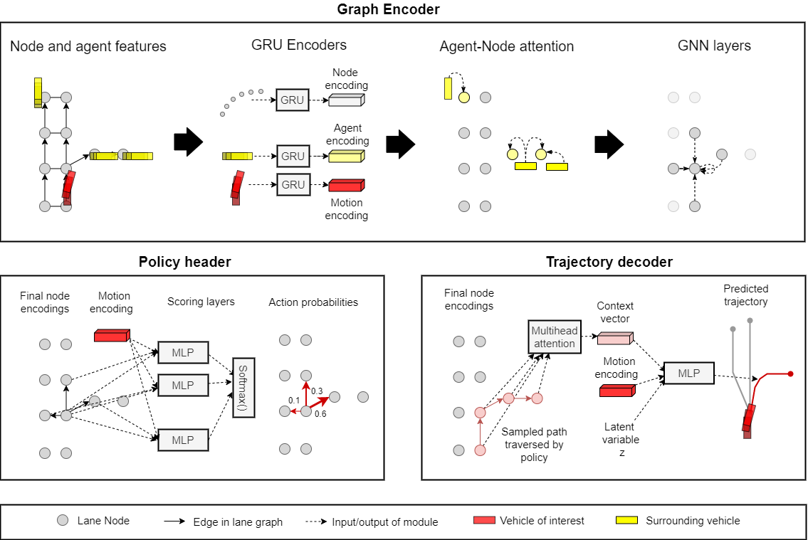

---

layout: post
comments: true
title: Trajectory Prediction
author: Team 32 (Kevin Jiang, Michael Yang)
date: 2023-01-29

---

> Trajectory prediction in the context of an autonomous vehicle involves predicting how nearby vehicles, pedestrians, and other subjects will move in a real-time environment, which in turn is needed for the autonomous vehicle to maneuver in an optimal and safe manner.

<!--more-->

## Models

### Stepwise Goal-Driven Networks for Trajectory Prediction

Paper: [https://doi.org/10.48550/arXiv.2103.14107](https://doi.org/10.48550/arXiv.2103.14107) [1]

Repository: [https://github.com/ChuhuaW/SGNet.pytorch](https://github.com/ChuhuaW/SGNet.pytorch) [2]

#### Overview [1]

This paper introduces a recurrent neural network (RNN) called Stepwise Goal-Driven Network (SGNet) for predicting trajectories of observed agents (e.g. cars and pedestrians).

Unlike previous research which model an agent as having a single, long-term goal, SGNet draws on research in psychology and cognitive science to model an agent as having a single, long-term *intention* that involves a series of goals over time.

To this end, SGNet estimates and uses goals at multiple time scales to predict agents' trajectories. It comprises an encoder that captures historical information, a stepwise goal estimator that predicts successive goals into the future, and a decoder to predict future trajectory.

### GRIP++: Enhanced Graph-based Interaction-aware Trajectory Prediction for Autonomous Driving

Paper: [https://doi.org/10.48550/arXiv.1907.07792](https://doi.org/10.48550/arXiv.1907.07792) [3]

Repository: [https://github.com/xincoder/GRIP](https://github.com/xincoder/GRIP) [4]

#### Overview [3]

This paper introduces an improvement on Graph-based Interaction-aware Trajectory Prediction (GRIP), called GRIP++, to handle both highway and urban scenarios.

Specifically, while GRIP performed well for highway traffic, urban traffic is much more complex, involving diverse agents with varying motion patterns and whose behavior affect one another. In addition, GRIP used a fixed graph to represent the relationships between agents, leading to potential performance degradation for urban traffic.

GRIP++ addresses these limitations by employing both fixed and dynamic graphs to represent the interactions between many different kinds of agents and predict trajectories for all traffic agents simultaneously.

### Multimodal Trajectory Prediction Conditioned on Lane-Graph Traversals

Paper: [https://doi.org/10.48550/arXiv.2106.15004](https://doi.org/10.48550/arXiv.2106.15004) [5]

Repository: [https://github.com/nachiket92/PGP](https://github.com/nachiket92/PGP) [6]

#### Overview [5]

This paper introduces an improvement on multimodal regression for trajectory prediction.

While standard multimodal regression aggregates the entirety of the graph representation of the map, the new method instead takes a subset of graph data that is more relevant to the vehicle and selectively aggregates this data.

In addition to lateral motion (acceleration, braking, etc.), the model also examines variations in longitudinal motion such as lane changes, utilizing a latent variable.

The model utilizes a graph encoder to encode node and agent features, a policy header to determine probable routes, and a trajectory decoder to determine a likely trajectory from this data.

#### Technical Details [5] [6]

The model consists of a graph encoder, policy header, and trajectory decoder.

## Studies

[TODO] Describe studies we intend to run.

## References

[1] Wang, Chuhua, et al. "Stepwise Goal-Driven Networks for Trajectory Prediction". *ArXiv*, IEEE, 27 Mar 2022, [https://doi.org/10.48550/arXiv.2103.14107](https://doi.org/10.48550/arXiv.2103.14107). *Papers with Code*, Papers with Code, 25 Mar 2021, [www.paperswithcode.com/paper/stepwise-goal-driven-networks-for-trajectory](https://paperswithcode.com/paper/stepwise-goal-driven-networks-for-trajectory), accessed 29 Jan 2023.

[2] Wang, Chuhua and Mingze Xu. "SGNet.pytorch." *GitHub*, GitHub, [www.github.com/ChuhuaW/SGNet.pytorch](https://github.com/ChuhuaW/SGNet.pytorch). *Papers with Code*, Papers with Code, 25 Mar 2021, [www.paperswithcode.com/paper/stepwise-goal-driven-networks-for-trajectory](https://paperswithcode.com/paper/stepwise-goal-driven-networks-for-trajectory), accessed 29 Jan 2023.

[3] Li, Xin, et al. "GRIP++: Enhanced Graph-based Interaction-aware Trajectory Prediction for Autonomous Driving." *ArXiv*, ArXiv, 19 May 2020, [https://doi.org/10.48550/arXiv.1907.07792](https://doi.org/10.48550/arXiv.1907.07792). *Papers with Code*, Papers with Code, [www.paperswithcode.com/paper/grip-graph-based-interaction-aware-trajectory](https://paperswithcode.com/paper/grip-graph-based-interaction-aware-trajectory), accessed 29 Jan 2023.

[4] Li, Xin. "GRIP." *GitHub*, GitHub, [www.github.com/xincoder/GRIP](https://github.com/xincoder/GRIP). *Papers with Code*, Papers with Code, [www.paperswithcode.com/paper/grip-graph-based-interaction-aware-trajectory](https://paperswithcode.com/paper/grip-graph-based-interaction-aware-trajectory), accessed 29 Jan 2023.

[5] Deo, Nachiket, et al. "Multimodal Trajectory Prediction Conditioned on Lane-Graph Traversals." *ArXiv*, ArXiv, 15 Sep 2021, [www.doi.org/10.48550/arXiv.2106.15004](https://doi.org/10.48550/arXiv.2106.15004). *Papers with Code*, Papers with Code, 28 Jun 2021, [www.paperswithcode.com/paper/multimodal-trajectory-prediction-conditioned](https://paperswithcode.com/paper/multimodal-trajectory-prediction-conditioned), accessed 26 Feb 2023.

[6] Deo, Nachiket. "PGP." *GitHub*, GitHub, [www.github.com/nachiket92/PGP](https://github.com/nachiket92/PGP). *Papers with Code*, Papers with Code, 28 Jun 2021, [www.paperswithcode.com/paper/multimodal-trajectory-prediction-conditioned](https://paperswithcode.com/paper/multimodal-trajectory-prediction-conditioned), accessed 26 Feb 2023.

---
