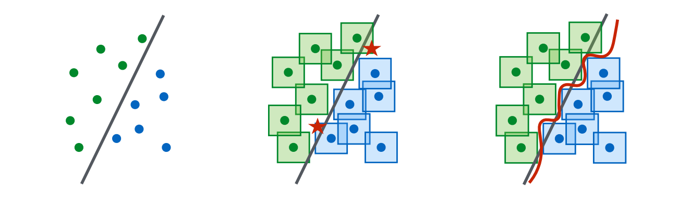

> DNN driven image recognition have been used in many real-world scenarios, such as for detection of road case or people. However, the DNNs could be vulnerable to adversarial examples (AEs), which are designed by attackers and can mislead the model to predict incorrect outputs while hardly be distinguished by human eyes. This blog aims to introduce how to generate AEs and how to defend these attacks.

<!--more-->
{: class="table-of-content"}

* TOC
{:toc}

## What is adversarial examples

As we know, the deep neural network (DNN) has great ability in image classification tasks. They have made great access in the last decade, as Balda $et$ $al.$ [9] say:

> Artificial intelligence is on the rise and Deep Neural Networks (DNNs) are an important part of it. Whether it is in speech analysis or visual tasks, they shine with a performance beyond what was imagined a decade ago.

However, the DNN is easily attacked by targeted attack. Images could be modified somehow to be completely wrongly recognized by the DNNs that could originally recognize them. Importantly, such modification could be tiny that  they look completely same as the original one to human eyes, as Balda $et$ $al.$ say:

> Their success is undeniable, nevertheless a flaw has been spotted in their performance. They are not stable under adversarial perturbations. Adversarial perturbations are intentionally worst case designed noises that aim at changing the output of a DNN to an incorrect one. The perturbations are most of the time so small that an ordinary observer may not even notice it, and even the state-of-theart DNNs are highly confident in their, wrong, classification of these adversarial examples.


Fig. 1.  A demonstration of adversarial examples generated using the FGSM (introduced later). By adding an imperceptibly small vector, GoogLeNet’s classification of the image can be changed [1].

As shown in Fig. 1, a image of panda is added with a tiny perturbation so that it looks same to our eyes. However, the GoogLeNet produces an error classification "gibbon".  A subtle adversarial perturbation is able to change the classification outcome, and such images with adversarial perturbation are called **adversarial examples** (AEs).

## How to generate adversarial examples

### Preliminaries

To produce AEs, it is assumed that we have access to the input images of a DNN (or system). Based on these images, we modify them by some algorithms to generate AEs. The AE should be restricted that an ordinary observer should not be capable of spotting a significant change in the modified image and its label. On this basis, the produced AEs should make the target DNN's performance severely degraded.

According to whether we know the target DNN's information, the attack task could be classified into two main categories: white-box attack and black-box attack. In white-box attack, we know the target DNN's detailed information, such as structure and weights. In black-box attack, we do not know any information about the target DNN. Note that some work declares that it is still a white-box attack task even if only partial information, such as partial structure of a DNN, is exposed, however, some work classifies it into a new task: gray-box attack. I list some descriptions in the work *Adversarial Examples in Deep Neural Networks: An Overview*  as follows:

> Adversarial attacks follow ubiquitously the same pattern. An adversarial attacker is assumed to have access to the system input. This can be the input of DNNs. It applies perturbations to the system inputs under an additional and important constraint. The perturbations should be restricted in some sense. For imagebased tasks, this means that an ordinary observer should not be capable of spotting, at least immediately, a significant change in the image and its label. More generally, this constraint makes it hard for the administrator to detect the perturbations. Finally, and most importantly, the system performance, for example its classification accuracy, should be severely degraded. The attacks in follow similar guidelines. Two categories of adversarial attacks can be envisaged, white-box and black-box attacks. In white-box attacks, the architecture of the target algorithms are known to the attacker, although there are attacks with only partial knowledge of the architecture. In contrast stand black-box attacks, which require no information about the target neural network, see for instance.

As introduced, we know that two main factors of AEs: 1) Degrade the target DNN's performance. 2) Make as small modification on original images as possible.

According to the factors, a common idea to produce AE is to **find adversarial perturbations that maximize the prediction error at the output**, note that here the **perturbations** refer to modification that human eyes can hardly distinguish.  The perturbations are approximated by minimizing the $l_2$-norm of the perturbation.

Formally, we suppose that the DNN is trained in a classification task, which predicts a class for each input, denoted as $f: \mathbb{R}^n \rightarrow[K]$. Given a image $x$, a perturbation $\eta$ is generated and added to the image vector to make the DNN predict the target label $l \in[K] \text {, i.e., } f(\mathbf{x}+\eta)=l$. The modified image $x+\eta$ is the AE.

Before introducing AE generation techniques, we first present some preliminaries:

#### Definition 1 (Score functions and classifier functions)

A classifier is defined by the mapping $k: \mathbb{R}^M \rightarrow[K]$ that maps an input $\mathrm{x} \in \mathbb{R}^M$ to its estimated class $k(\mathbf{x}) \in[K]$. The mapping $k(\cdot)$ is itself defined by
$$k(\mathbf{x})=\underset{l \in[K]}{argmax}\left\{f_l(\mathbf{x})\right\},$$

$f(\mathbf{x})$ given by the vector $\left(f_1(\mathbf{x}), \ldots, f_K(\mathbf{x})\right)^{\top}$ is known as score function and can be assumed to be differentiable almost everywhere for many classifiers.

To impose undetectability of adversarial examples, a common way is to add perturbation to input to preserve the outcome of the ground truth classifier, also known as oracle classifier. Usually, the oracle classifier refers to the human brain. Similar to Definition 1. denote the score function of the oracle classifier as $g: \mathbb{R}^M \rightarrow \mathbb{R}^K$, which outputs a vector with entries $g_l: \mathbb{R}^M \rightarrow \mathbb{R}$ for $l=1, \ldots, K$. The adversarial perturbation $\eta$ is said to be undetectable if
$$
L_g(\mathbf{x}, \boldsymbol{\eta})=g_{k(\mathbf{x})}(\mathbf{x}+\boldsymbol{\eta})-\max _{l \neq k(\mathbf{x})} g_l(\mathbf{x}+\boldsymbol{\eta})>0 .
$$
Using this notion, the problem of finding adversarial examples amounts to the following.

####  Definition 2 (Adversarial Generation Problem)

For a given $\mathrm{x} \in \mathbb{R}^M$, the adversarial generation problem consists of finding a perturbation $\boldsymbol{\eta} \in \mathbb{R}^M$ to fool the classifier $k(\cdot)$ by the adversarial sample $\hat{\mathbf{x}}=\mathbf{x}+\boldsymbol{\eta}$ such that $k(\mathbf{x}) \neq k(\hat{\mathbf{x}})$ and the oracle classifier is not changed, i.e.,
$$
\begin{aligned}
\text { Find : } & \boldsymbol{\eta} \\
\text { s.t. } & L_f(\mathbf{x}, \boldsymbol{\eta})=f_{k(\mathbf{x})}(\mathbf{x}+\boldsymbol{\eta})-\max _{l \neq k(\mathbf{x})} f_l(\mathbf{x}+\boldsymbol{\eta})<0 \\
& L_g(\mathbf{x}, \boldsymbol{\eta})=g_{k(\mathbf{x})}(\mathbf{x}+\boldsymbol{\eta})-\max _{l \neq k(\mathbf{x})} g_l(\mathbf{x}+\boldsymbol{\eta})>0
\end{aligned}
$$

For black-box attack, usually a DNN is trained to simulate the unknown target DNN, and the trained DNN is attacked by white-box attack techniques to generate AEs. It is interesting that even if the used NN structure and training process are different, they are easily attacked by adding similar perturbations only if they are trained with the same dataset. This phenomenon is named as **transferability**, which is still under-research and has not been completely illustrated.

Therefore, in this blog, I introduce white-box attack technologies in detail and black-box ones roughly. With clear understand of the white-box attack algorithms, it becomes really easy to further learn about the black-box algorithms.

###  Fast gradient sign method (FSGM)

FSGM is the most classical white-box attack algorithm, proposed in the work *Explaining and harnessing adversarial examples.* Since it is really important, I will introduce some motivation of this algorithm to help understand instead of only giving algorithms.

Given a image $x$, we want to generate an AE $\tilde x = x+\eta$ by adding a perturbation $\eta$, and we want the perturbation to be small enough to avoid discarded by the observe, i.e., $\|\boldsymbol{\eta}\|_{\infty}<\epsilon$. The AE $\tilde x$ should fool the target DNN to assign an error class to it, while the target DNN has ability to assign the correct class to $x$.

For easy understand, we begin with a linear classifier.  Consider the dot product between a weight vector $w$ and an adversarial example $\tilde x$:  
$$
\boldsymbol{w}^{\top} \tilde{\boldsymbol{x}}=\boldsymbol{w}^{\top} \boldsymbol{x}+\boldsymbol{w}^{\top} \boldsymbol{\eta}
$$

> The adversarial perturbation causes the activation to grow by $\boldsymbol{w}^{\top} \boldsymbol{\eta}$. We can maximize this increase subject to the max norm constraint on $\boldsymbol{\eta}$ by assigning $\eta=\operatorname{sign}(\boldsymbol{w})$. If $\boldsymbol{w}$ has $n$ dimensions and the average magnitude of an element of the weight vector is $m$, then the activation will grow by $\epsilon m n$. Since $\|\eta\|_{\infty}$ does not grow with the dimensionality of the problem but the change in activation caused by perturbation by $\eta$ can grow linearly with $n$, then for high dimensional problems, we can make many infinitesimal changes to the input that add up to one large change to the output. We can think of this as a sort of "accidental steganography," where a linear model is forced to attend exclusively to the signal that aligns most closely with its weights, even if multiple signals are present and other signals have much greater amplitude.

The explanation from the paper shows that a simple linear model can have adversarial examples if its input has **sufficient dimensionality**. Their hypothesis based on linearity can explain why softmax regression is vulnerable to adversarial examples, and motivates the fast gradient sign method. As the name shows, it is a  fast way of generating AEs. Since NNs are designed in a linear manner to be easily optimized, the work hypothesize that neural networks are too linear to resist linear adversarial perturbation. Therefore, attacking NNs is similar to attacking a linear classifier.

Let $\boldsymbol{\theta}$ be the parameters of a model $F$, $\boldsymbol{x}$ the input to the model, $y$ the label of $\boldsymbol{x}$ and $J(\boldsymbol{\theta}, \boldsymbol{x}, y)$ be the loss used to train the neural network. FSGM linearizes the cost function around the current value of $\boldsymbol{\theta}$, obtaining an optimal max-norm constrained pertubation of:
$$
\boldsymbol{\eta}=\epsilon \operatorname{sign}\left(\nabla_{\boldsymbol{x}} J(\boldsymbol{\theta}, \boldsymbol{x}, y)\right)
$$
Take the MSE as an example, $J(\boldsymbol{\theta}, \boldsymbol{x}, y) = cF(\boldsymbol{x})\nabla_xF(\boldsymbol{x}) $, where $\nabla_xF(\boldsymbol{x})$ could be quickly calculated by the  backpropagation  process. Therefore, the algorithm has a fast performance to generate AEs.

The task to find an AE can be regarded to find an image vector in a sphere with radius $\epsilon$ centered on the original image vector point. And FGSM shows us an idea that with **enough numbers of dimension**, we can find a extremely small vector added to a known example to make the it move to a position of another class. The image just satisfies this condition. Therefore, the natural way is to move the example along the orthogonal direction to the nearest boundary, and FGSM tries to do the same thing. I present an example to help understanding this as follows, and it shows the case in the 2-dimension scenario.


Fig. 2.  An example of illustrating the FGSM idea.
Now let's see the FGSM from the view of loss function. Its mathematical nature is to force the generated AE to have a possibly much loss to be classified into the correct class. It is easy to understand that if we make the loss function of the AE as large as possible, we can hopefully make the NN misclassify it.

A FGSM implementation is shown as follows:

```python
# FGSM
def fgsm_AE(image, epsilon, data_grad):
    # data_grad is obtained by the inner backpropagation funtion of torch
    sign_data_grad = data_grad.sign()
    # AE generation
    perturbed_image = image + epsilon*sign_data_grad
    # Avoid image being out of boundary
    perturbed_image = torch.clamp(perturbed_image, 0, 1)
    return perturbed_imag
```

To help understand the effect of FGSM, we list an instance of using FGSM to attack a following NN (the pre-trained model can be accessed [here](https://drive.google.com/drive/folders/1fn83DF14tWmit0RTKWRhPq5uVXt73e0h)):

```python
import torch.nn as nn
import torch.nn.functional as F
class Net(nn.Module):
    def __init__(self):
        super(Net, self).__init__()
        self.conv1 = nn.Conv2d(1, 10, kernel_size=5)
        self.conv2 = nn.Conv2d(10, 20, kernel_size=5)
        self.conv2_drop = nn.Dropout2d()
        self.fc1 = nn.Linear(320, 50)
        self.fc2 = nn.Linear(50, 10)

    def forward(self, x):
        x = F.relu(F.max_pool2d(self.conv1(x), 2))
        x = F.relu(F.max_pool2d(self.conv2_drop(self.conv2(x)), 2))
        x = x.view(-1, 320)
        x = F.relu(self.fc1(x))
        x = F.dropout(x, training=self.training)
        x = self.fc2(x)
        return F.log_softmax(x, dim=1)
```

The attack results are shown as follows:

$\begin{array}{ll}
\text { Epsilon: } 0 & \text { Test Accuracy }=0.981 \\
\text { Epsilon: 0.05 } & \text { Test Accuracy }=0.943 \\
\text { Epsilon: 0.1 } & \text { Test Accuracy }=0.851 \\
\text { Epsilon: 0.15 } & \text { Test Accuracy }=0.683 \\
\text { Epsilon: } 0.2 & \text { Test Accuracy }=0.430 \\
\text { Epsilon: } 0.25 & \text { Test Accuracy }=0.208 \\
\text { Epsilon: } 0.3 & \text { Test Accuracy }=0.087
\end{array}$

Some AEs are shown as follows:


Fig. 3.  Examples of AEs that successfully fool the NN. The first line is clean images that are not modified, so they are correctly recognized by the NN.

From the above results, we see that as the $\epsilon$ increases, the accuracy of the NN is greatly degraded, however, form the AEs we can see that the modification of images becomes more easy to detect by our eyes when $\epsilon$ goes too much.

### Basic iterative method (BIM)

BIM algorithm is proposed by the work *Adversarial examples in the physical world* [4]. It address the black-box attack, i.e., BIM can produce AEs without knowing the target model's structure and parameters. Interestingly, the authors implement a real-world attack experiment. The experiment before directly input the AEs into the model input, without any change. That is, the image vector is consistent with the generated one. However, in most real-world cases, the target model reaches their input by a camera, and the image vector could be different from the original one. This could happen due to the complex environmental condition, such as the light or the camera resolution ratio.

The authors attack an  TensorFlow Camera Demo app, they took a image of washer and the app correctly recognize it. Then they use BIM to generate some AEs and print them, and the camera app misclassified the  printed AE photograph. The examples are presented as follows:


Fig. 4.  The real-world experiment that the authors conduct [4].

Now I introduce the content of BIM. It is a extension version of FGSM, which is re-presented in the following form:
$$
\boldsymbol{X}^{a d v}=\boldsymbol{X}+\epsilon \operatorname{sign}\left(\nabla_X J\left(\boldsymbol{X}, y_{t r u e}\right)\right)
$$
The authors apply FGSM multiple times with small step size, and clip pixel values of intermediate results after each step to ensure that they are in an $\epsilon$-neighbourhood of the original image:

$$
\boldsymbol{X}_0^{a d v}=\boldsymbol{X}, \quad \boldsymbol{X}_{N+1}^{a d v}=C l i p_{X, \epsilon}\left\{\boldsymbol{X}_N^{a d v}+\alpha \operatorname{sign}\left(\nabla_X J\left(\boldsymbol{X}_N^{a d v}, y_{t r u e}\right)\right)\right\}
$$

### Projected gradient descent (PGD)

PGD algorithm is proposed in the work *Towards Deep Learning Models Resistant to Adversarial Attacks*.

The topic of this work is actually how to defend AEs, which will be introduced later. Here, I mainly introduce an AE generation algorithm they mentioned. The PGD algorithm also extend the FGSM algorithm in an iterative manner. So we first re-present the FGSM as:
$$
x+\varepsilon \operatorname{sgn}\left(\nabla_x L(\theta, x, y)\right) .
$$
The authors interpret this attack as a simple one-step scheme for maximizing the inner part of the saddle point formulation. A more powerful adversary is the multi-step variant, which is essentially projected gradient descent (PGD) on the negative loss function:
$$
x^{t+1}=\Pi_{x+\mathcal{S}}\left(x^t+\alpha \operatorname{sgn}\left(\nabla_x L(\theta, x, y)\right)\right) .
$$

### DeepFool

DeepFool algorithm is proposed in the work *DeepFool: a simple and accurate method to fool deep neural networks*.

To overcome the non-linearity in high dimension, the authors performed an iterative attack with a linear approximation. Starting from an affine classifier, the authors found that the minimal perturbation of an affine classifier is the distance to the separating affine hyperplane $\mathcal{F}=\{x$ : $\left.w^T x+b=0\right\}$. The perturbation of an affine classifier $f$ can be $\eta^*(x)=-\frac{f(x)}{\|w\|^2} w$.

If $f$ is a binary differentiable classifier, an iterative method is used to approximate the perturbation by considering $f$ is linearized around $x_i$ at each iteration. The minimal perturbation is computed as:
$$
\begin{array}{ll}
\underset{\eta_i}{\arg \min } & \left\|\eta_i\right\|_2 \\
\text { s.t. } & f\left(x_i\right)+\nabla f\left(x_i\right)^T \eta_i=0 .
\end{array}
$$
This result can also be extended to the multi-class classifier by finding the closest hyperplanes. It can also be extended to a more general $\ell_p$ norm, $p \in[0, \infty)$. DeepFool provided less perturbation compared to FGSM and JSMA did. Compared to JSMA, DeepFool also reduced the intensity of perturbation instead of the number of selected features.

The detailed DeepFool algorithm for binary classifier and mutli-class case are presented as follows:
$$
\begin{aligned}
& \hline \text { Algorithm } 1 \text { DeepFool for binary classifier } \\
& \hline \text { 1: input: Image } \boldsymbol{x} \text {, classifier } f . \\
& \text { 2: output: Perturbation } \hat{\boldsymbol{r}} \text {. } \\
& \text { 3: Initialize } \boldsymbol{x}_0 \leftarrow \boldsymbol{x}, i \leftarrow 0 . \\
& \text { 4: while } \operatorname{sign}\left(f\left(\boldsymbol{x}_i\right)\right)=\operatorname{sign}\left(f\left(\boldsymbol{x}_0\right)\right) \text { do } \\
& \text { 5: } \quad \boldsymbol{r}_i \leftarrow-\frac{f\left(\boldsymbol{x}_i\right)}{\left\|\nabla\left(x_i\right)\right\|_2^2} \nabla f\left(\boldsymbol{x}_i\right), \\
& \text { 6: } \quad \boldsymbol{x}_{i+1} \leftarrow \boldsymbol{x}_i+\boldsymbol{r}_i, \\
& \text { 7: } \quad i \leftarrow i+1 . \\
& \text { 8: end while } \\
& \text { 9: } \quad \text { return } \hat{\boldsymbol{r}}=\sum_i \boldsymbol{r}_i .\\
\hline
\end{aligned}
$$

$$
\begin{aligned}
& \hline \text { Algorithm } 2 \text { DeepFool for multi-class case  } \\
& \hline \text { 1: input: Image } \boldsymbol{x} \text {, classifier } f . \\
& \text { 2: output: Perturbation } \hat{\boldsymbol{r}} . \\
& \text { 4: Initialize } \boldsymbol{x}_0 \leftarrow \boldsymbol{x}, i \leftarrow 0 . \\
& \text { 5: while } \hat{k}\left(\boldsymbol{x}_i\right)=\hat{k}\left(\boldsymbol{x}_0\right) \text { do } \\
& \text { 6: } \quad \text { for } k \neq \hat{k}\left(\boldsymbol{x}_0\right) \mathbf{d o} \\
& \text { 7: } \quad \boldsymbol{w}_k^{\prime} \leftarrow \nabla f_k\left(\boldsymbol{x}_i\right)-\nabla f_{\hat{k}\left(\boldsymbol{x}_0\right)}\left(\boldsymbol{x}_i\right) \\
& \text { 8: } \quad f_k^{\prime} \leftarrow f_k\left(\boldsymbol{x}_i\right)-f_{\hat{k}\left(\boldsymbol{x}_0\right)}\left(\boldsymbol{x}_i\right) \\
& \text { 9: } \quad \text { end for }\\
&\text { 10: }  \hat{l} \leftarrow \arg \min _{k \neq \hat{k}\left(\boldsymbol{x}_0\right)} \frac{\left|f_k^{\prime}\right|}{\left\|\boldsymbol{w}_k^{\prime}\right\|_2} \\
&\text { 11: } \quad \boldsymbol{r}_i \leftarrow \frac{\left|f_{\hat{l}}^{\prime}\right|}{\left\|\boldsymbol{w}_{\hat{i}}^{\prime}\right\|_2^2} \boldsymbol{w}_{\hat{l}}^{\prime} \\
&12:  \boldsymbol{x}_{i+1} \leftarrow \boldsymbol{x}_i+\boldsymbol{r}_i \\
&\text { 13: }  i \leftarrow i+1 \\
&\text { 14: }  \text { end while } \\
&\text { 15: }  \text { return } \hat{\boldsymbol{r}}=\sum_i \boldsymbol{r}_i\\
\hline
\end{aligned}
$$

## How to defend adversarial examples

### Overall

As shown before, we see that adversarial perturbations are **imperceptible to human** but can **easily fool deep neural networks** in the testing/deploying stage, even in the real-world scenario. The vulnerability to adversarial examples could be one of the major risks for applying deep neural networks in safety-critical environments. Therefore, how to defend AEs is an important topic, and of course attracts lots of research attention. I will introduce the **underlying mechanism of anti-AE techniques** and show some effective **AE defense algorithms** in this part.

Before talking about the detailed AE defense algorithms, let's consider a question: **why can** we defend an AE generated in a way that we do not know at all. Of course, we do not know specific vectors of these AEs. Then, how can we possibly defend an AE completely invisible to us?

The answer is actually hidden in the AE generation methods. Review the black-box attack, where the target NN structure is also unknown. However, the researchers empirically demonstrate that if we know training dataset, it is enough to attack an unknown NN. They simulate an NN could by training the same dataset and attack it, and then use the AEs to attack the unknown NN. Even if the model structures are different, the AEs targeting on the simulated NN are also mostly effective to the unknown target NN. This implies that the AEs are **dataset driven** rather than model driven or training strategy driven. Therefore, if the black-box AE attack is effective, the black-box AE defense is surely feasible. In a word, AEs are dataset driven,  and our generated AEs are similar to the AEs generated in unknown ways. Therefore, we can simulate the attack process and defend our simulated AEs accordingly.

There are mainly two types of defense strategies for AEs: 1) **reactive** (Adversarial Detecting): detect adversarial examples after deep neural networks are built; 2) **proactive** (Network Distillation, Adversarial Training): make deep neural networks more robust before adversaries generate adversarial examples. Subsequently, I will introduce some well-known AE defense algorithms.

### Network Distillation

Using Network Distillation to defend AEs is first proposed in the work *Distillation as a defense to adversarial perturbations against deep neural networks* [5].

Since this is the first AE defense algorithm I introduce, in this part, I will also introduce the basic idea of AE defense rather than only introducing the algorithm itself. Similar to AE generation, AE defense also obey a common rule, and I will first illustrate it.

Let's review the AE generation methods, they commonly find a small perturbation and add it to the original image to fool the NN while not discarded by human eyes. It can be regarded as a sample search in the area with a small radius $\epsilon$ centered at the original image vector point. The paper provides a good diagram to show us this case:


Fig. 5. A diagram of a hardness metric in [5], which is a metric defining the robustness of an NN to AEs. I will explain the underlying idea of justifying a roubustness of NNs to AEs on this basis.

From Fig. 5, we see that AEs are usally chosen in the gray area. If we promise that all examples in the gray area are classified as a same class as X. Then the AEs will not make sense any more. For this purpose, we need to ensure that the *smooth* of the classifier. To help understand what the *smooth* is, and why we should ensure it, I draw a diagram as follows:


Fig. 6. An example that there is an image point of different class in the neighborhood of the target example.

From the above example, we see that if there is an image point of different class in the neighborhood of the target example, the interface of the classifier should be extremely bent to reach such a result. This will cause the gradient of partial classifying interface to be high, which means that the classifier is not *smooth* enough. If the classifier classify all the examples in the area of the dashed circle, then the interface is a circle and it is *smooth*, which then has a good robustness to AEs. Therefore, the aim of the AE defense algorithm is to train the target NN as *smooth* as possible to defend AEs.

Now I introduce the main content of Network Distillation based AE defense. **Network Distillation** is originally proposed to transfer the learned content from large networks to small networks, to implement its application in some calculation resource limited devices, such as mobile phones or some embedded systems. The authors analyzed that knowledge extracted by distillation, in the form of probability vectors, and transferred in smaller networks to maintain accuracies comparable with those of larger networks can also be beneficial to improving generalization capabilities of DNNs outside of their training dataset and therefore enhances their resilience to perturbations. Note that to completely understand their method, you should figure out the Network Distillation itself, which is formally introduced in [6].

The detailed process is presented as follows:

> 1) The input of the defensive distillation training algorithm is a set $\mathcal{X}$ of samples with their class labels. Specifically, let $X \in \mathcal{X}$ be a sample, we use $Y(X)$ to denote its discrete label, also referred to as hard label. $Y(X)$ is an indicator vector such that the only non-zero element corresponds to the correct class' index (e.g. $(0,0,1,0, \ldots, 0)$ indicates that the sample is in the class with index 2).
>
> 2) Given this training set $\{(X, Y(X)): X \in \mathcal{X}\}$, we train a deep neural network $F$ with a softmax output layer at temperature $T$. As we discussed before, $F(X)$ is a probability vector over the class of all possible labels. More precisely, if the model $F$ has parameters $\theta_F$, then its output on $X$ is a probability distribution $F(X)=p\left(\cdot \mid X, \theta_F\right)$, where for any label $Y$ in the label class, $p\left(Y \mid X, \theta_F\right)$ gives a probability that the label is $Y$. To simplify our notation later, we use $F_i(X)$ to denote the probability of input $X$ to be in class $i \in 0 . . N-1$ according to model $F$ with parameters $\theta_F$.
>
> 3) We form a new training set, by consider samples of the form $(X, F(X))$ for $X \in \mathcal{X}$. That is, instead of using hard class label $Y(X)$ for $X$, we use the soft-target $F(X)$ encoding $F$ 's belief probabilities over the label class.
>
> 4) Using the new training set $\{(X, F(X)): X \in \mathcal{X}\}$ we then train another DNN model $F^d$, with the same neural network architecture as $F$, and the temperature of the softmax layer remains $T$. This new model is denoted as $F^d$ and referred to as the distilled model.

The diagram of the algorithm is shown as follows:


Fig. 7. Overview of the Network Distillation to defend AEs [5].

### Adversarial Training

Adversarial Training is a common idea. Firstly, we specify a adversarial attack model, i.e., the AE generation algorithms. Then in the training process, we define a loss function describing the adversarial risk of the model, and we minimize the function to defend against the AE attack.

I base on the work *Towards deep learning models resistant to adversarial attacks* [3] to introduce the adversarial training process.

First I introduce some symbols they use. For each data point $x$, the authors specify a set of allowed perturbations $\mathcal{S} \subseteq \mathbb{R}^d$ that formalizes the manipulative power of the adversary. In image classification, the authors choose $\mathcal{S}$ so that it captures perceptual similarity between images. For instance, the $\ell_{\infty}$-ball around $x$ has recently been studied as a natural notion for adversarial perturbations.
Next, the authors modify the definition of population risk $\mathbb{E}_{\mathcal{D}}[L]$ by incorporating the above adversary. Instead of feeding samples from the distribution $\mathcal{D}$ directly into the loss $L$, the authors allow the adversary to perturb the input first. This gives rise to the following saddle point problem:
$$
\min _\theta \rho(\theta), \quad \text { where } \quad \rho(\theta)=\mathbb{E}_{(x, y) \sim \mathcal{D}}\left[\max _{\delta \in \mathcal{S}} L(\theta, x+\delta, y)\right]
$$
By optimize this loss function, the interface of the classifier tends to become more robustness to AEs. The authors gives a good diagram to show us the classifier interface using ordinary training and adversarial training, shown as follows:


Fig. 8. Illustration of the change of classifier using adversarial training [3]. Left: A set of points that can be easily separated with a simple (in this case, linear) decision boundary. Middle: The simple decision boundary does not separate the $\ell_{\infty}$-balls (here, squares) around the data points. Hence there are adversarial examples (the red stars) that will be misclassified. Right: Separating the $\ell_{\infty}$-balls requires a significantly more complicated decision boundary. The resulting classifier is robust to adversarial examples with bounded $\ell_{\infty}$-norm perturbations.

Note that through the adversarial training, the robustness to the AEs become better, but it usually brings degraded performance in classifying other clear images. From Fig. 8 we can infer this result, since the classifier interface by adversarial training actually loses generalization to some extent.

### Adversarial Detecting

As introduced before, adversarial training may harm the NN performance. Therefore, detecting the AEs in the testing stage seems a good way to defend AEs without harm the NN effects in application.

We take  SafetyNet [7] as an example to introduce this way. SafetyNet extracted the binary threshold of each ReLU layer’s output as the features of the adversarial detector and detects adversarial images by an RBF-SVM classifier. The authors claimed that their method is hard to be defeated by adversaries even when adversaries know the detector because it is difficult for adversaries to find an optimal value, for both adversarial examples and new features of SafetyNet detector.

SafetyNet consists of the original classifier, and an adversary detector which looks at the internal state of the later layers in the original classifier, as in Fig. 9. If the adversary detector declares that an example is adversarial, then the sample is rejected. 


Fig. 9. Diagram of the SafetyNet [6]. SafetyNet consists of a conventional classifier with an RBFSVM that uses discrete codes computed from late stage ReLUs to detect adversarial examples.

The detailed design are shown as follows:

> The adversary detector needs to be hard to attack. We force an attacker to solve a hard discrete optimization problem. For a layer of ReLUs at a high level in the classification network, we quantize each ReLU at some set of thresholds to generate a discrete code (binarized code in the case of one threshold). Our hypothesis 1 suggests that different code patterns appear for natural examples and adversarial examples. We use an adversary detector that compares a code produced at test time with a collection of examples, meaning that an attacker must make the network produce a code that is acceptable to the detector. The adversary detector in SafetyNet uses an RBF-SVM on binary or quaternary codes (activation patterns) to find adversarial examples.
> We denote a code by c. The RBF-SVM classifies by
> $$
> f(\mathbf{c})=\sum_i^N \alpha_i y_i \exp \left(-\left\|\mathbf{c}-\mathbf{c}_i\right\|^2 / 2 \sigma^2\right)+b
> $$
> In this objective function, when $\sigma$ is small, the detector produces essentially no gradient unless the attacking code $\mathbf{c}$ is very close to a positive example $\mathbf{c}_i$. Our quantization process makes the detector more robust and the gradients even harder to get. Experiments show that this form of gradient obfuscation is quite robust, and that confusing the detector is very difficult without access to the RBF-SVM, and still  difficult even when access is possible.

## Code respositories

Here are some related repository of AE generation and defense:

Uncovering the Limits of Adversarial Training against Norm-Bounded Adversarial Examples (https://github.com/deepmind/deepmind-research)

Technical Report on the CleverHans v2.1.0 Adversarial Examples Library (https://github.com/tensorflow/cleverhans)

Adversarial Examples Improve Image Recognition (https://github.com/tensorflow/tpu)

EAD: Elastic-Net Attacks to Deep Neural Networks via Adversarial Examples (https://github.com/cleverhans-lab/cleverhans/blob/master/cleverhans_v3.1.0/cleverhans/attacks/elastic_net_method.py)

Indicators of Attack Failure: Debugging and Improving Optimization of Adversarial Examples (https://github.com/Trusted-AI/adversarial-robustness-toolbox)

## References

[1] Goodfellow, I. J., Shlens, J., & Szegedy, C. (2014). Explaining and harnessing adversarial examples. *arXiv preprint arXiv:1412.6572*.

[2]  Kurakin A, Goodfellow I J, Bengio S. Adversarial examples in the physical world[M]//Artificial intelligence safety and security. Chapman and Hall/CRC, 2018: 99-112.

[3]  Madry A, Makelov A, Schmidt L, et al. Towards deep learning models resistant to adversarial attacks[J]. arXiv preprint arXiv:1706.06083, 2017.

[4]  DeepFool: a simple and accurate method to fool deep neural networks.

[5]  Papernot N, McDaniel P, Wu X, et al. Distillation as a defense to adversarial perturbations against deep neural networks[C]//2016 IEEE symposium on security and privacy (SP). IEEE, 2016: 582-597.

[6]  G. Hinton, O. Vinyals, and J. Dean, “Distilling the knowledge in a neural network,” in Deep Learning and Representation Learning Workshop at NIPS 2014. arXiv preprint arXiv:1503.02531, 2014.

[7]  Lu J, Issaranon T, Forsyth D. Safetynet: Detecting and rejecting adversarial examples robustly[C]//Proceedings of the IEEE international conference on computer vision. 2017: 446-454.

[8]  Yuan X, He P, Zhu Q, et al. Adversarial examples: Attacks and defenses for deep learning[J]. IEEE transactions on neural networks and learning systems, 2019, 30(9): 2805-2824.

[9]  Balda E R, Behboodi A, Mathar R. Adversarial examples in deep neural networks: An overview[J]. Deep Learning: Algorithms and Applications, 2020: 31-65.

---
