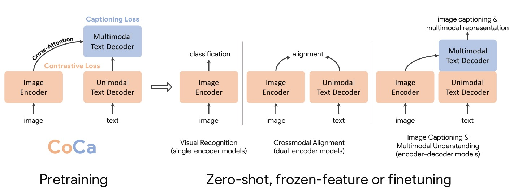
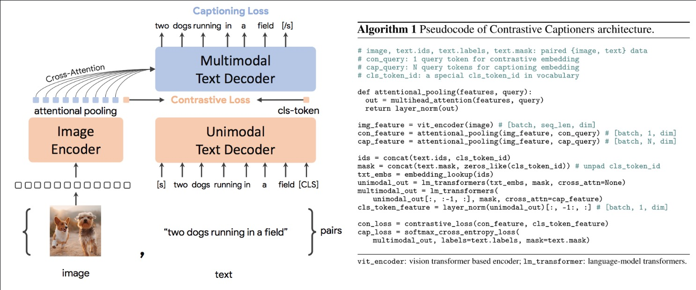

> The creation of high quality labeled datasets for the purposes of training Computer Vision models remains one of the most time consuming tasks for Computer Vision research. Consequently, alternative methods of extracting label information from existing images and visual data is one of the areas of focus for recent research. In this blog we explore  these state of the art methods in pre-training Image Classification models, namely CLIP (Contrastive Language–Image Pre-training) and CoCa (Contrastive Captioners). Extracting latent labels from images already associated with text widely available on the internet is a promising method to fast-track the training of Computer Vision models using text *and* image encoders.


- [Introduction](#introduction)
- [Background](#background)
    - [Contrastive Representation Learning](#contrastive-representation-learning)
    - [NLP and Zero-Shot Transfer Learning](#nlp-and-zero-shot-transfer-learning)
- [CLIP](#clip)
  - [Environment setup](#environment-setup)
  - [Datasets](#datasets)
  - [Code](#code)
    - [Psuedocode implementation of CLIP:](#psuedocode-implementation-of-clip)
    - [CLIP Visual Encoder for CIFAR 10](#clip-visual-encoder-for-cifar-10)
    - [CIFAR training loop](#cifar-training-loop)
  - [CLIP Results](#clip-results)
- [CoCa](#coca)
- [Relevant Research Papers](#relevant-research-papers)
- [References](#references)


## Introduction

Our project aims to validate and expand upon novel contrastive approaches to pre-training image classification models, combining text and image encoders to achieve high accuracy. Contrastive pre-training seeks to extract latent labels for images from related text in order to bypass the usual need for tedious manual labeling. Moreover, this approach allows for image classification models to recognize classes for which it wasn't originally trained on using "zero-shot learning", overcoming the inherent limations of relying on a finite set of classes. We will explore the original approach taken in [1] with a variety of datasets and varying image classifcation architectures. Then, we'll examine state of the art extensions of the original paper [2] with more modern encoders and even generative methods.

## Background

#### Contrastive Representation Learning
In principle, contrastive representation learning seeks to make machine learning models more closely mimic the way humans learn to categorize the world around them. The standard approach of machine learning is to miminimize a cost function know as "loss" representing how far off a model was from predicting the correct class of input data. With contrastive learning, the loss is calculated both from the how closely the model predicted the correct class but also how "far" it was from predicting incorrect classes.

#### NLP and Zero-Shot Transfer Learning
Research in 2017 revealed the potential of using Natural Language Processing (NLP) to aid in expanding the output feature space for image classification tasks. Rather than relying on a fixed set of class labels, the use of NLP allows for new labels to be introduced simply by learning a the textual encoding of said labels. This allows for zero-shot transfer learning, where models had the theoretical capability to predict classes on which they had not been trained for previously unseen data. However, the accuracy of the NLP based zero-shot method was poor on benchmark datasets such as ImageNet compared to state of the art (SoTA) methods. While the approach was improved by using a vastly larger datasets during training, training was slow and abandoned full capabilities of zero-shot transfer by restricting outputs to the output labels of the target benchmarks.

## CLIP

The Contrastive Language–Image Pre-training approach united contrastive representation learning with the existing zero-shot approach to using NLP to classify images in the form of a joint embedding matrix between text encodings and image encodings [1]. The key advancement was to use the aforementioned encodings to perform contrastive learning rather than the standard prediction where only the correct class is considered. Not only does this approach improve the training efficiency on the ImageNet accuracy benchmark compared to the status quo NLP based models, but it retains the full zero-shot capabilities. During pre-training, the model learns to maximize the similarity scores between correct image and text encodings while maximimizing dissimilirity scores between incorrect pairings:


*Figure 1: Summary of Contrastive Language–Image Pre-training (CLIP)*

To adopt additional labels unseen during pre-training, all that needs to be done is to learn the encoding of these new potential classes. Then, during the forward pass, the model uses the  newly augment set of text label encodings to sythesize a linear classifier which calculates the highest similarity score between input images and said labels. While the length of the text encodings does have a finite length (76 elements in the case of CLIP), this representation still allows for a broad range of labels to be introduced for almost any downstream image classification task.


*Figure 2: Zero-shot predictive capabilities of CLIP*


### Environment setup

[PLACEHOLDER]

### Datasets

[PLACEHOLDER]

[WILL USE CIFAR AND IMAGENET]

### Code

Link to WIP Colab: https://colab.research.google.com/drive/1e-foMlRTY2Q-vhC3Wp4EVyjD5stG1QHl?usp=sharing&authuser=4#scrollTo=5eiaKVj--wUH

#### Psuedocode implementation of CLIP:
```
# image_encoder - ResNet or Vision Transformer # text_encoder  - CBOW or Text Transformer 
# I[n, h, w, c] - minibatch of aligned images 
# T[n, l]       - minibatch of aligned texts 
# W_i[d_i, d_e] - learned proj of image to embed 
# W_t[d_t, d_e] - learned proj of text to embed 
# t             - learned temperature parameter 
# extract feature representations of each modality 
I_f = image_encoder(I) #[n, d_i] 
T_f = text_encoder(T)  #[n, d_t] 

# joint multimodal embedding [n, d_e] 
I_e = l2_normalize(np.dot(I_f, W_i), axis=1) 
T_e = l2_normalize(np.dot(T_f, W_t), axis=1) 

# scaled pairwise cosine similarities [n, n] 
logits = np.dot(I_e, T_e.T) * np.exp(t)

# symmetric loss function 
labels = np.arange(n) 
loss_i = cross_entropy_loss(logits, labels, axis=0) 
loss_t = cross_entropy_loss(logits, labels, axis=1) 
loss   = (loss_i + loss_t)/2
```

#### CLIP Visual Encoder for CIFAR 10
```
CLIP(
  (visual): VisionTransformer(
    (conv1): Conv2d(3, 768, kernel_size=(32, 32), stride=(32, 32), bias=False)
    (ln_pre): LayerNorm((768,), eps=1e-05, elementwise_affine=True)
    (transformer): Transformer(
      (resblocks): Sequential(
        ##### Includes 12 of the following Residual Attention blocks #####

        (0): ResidualAttentionBlock(
          (attn): MultiheadAttention(
            (out_proj): NonDynamicallyQuantizableLinear(in_features=768, out_features=768, bias=True)
          )
          (ln_1): LayerNorm((768,), eps=1e-05, elementwise_affine=True)
          (mlp): Sequential(
            (c_fc): Linear(in_features=768, out_features=3072, bias=True)
            (gelu): QuickGELU()
            (c_proj): Linear(in_features=3072, out_features=768, bias=True)
          )
          (ln_2): LayerNorm((768,), eps=1e-05, elementwise_affine=True)
        )
        ##### ... #####
      )
    )
    (ln_post): LayerNorm((768,), eps=1e-05, elementwise_affine=True)
  )
  (transformer): Transformer(
    (resblocks): Sequential(
      ##### Includes 12 of the following Residual Attention blocks #####

      (0): ResidualAttentionBlock(
        (attn): MultiheadAttention(
          (out_proj): NonDynamicallyQuantizableLinear(in_features=512, out_features=512, bias=True)
        )
        (ln_1): LayerNorm((512,), eps=1e-05, elementwise_affine=True)
        (mlp): Sequential(
          (c_fc): Linear(in_features=512, out_features=2048, bias=True)
          (gelu): QuickGELU()
          (c_proj): Linear(in_features=2048, out_features=512, bias=True)
        )
        (ln_2): LayerNorm((512,), eps=1e-05, elementwise_affine=True)
      )
      ##### ... #####
    )
  )
  (token_embedding): Embedding(49408, 512)
  (ln_final): LayerNorm((512,), eps=1e-05, elementwise_affine=True)
```

#### CIFAR training loop
```
for epoch in range(EPOCH):
  for batch in tqdm(train_dataloader):
      optimizer.zero_grad()

      images,texts = batch 
    
      images= images.to(device)
      texts = texts.to(device)
    
      logits_per_image, logits_per_text = model(images, texts)

      ground_truth = torch.arange(len(images),dtype=torch.long,device=device)

      total_loss = (loss_img(logits_per_image,ground_truth) + loss_txt(logits_per_text,ground_truth))/2
      total_loss.backward()
      if device == "cpu":
          optimizer.step()
      else : 
        convert_models_to_fp32(model)
        optimizer.step()
        clip.model.convert_weights(model)
```
Note how the loss used is the sum of the text encoder loss as well as the image loss.

### CLIP Results

Initial Proof of Concept:
```
image, class_id = cifar100[3637]
image_input = preprocess(image).unsqueeze(0).to(device)
with torch.no_grad():
    image_features = model.encode_image(image_input)
    text_features = model.encode_text(text_inputs)

# Pick the top 5 most similar labels for the image
image_features /= image_features.norm(dim=-1, keepdim=True)
text_features /= text_features.norm(dim=-1, keepdim=True)
similarity = (100.0 * image_features @ text_features.T).softmax(dim=-1)
values, indices = similarity[0].topk(5)

# Print the result
print("\nTop predictions:\n")
for value, index in zip(values, indices):
    print(f"{cifar100.classes[index]:>16s}: {100 * value.item():.2f}% index:{index}")

### CELL OUTPUT ###
Top predictions:

           snake: 65.19% index:78
          turtle: 12.44% index:93
    sweet_pepper: 3.92% index:83
          lizard: 1.91% index:44
       crocodile: 1.71% index:27

```

 


## CoCa

In 2022 an extension of the ideas explored by CLIP was published in the form of CoCa (Contrastive Captioners). CoCa combines the contrastive learning methods of CLIP with techniques from Generative Adversarial Networks. First, note that CoCa uses a single image-text foundation that contains the to execute three different downstream tasks including Visual Recognition (single encoder), Crossmodal Alignment (dual encoder), and Image Captioning & Multimodal Understanding (encoder-decoder). However, for the purposes of this blog we will focus solely on the Image Classification capabilities of the architecture while leaving the other capabilities to a brief discussion. The dual encoder model shown below is used for downstream Image Classification.


*Figure 3: CoCa Overview*

The primary change made to the architecture is the separation of the text decoder transformer into two parts, a unimodal decoder and a multimodal decoder. For the test-time downstream image classification task, only the Unimodal Text Decoder is used. However, the model itself is trained using a combination of the contrastive loss from the image encoding and unimodal text encodings as well as the captioning loss from the multimodal text encodings and the cross  attentional pooling of image encodings. The inclusion of both the captioning loss and the contrastive loss diversifies the training process and likely allows the model to extract more semantic meaning from the latent text labels because of the added focus on captioning loss (for the purposes of generative captioning).


*Figure 4: CoCa architecture and PseudoCode*


## Relevant Research Papers

**Learning Transferable Visual Models From Natural Language Supervision**

Proposes a novel method of training image classification models via latent label extraction with text encoders [1]

Website article: https://openai.com/blog/clip/

Paper: https://arxiv.org/abs/2103.00020

Code: https://github.com/openai/CLIP


**Coca: Contrastive captioners are image-text foundation models**

Presents Contrastive Captioner (CoCa), a minimalist design to pretrain an image-text encoder-decoder foundation model jointly with contrastive loss and captioning loss, thereby subsuming model capabilities from contrastive approaches like CLIP and generative methods like SimVLM. [2]

Paper: https://arxiv.org/abs/2205.01917

Code: https://github.com/lucidrains/CoCa-pytorch

**An Image is Worth 16x16 Words: Transformers for Image Recognition at Scale**

Demonstrates a method of image classification using a pure transformer applied directly to sequences of image patches which performs very well on image classification tasks without the use of a CNN. [3]

Paper: https://arxiv.org/abs/2010.11929

Code: https://github.com/google-research/vision_transformer

## References

[1] Radford, Alec, et al. "Learning transferable visual models from natural language supervision." International conference on machine learning. PMLR, 2021.

[2] Yu, Jiahui, et al. "Coca: Contrastive captioners are image-text foundation models." arXiv preprint arXiv:2205.01917 (2022).

[3] Dosovitskiy, Alexey, et al. "An image is worth 16x16 words: Transformers for image recognition at scale." arXiv preprint arXiv:2010.11929 (2020).