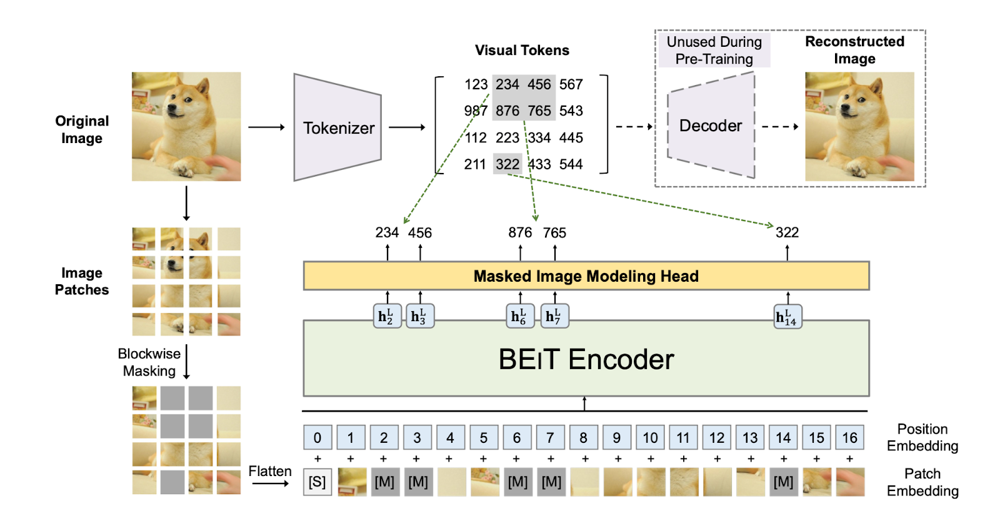
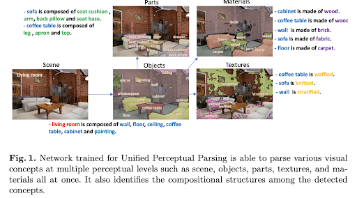
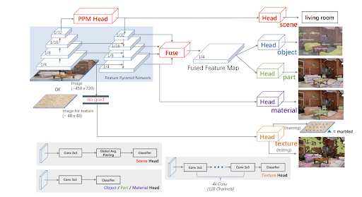
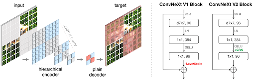
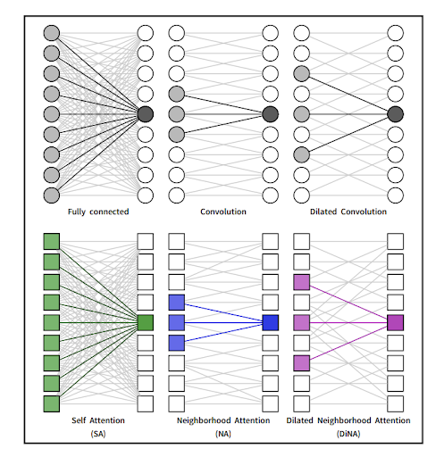

<!--more-->
{: class="table-of-content"}
* TOC
{:toc}

## Abstract
The recent emergence and explosion of semantic segmentation models in machine learning, in particular Unified Perceptual Parsing Network (UPerNet), has largely been attributed to advancements made both in the architecture of modern Convolutional Neural Networks (CNN) which allow for increased efficiency (i.e. large number of Residual Networks included in UPerNet’s framework) as well as the progress of hardware – namely the transition to widespread TPU usage (Xiao et al. 2018). Not only have decoder heads like UPerNet revolutionized the semantic segmentation space, but the relatively young model has yet to be fully optimized as its performance also depends on the strength and compatibility of underlying encoders used in conjunction with UPerNet which perform feature extraction on raw image data to be used as input for UPerNet. 
Drawing largely on the framework and implementation of UPerNet highlighted in Xiao et al., we used three different encoders as backbones for UPerNet, the fully convolutional ConvNeXt V2, attention-based Neighborhood Attention Transformer (NAT), and its successor Dilated Neighborhood Attention Transformer (DiNAT), to check for differences in efficacy on the benchmark ADE20K dataset. After training and testing, we attempted to visualize our results by leveraging the Class Activation Mapping (CAM) method; however, the results were inconclusive and failed to determine which was the best encoder to pair with UPerNet.

## Introduction

# Semantic Segmentation
Image-centered computer vision tasks, as outlined in the lecture slides, can largely be split up into four categories: classification, object detection, instance segmentation, and semantic segmentation. Among the aforementioned subtopics, the one we will hone in on over the course of this report is semantic segmentation. By labeling (classifying) each pixel in an image rather than object instances, semantic segmentation differentiates itself from classical object detection by sacrificing classification of object instances in favor of being able to label every single pixel including background and continuous “stuff (sky, grass, water, trees, etc.)” (Zhou 2023). To do so, a traditional encoder-decoder model is used where the encoder architecture deals with the problem of “how to better encode spatial context information” and the decoder architecture answers the question of “how to best maintain the spatial structure of the mask” (Zhou 2023). 

# Hypotheses and Goal
By fixing the decoder architecture to the UPerNet framework, we hope to investigate the effect of three different backbones (encoders), ConvNeXt V2, NAT, and DiNAT, on the performance of UPerNet and its ability to accurately label/classify pixels in an image. Moreover, the different encoder approaches (independent variable) will all be tested on a constant dataset to maintain control and yield valid results for measuring UPerNet performance (dependent variable). With current innovations in the attention field, many new architectures like NAT and DiNAT have appeared which utilize the local attention aspect which reduces the time and space complexity of attention to O(n) rather than O(n2); however, while NAT and DiNAT have made many major improvements to the usually slow attention methods, the underlying issues of difficulty of training, enormous computational costs associated with attention weights, and overreliance on attention itself lead us to believe that given the limited computational resources at our disposal, ConvNeXt V2, a fully convoluted encoder, will outperform the NAT and DiNAT.

## Method

# Unified Perceptual Parsing Network (UPerNet)
The speciality of UPerNet lies within its innovation of attempting “to solve several visual recognition tasks simultaneously,” more commonly referred to as multi-task learning (Xiao et al. 2018). While semantic segmentation is the underlying task, Unified Perceptual Parsing aims to not only classify pixels like traditional semantic segmentation, but also to “recognize as many visual concepts as possible from a given image. Possible visual concepts are organized into several levels: from scene labels, objects, and parts of objects, to materials and textures of objects” (Xiao et al. 2018). The figure below, taken from Xiao et al. 2018, provides a fundamental viewpoint and example of the aims of this network.

Figure 1. The above images show the results of running UPerNet on an image with not only each pixel classified but also each object’s material and texture labeled.
Delving more deeply into the actual architecture of UPerNet, the network uses a Feature Pyramid Network (FPN), which is a top-down method of feature extraction, as a baseline. Furthermore, UPerNet places a Pyramid Pooling Module (PPM) onto the last layer of encoder (before application of the FPN) in order to resolve the issue of smaller empirical receptive field size of deep CNNs (Xiao et al. 2018). At each level of the FPN, different heads are attached to separate levels of visual concepts (i.e. object head vs. scene head) and perform the necessary tasks set forth above. Thus, as a whole, UPerNet is able to perform multiple computer vision tasks at once which enhances decoder ability while decreasing latency of having to run a different decoder for every task. The network structure given by the creators of UPerNet is provided below (Xiao et al. 2018).

Figure 2. The above figure shows the general architecture of UPerNet to the left with the results of different heads of the framework shown in a collection of images to the right.

#ConvNeXt V2
Based loosely on ResNet ConvNet, ConvNeXt V2 is the second iteration of ConvNeXt which is a model that attempts to use a convoluted neural network to model the ability of vision transformers like ViT. The obvious advantages of such a network is that it retains the easiness of design and implementation of CNNs while performing at similar levels and even outperforming vision transformers which are much more complicated. ConvNeXt came about by tweaking high-level design structures of ResNet ConvNet as well as changing some smaller scale decisions (i.e. replacing ReLU with GeLU) and showed great accuracy and performance even when compared to much more complicated vision transformers on the same datasets and training methods.
The main improvement of ConvNeXt V2 is that it “makes mask-based self-supervised learning effective for ConvNeXt models and achieving results similar to those obtained using transformers,” which is essential for application as an encoder for UPerNet. To do so, ConvNeXt V2 uses sparse convolutions in order “to process only the visible parts” of an image. Additionally, ConvNeXt V2 uses a ConvNeXt block (shown below) in place of the transformer decoder used in ConvNeXt V1 which makes it a fully convoluted network and decreases model complexity greatly with the general framework also provided below. Finally, a Global Response Normalization (GRN) is applied to “enhance inter-channel feature competition” (Woo et al. 2023).

Figure 3. The above figure shows the framework of ConvNeXt V2 to the left and the differences between the version blocks on the right (i.e. addition of GRN in ConvNeXt V2 block).

# NAT and DiNAT
Developed by Guo et al., the Neural Architecture Transformer seeks to combat some of the biggest issues posed by attention methods, namely the high time and space complexity (O(n2) with n being the length of input sequence). With such a large input sequence from all pixels in an image, the amount of computation that must be performed for attention weights to be optimized is extremely costly. To avoid this, NAT uses “a pixel-wise operation, localizing self attention (SA) to the nearest neighboring pixels, and therefore enjoys a linear time and space complexity compared to the quadratic complexity of SA (self-attention)” (Hassani et al. 2022); furthermore, the structure of NAT’s architecture includes some aggressive downsampling at the earliest sequential layers to reduce cost of high resolution images. Thus, some of the initial hesitations for using attention as the basis for encoder architectures are resolved by NAT.
The extension of NAT to DiNAT comes from the “natural extension of Neighborhood Attention to Dilated Neighborhood Attention” which “captures more global context and increases receptive field size exponentially with no additional cost” (Hassani et al. 2023). Looking more closely at the concept of dilation, we learned that dilated convolution increases the receptive field size without increasing the number of weights. This same concept is applied here where DiNAT is able to capture both local and global attention – a tremendous boost from traditional NAT with greater speed and accuracy reported by Hassani et al. A comparison of both encoders is shown below.

Figure 4. The above figure shows comparisons between NA used in NAT and the combination of NA and DiNA in DiNAT.

# Dataset
The dataset we are using is popularly known as ADE20k. Used in many other landmark semantic segmentation, ADE20k contains 20,000 images with 150 object categories. What makes it so highly-used in semantic segmentation is the fact that the images are scene-centric which is essential to semantic segmentation; moreover, its status as a benchmark dataset provides us with some ability to compare the different encoders on a concrete and credible basis.

## Experiments and Results
To load the dataset so it could be used, we uploaded the zip file to Google Drive and unzipped it in Colab. We then created a class for this dataset. We also used a DataLoader to be able to load batches of the data during training. To load the models into python, we used the Transformers library. This library contains architectures for many models, including all the encoders and decoders we planned on using. We also had to load in an image processor for each of the encoders to ensure the input image was in the right format. Here is an example for the ConvNeXtV2 encoder:
cn_config = ConvNextV2Config()
cn_un_config = UperNetConfig(backbone_config=cn_config)
cn_un = UperNetForSemanticSegmentation(cn_un_config).from_pretrained("openmmlab/upernet-convnext-tiny").to(device)
cn_un_img_proc = ConvNextImageProcessor()
Here, we load in the correct configuration and image processor for the model. We also froze all the layers of these models except for the very last few layers. This was so we could use the pretrained models that were given and could finetune them to ADE20K.
We also needed to define functions to calculate both pixel accuracy and IoU. These are two important metrics to measure the success of our model’s ability to perform semantic segmentation. Pixel accuracy is the ratio of correctly classified pixels to the total number of pixels. The IoU method of analyzing results is commonplace among many computer vision tasks and is based on splitting the image into regions. Each proposed region is compared against the true region, and the IoU score is the ratio of the number of pixels in the intersection of the two to the number of pixels in the union of the two.
Here is our code to calculate these two metrics:
def pixel_accuracy(output, mask):
    with torch.no_grad():
        output = torch.argmax(F.softmax(output, dim=1), dim=1)
        correct = torch.eq(output, mask).int()
        accuracy = float(correct.sum()) / float(correct.numel())
    return accuracy
def mIoU(pred_mask, mask, smooth=1e-10, n_classes=23):
    with torch.no_grad():
        pred_mask = F.softmax(pred_mask, dim=1)
        pred_mask = torch.argmax(pred_mask, dim=1)
        pred_mask = pred_mask.contiguous().view(-1)
        mask = mask.contiguous().view(-1)
        iou_total = 0
        for class in range(0, n_classes): #loop per pixel class
            true_class = pred_mask == class
            true_label = mask == class
            intersect = torch.logical_and(true_class, true_label).sum().float().item()
            union = torch.logical_or(true_class, true_label).sum().float().item()
            iou_total += (intersect + smooth) / (union +smooth)
        return iou_total / n_classes
Once this was setup, the last part to finish before we could start training was the training loop. This loop used a criterion to find the loss between the output and the correct mask. It then used an optimizer to optimize all the weights in order to reduce the loss.
def train(model, name, train_loader, val_loader, optimizer, criterion, num_epochs):
    for epoch in range(num_epochs):
        model.train()
        with tqdm(total=len(train_loader), desc=f'Epoch {epoch + 1}/{num_epochs}') as pbar:
            for input, data in train_loader:
                image = data[0].to(device)
                mask = data[1].to(device)
                optimizer.zero_grad()
                print(image.size())
                output = model(image)
                loss = criterion(output, mask)
                loss.backward()
                xm.optimizer_step(optimizer)
                pbar.update(1)
                pbar.set_postfix(loss=loss.item())
        model_path = f'{name}_epoch_{epoch}.pt'
        torch.save(model.state_dict(), model_path)
        avg_loss, pixel_accuracy, avg_iou_score = evaluate(model, val_loader, criterion)
        print(f'Validation set: Average loss = {avg_loss:.4f}, Pixel accuracy = {pixel_accuracy:.4f}, Average IoU score = {avg_iou_score:.4f}')
Unfortunately, this is where we started running into problems. We were unable to have the train function successfully run on any of our models regardless of the encoder. We applied different strategies to make this work, such as changing the code for our dataset class, applying different transformations to the input image, and so forth. For some reason, even though the image would successfully be processed by the corresponding image processor to the model we were using, the model was never able to correctly run on the image.

## Discussion
We had most of the pieces together in order to figure out which encoder would be most successful for UPerNet. Our data was loaded into a dataset and was set up to be loaded into batches during training. We were able to load the encoders and decoder we wanted to use into our code. We also had functions to calculate a couple metrics, pixel accuracy and IoU, in order to test how well our model was performing semantic segmentation on the ADE20K dataset. However, when it came time to put all of these pieces together, they would not fit. Somehow, even though the image processors we loaded in were able to process the images from the dataset, we could not get any of our models to successfully run on them. Because of this, we were unable to perform training. Unfortunately, this meant we could not make any progress in determining which encoder, ConvNeXt V2, NAT, or DiNAT, would be best for encoding images for UPerNet to process. We were also unable to use CAM to visualize our results. In retrospect, we most likely should have used a different library to load these encoders and decoder into our code. If we had been able to get all of the pieces we finished to work together, because we took advantage of the previous success of these pretrained models, I suspect we would have seen useful results. 

## Presentation Link
https://youtu.be/W87jOS2OkmE

## References
- Woo, Sanghyun, et al. “ConvNeXt V2: Co-designing and Scaling ConvNets with Masked Autoencoders. “ arXiv preprint arXiv:2301.00808. 2023.

- Hassani, Ali, et al. “Dilated Neighborhood Attention Transformer. “ arXiv preprint arXiv:2209.15001. 2023.

- Xiao, Tete, et al. “Unified Perceptual Parsing for Scene Understanding. “ arXiv preprint arXiv:1807.10221. 2018.

- Hassani, Ali, et al. “Neighborhood Attention Transformer. “ arXiv preprint arXiv:2204.07143. 2022.

- Scene Parsing through ADE20K Dataset. Bolei Zhou, Hang Zhao, Xavier Puig, Sanja Fidler, Adela Barriuso and Antonio Torralba. Computer Vision and Pattern Recognition (CVPR), 2017.

- Semantic Understanding of Scenes through ADE20K Dataset. Bolei Zhou, Hang Zhao, Xavier Puig, Tete Xiao, Sanja Fidler, Adela Barriuso and Antonio Torralba. International Journal on Computer Vision (IJCV).
