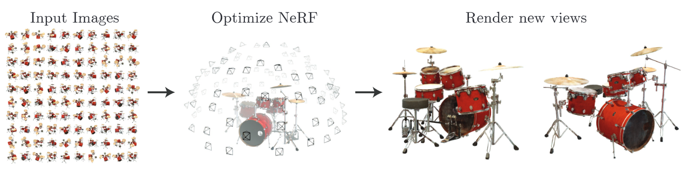
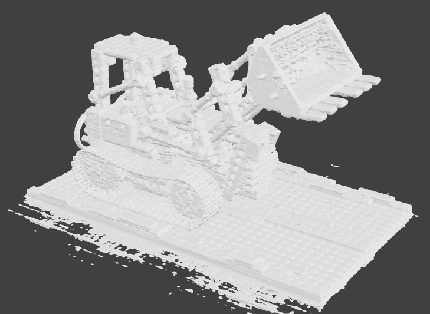
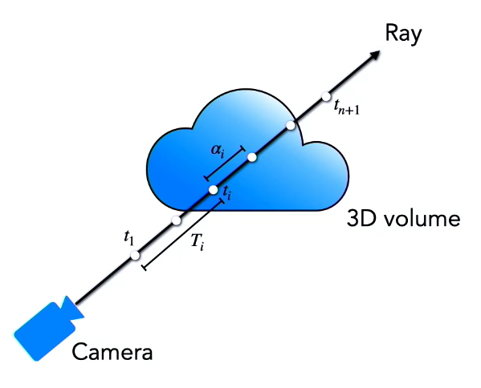
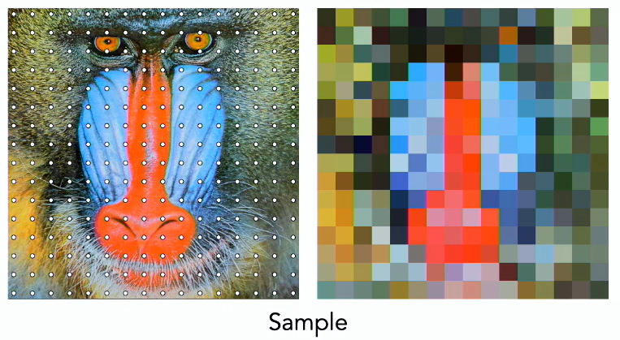
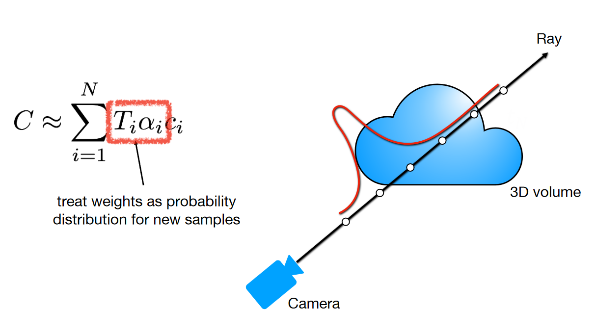
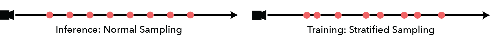

> This project is an introduction to the Neural Rendering Field (NeRF) model for generating novel views of 3D scenes. It explains what a NeRF is, how it works, and provides a complete example of how to build the original NeRF architecture using PyTorch in Google Colab.

<!--more-->

{: class="table-of-content"}
* TOC
{:toc}

---

### **Note**:

This project may not exactly meet the specifications for this assignment, but I wanted to do something with 3D and I was having a hard time understanding the material and an even harder time getting any example libraries to work on GCP or Colab. For me, one of the best ways to ensure I understand something is to try to teach it to others. An introduction to the most basic version of NeRF seemed like a good way to reinforce my understanding and at least try to meet the goal of learning something new.

---

# What is a NeRF?

A Neural Radiance Field (NeRF) is a type of generative model that takes a set of images of a 3D scene along with their orientations and creates new views of that scene. NeRFs were first introduced to the world of deep learning and computer vision in the ECCV 2020 paper “NeRF: Representing Scenes as Neural Radiance Fields for View Synthesis” [1] and the technique has become widely popular, garnering over 2500 citations since.

<figure>
  <video autoplay loop muted  width='25%'>
    <source src='../assets/images/team50/colorspout_200k_rgb.mp4' type='video/mp4'>
  </video>
  
  <video autoplay loop muted  width='25%'>
    <source src='../assets/images/team50/trike_200k_rgb.mp4' type='video/mp4'>
  </video>
  
   <video autoplay loop muted  width='25%'>
    <source src='../assets/images/team50/fullmagnolia_200k_rgb.mp4' type='video/mp4'>
  </video>
  <figcaption><i>Videos credit <a href="https://www.matthewtancik.com/nerf">NeRF website</a></i></figcaption>
</figure>

NeRF has revolutionized the field of 3D scene synthesis, enabling the creation of realistic images of scenes with complex geometry and lighting that would be difficult or impossible to capture with traditional photography or rendering techniques.

The goal of the NeRF model is to learn a continuous function for a volumetric representation of a 3D scene captured by a set of images. This function is represented as a neural network that takes a point in space and a view direction as input and outputs the color of light along the corresponding viewing ray. The model can then be queried for "novel view synthesis," which is the generation of new images of the same scene, by providing any location and any angle, including those not present in the original image set.

<figure>
    
    <figcaption><i>Image credit <a href="https://arxiv.org/pdf/2003.08934.pdf">original NeRF paper</a></i></figcaption>
</figure>

Although NeRFs learn directly from images, there are no convolutional layers or transformers in the original model. Instead, NeRFs rely on a concept known as a [light field, or radiance field](https://en.wikipedia.org/wiki/Light_field), which is a functional representation of all of the light transport within a 3D scene. This function is differentiable, and the NeRF model trains a simple fully connected network, or [multi-layer perceptron (MLP)](https://en.wikipedia.org/wiki/Multilayer_perceptron), to learn the parameters of an approximation of the function using only the images of the scene and their poses.

This method of learning a volumetric representation of the space based on light transport provides several nice properties:

* The model learns directly from the data.

* The continuous function represents very small, thin, or complex structures very well

* Since the function models light, lighting of the scene, as well as physical properties such as roughness and specularity, are handled implicitly

* Since the model is learning a the parameters of a function, the weights learned by the model may be significantly smaller in storage size than the images used to produce them

Additionally, in performing the volumetric rendering, the model explicitly defines the 3D shape and appearance of the scene as a continuous function. This allows for the NeRF output to be converted to a 3D mesh using a technique called [marching cubes](https://en.wikipedia.org/wiki/Marching_cubes).

<figure>
    
    <figcaption><i>Image credit <a href="https://www.matthewtancik.com/nerf">NeRF website</a></i></figcaption>
</figure>

# How does it work?

## The Plenoptic Function

The plenoptic function is a theoretical concept in computer graphics and computer vision that describes all possible light rays passing through a 3D scene and reaching a camera sensor [2]. It includes information about the intensity, direction, and location of the rays, as well as other optical properties. Importantly, it is a differentiable function, which means it can be learned by a neural network.

If a person is looking out at the world, that person can view some portion of a sphere around their head at any given time. If their view is modeled as a single ray, then the intensity of light that they see can be modeled by the plenoptic function $P$:

$$P(\theta,\phi,\lambda,t,V_X,V_Y,V_Z)$$

This 7D function represents the **intensity of light** seen from any **position** ($V_x,V_y,V_z$) and any **direction** ($\theta,\phi$), over **time** ($t$), as a function of **wavelength** ($\lambda$). Querying the plenoptic function is a theoretical way to recreate the person's entire visual reality. 

The goal of NeRF to recreate the plenoptic function from a set of images in order to be able to visually reconstruct an entire 3D scene. However, this means that **NeRF is not about recreating 3D geometry or surfaces**. Instead, each viewing direction (ray) that can be queried can be represented as single pixel in an image. Thus, the 3D representation that NeRF is trying to learn is not a mesh or point cloud, but a volumetric representation of the whole space. However, unlike voxels which represent discrete data points within the space, NeRF is trying to learn the continuous function that represents it.

Since NeRF is working with RGB images of a static scene, the plenoptic function can be simplified. Time becomes a constant and the wavelength of the light can be removed in favor of allowing the function to output RGB color:

$$P(\theta,\phi,V_X,V_Y,V_Z)$$

The NeRF model learns this 5D approximation of the plenoptic function using a neural network, which takes as input a **position** ($V_x,V_y,V_z$) in space and a ray representing the **direction the point is viewed from** ($\theta,\phi$), and predicts the corresponding **RGB color** and **density** ($\sigma$) of light at that position. By modeling the plenoptic function NeRF can generate photo-realistic images of scenes from any viewpoint, even for scenes with complex lighting and geometry.

$$(\underbrace{x,y,z}_{\substack{\text{spatial} \\ \text{location}}},\underbrace{\theta,\phi}_{\substack{\text{viewing} \\ \text{direction}}}) \rightarrow \underbrace{NeRF}_{\substack{\text{MLP}}} \rightarrow (\underbrace{r,g,b}_{\substack{\text{output} \\ \text{color}}},\underbrace{\sigma}_{\substack{\text{output} \\ \text{density}}})$$

Although the underlying neural network of the NeRF model should be capable of outputting the color and density of light at any point viewed from any angle in a 3D scene, there is no way to train it purely based on this data. There is no way to provide a ground truth label to the model which accurately describes those values. Additionally, the entire purpose of the model is be able to recover image representations of the 3D scene.

A technique called Volumetric Rendering can be used to recover an image from NeRF's volumetric representation of the 3D space. During training, an image can be recovered with the same parameters as a real image of the space taken by a camera in order to compare and optimize the model. Once the model has been optimized, new images can be generated with any parameters to accomplish "novel view synthesis."

## Volumetric Rendering

One of the most important aspects of the NeRF model is analysis by synthesis. This means that optimization is applied at the rendering step, when a new image is rendered and compared to the original. In order to accomplish this, there must be a differentiable rendering function that can be optimized.

In order to render an image from a 3D volume, for each pixel in the image, a ray is generated from the camera position passing through that pixel. The direction of the ray is determined by the camera's intrinsics and extrinsics, such as it's position and focal length. The volume can be considered as a cloud of RGB particles, and it every time a ray hits a particle it returns that RGB value. As the ray travels through the volume, the chance of hitting at particle at any point $t$ is a probabilistic distribution determined by the density of the volume ($\sigma$). At every point along the ray, the chance of hitting a particle earlier in the ray also influences the chance of a particle in the current position being hit, a property known as transmittance:

$$P(\text{first hit at }t) = P(\text{no hit before }t) \times P(\text{hit at }t) = \underbrace{T(t)}_{\substack{\text{Transmittance}}}\overbrace{\sigma(t)}^{\substack{\text{density}}}dt$$

However, transmittance $T(t)$ is actually also a function of density $\sigma(t)$ because:

1. $P(\text{no hit before }t + dt) = P(\text{no hit before }t) \times P(\text{no hit at }t)$

2. $P(\text{no hit at }t) = 1 - P(\text{hit at }t) = 1-\sigma(t)dt$

3. $P(\text{no hit before }t) = T(t)$

Therefore, the following is true:

$$T(t + dt) = T(t) \times (1-\sigma(t)dt)$$

and a Taylor expansion can be used to find the integral of this expression:

$$T(t) + T'(t)dt = T(t) - T(t)\sigma(t)dt$$

$$\frac{T'(t)}{T(t)}dt = -\sigma(t)dt$$

$$\log T(t) = -\int_{t_0}^{t}\sigma(s)ds$$

$$T(t) = \exp(-\int_{t_0}^{t}\sigma(s)ds)$$

Given this expression for transmittance, the full probability becomes:

$$P(\text{first hit at }t) =\exp \left(-\int_{t_0}^{t}\sigma(s)ds\right)\sigma(t)dt$$

And the expected value of color, is the integral of this probability times the color:

$$ \int_{t_0}^{t} \exp \left( - \int_{t_0}^{t} \sigma(s) ds \right) \sigma(t) c(t) dt$$

However this nested integral is very difficult to solve. Instead, a technique called quadrature can be used to approximate the result with the following assumptions:

* The ray is split into segments with endpoints $\{t_1,t_2,...,t_{n+1}\}$
* The segments all have equal length $\delta _i = t_{i+1} - t_i$
* The volume density and color are (roughly) constant over each segment

These assumptions allow for the approximation:

$$\int_{t_0}^{t} \exp \left( - \int_{t_0}^{t} \sigma(s) ds \right) \sigma(t) c(t) d \approx \sum_{i = 1}^n \int_{t_i}^{t_{i+1}} \exp \left( - \int_{t_0}^{t} \sigma(s) ds \right) \sigma_i c_i dt$$

However, the inner integral is still based on $\sigma(s)$ and not on $t$. Since $s$ takes on values of $t$, the integral can be converted into a piecewise function based on limits of $t$:

$$\text{For } i \in [t_i, t_{i+1}], T(t) = \exp \left( - \int_{t_1}^{t_i} \sigma_i ds \right) \exp \left( - \int_{t_i}^{t} \sigma_i ds \right)$$

Where the first $exp$ term covers everything before the ray segment that  the current point $i$ resides in, and the second $exp$ term covers the portion of the current ray segment that lies before the point $i$. Since the inner terms no longer depend on $s$, the integrals can be simplified:

$$\exp \left( - \sum_{j=1}^{i-1} \sigma_j \delta_j \right) \exp \left( -\sigma_i(t-t_i)\right)$$

This result can be plugged back into the original equation:

$$\sum_{i = 1}^n \int_{t_i}^{t_{i+1}}  \exp \left( - \sum_{j=1}^{i-1} \sigma_j \delta_j \right) \exp \left( -\sigma_i(t-t_i)\right)\sigma_i c_i dt$$

Notice that there is now only a single term that depends on the integral variable $t$. Each of the other terms can be constant and moved out of the integral, which can then be solved.

$$\sum_{i = 1}^n \int_{t_i}^{t_{i+1}}  \underbrace{\exp \left( - \sum_{j=1}^{i-1} \sigma_j \delta_j \right)}_{\text{replace with } T_i} \exp \left( -\sigma_i(t-t_i)\right)\sigma_i c_i dt$$

$$\sum_{i = 1}^n T_i \sigma_ic_i\int_{t_i}^{t_{i+1}} \exp \left( -\sigma_i(t-t_i)\right) dt$$

$$\sum_{i = 1}^n T_i \sigma_i c_i \frac{\exp \left( -\sigma_i(t_{i+1}-t_i)\right)-1}{-\sigma_i}$$

$$\sum_{i = 1}^n T_i \sigma_i c_i \frac{1-\exp \left( -\sigma_i\delta_i\right)}{\sigma_i}$$

$$\sum_{i = 1}^n T_i c_i \left(1-\exp ( - \sigma_i \delta_i )\right)$$

Interestingly, if the final term can be labelled as opacity, and is represented as $\alpha_i$.

$$\sum_{i = 1}^n T_i c_i \underbrace{\left(1-\exp ( - \sigma_i \delta_i )\right)}_{\text{replace with } \alpha_i}$$

$$\text{pixel color} \approx \sum_{i = 1}^n T_i c_i \alpha_i$$

A connection can then be made to standard alpha compositing techniques in computer graphics.

$$T_i =\exp \left( - \sum_{j=1}^{i-1} \sigma_j \delta_j \right)$$

$$T_i = \prod_{j=1}^{i-1} \exp ( - \sigma_j \delta_j)$$

$$\alpha_j = 1 - \exp ( - \sigma_j \delta_j)$$

$$\exp ( - \sigma_j \delta_j) = 1 - \alpha_j$$

$$T_i = \prod_{j=1}^{i-1}(1-\alpha_j)$$

$$\text{pixel color} \approx \sum_{i = 1}^n c_i \alpha_i \prod_{j=1}^{i-1}(1-\alpha_j)$$

The final formula for color of the pixel is the sum over all points along the ray of the product of that point's color, its opacity, and the product of the opacity of all points before it in the viewing direction. This formula depends only on the color and density of points along a given ray for a pixel which are exactly the values that the NeRF model outputs. This means that every pixel of an image can be reconstructed using the NeRF model and then compared to the real image to calculate loss. Importantly, the function is trivially differentiable with respect to those color and density values for modern machine learning systems ands the entire process can be optimized using this loss value.

<figure>
    
    <figcaption><i>Image credit <a href="https://vimeo.com/showcase/10108932">ECCV'22 NeRF Presentation</a></i></figcaption>
</figure>

## Representing the Data

The goal of the NeRF model is to get clear, photorealistic images, but the NeRF model attempts to represent a 3D space as a single function and then learn that function using a standard multilayered perceptron network. Such neural networks struggle to learn high frequency functions based on continuous inputs. When, for example, two pixels are very close to each other, but hold completely different colors, the neural network has a hard time considering them to be separate entities and will often try to average the colors between them. This results in a blurry image, devoid of hard edges.

<figure>
  <video autoplay loop muted  width='50%'>
    <source src='../assets/images/team50/fox.mp4' type='video/mp4'>
  </video>
  <figcaption><i>Original Video credit <a href="https://www.youtube.com/watch?v=nVA6K6Sn2S4">Fourier Features via Youtube</a></i></figcaption>
</figure>

A solution to this problem is a technique called positional encoding that is used in another very popular machine learning called a transformer. In a transformer, inputs are processed in parallel which makes it hard to the model to maintain an idea of what order they belong in. Positional encoding is the practice of mapping those inputs to a higher dimensional space in order to maintain their spatial relationships during parallel processing. In the NeRF model, the inputs are not processed in parallel, but the positional encoding makes it easier for the model to recognize the difference between inputs that are close together and thereby learn higher frequency functions for their representation.

<figure>
  <video autoplay loop muted  width='50%'>
    <source src='../assets/images/team50/fox2.mp4' type='video/mp4'>
  </video>
  <figcaption><i>Original Video credit <a href="https://www.youtube.com/watch?v=nVA6K6Sn2S4">Fourier Features via Youtube</a></i></figcaption>
</figure>

By performing this positional encoding before passing the inputs through the NeRF MLP, the output of NeRF actually becomes the combination of two functions:

$$F = F' \circ \gamma$$

Where $F'$ represents the MLP and $\gamma$ represents the encoding function. In the original NeRF model positional encoding is done using a series of a alternating sine and cosine functions with $L$ frequencies, applied separately to each of the dimensions of the inputs.

$$\gamma(p) = \left( \sin(2^0 \pi p), \cos(2^0 \pi p),..., \sin(2^{L-1} \pi p), \cos(2^{L-1} \pi p) \right)$$

For spatial coordinates they used $L=10$, while for the viewing direction they used $L=4$.

## Signal Processing

Another consideration for getting clear images from NeRF's volumetric representation is how points are sampled along the rays. If points are sampled too far apart, high frequency information becomes a problem once again. This is related to the idea of aliasing in image processing, where points are sampled much less frequently than the underlying pattern and the result seems very blurry.

<figure>
    
    <figcaption><i>Original Video credit <a href="https://vimeo.com/showcase/10108932">ECCV'22 NeRF Presentation</a></i></figcaption>
</figure>

One naive approach is to attempt to sample very densely, everywhere along the ray. However this results in a lot of waste because most the volume is typically empty or occluded. A better approach would be to sample points proportionally to their expected effect on the final rendering. While this may seem like an idealistic goal, the volumetric rendering function actually provides a weighting for the color at each point along the ray.

$$\text{pixel color} \approx \sum_{i = 1}^n \underbrace{T_i \alpha_i}_{\substack{\text{weight of} \\ \text{color } c_i}} c_i$$

<figure>
    
    <figcaption><i>Image credit <a href="https://vimeo.com/showcase/10108932">ECCV'22 NeRF Presentation</a></i></figcaption>
</figure>

Those weights can then be treated as a probability density function to determine which colors are more likely to contribute to the final rendering. Using this inherent information, a technique called hierarchical sampling can be applied to extract a more detailed image.

In hierarchical sampling, two NeRFs are trained at the same time. A coarse model, using more evenly spaced, but further apart sampling, and a fine model, using the weights of the points in the coarse model as a probability density function to sample many more points in the areas where the color most heavily affects the output. An important optimization is made to the coarse model to sample randomly within each of the ray segments instead of at perfectly even intervals in order to better provide a more continuous probability density for the fine model.

<figure>
    
    <figcaption><i>Image credit <a href="https://docs.nerf.studio/en/latest/nerfology/model_components/visualize_samplers.html">NerfStudio</a></i></figcaption>
</figure>

# Building a NeRF

A full working example of this model can be found in the accompanying [An Introduction to NeRFs](https://colab.research.google.com/drive/19WoCxed1EeEY1atC3IFj3KW-1SqXbKlv?usp=sharing) Colab notebook.

This example tries to closely follow the model presented in the original paper, but some consolations must be made in order to fit within the limitations of the Colab environment, especially with regards to available GPU memory.

Additionally, this example will uses preprocessed images of the synthetic LEGO bulldozer scene with known view poses and focal length.

# Going Further with NeRFs 

## Limitations

While the original NeRF model put forth some promising results, there were many limitations of what the model was capable of. Some examples include:

* Expensive / slow to train
* Expensive / slow to render
* Sensitive to sampling strategy
* Sensitive to camera pose accuracy
* Assumes static lighting
* Not a mesh
* Assumes static scene
* Does not generalize between scenes
* and more...

Even some of the perceived benefits actually get in the way when trying to take the model further. For example, the fact that lighting is baked in makes for very realistic images without expensive physics simulations for light rays, but it also makes it difficult to modify the lighting in scenes when trying to take an even more generative approach of creating novel scenes instead of just novel views.

However, in the past few years many of these challenges have been addressed. Techniques have been developed to vastly improve the speed and robustness of NeRF, including those which do not require an MLP at all.

## Extending to More Advanced Techniques

Since the original NeRF paper has released a huge number of related techniques and improvements have been found to improve and extend the model. Over the last couple years the limitations of NeRF are being overcome one by one. At the last Computer Vision and Pattern Recognition Conference (CVPR) in 2022, there were over 50 papers presenting new ideas based on the NeRF model.

Some examples extending nerf include:

* Stereo Radiance Fields (SRF)[3] (2021) and pixelNeRF[4] (2021) focus on learning NeRFs from very low image counts.
* Neural Scene Flow Fields[5] (2021) and D-NeRF[6] (2021) attempt to add support for dynamic scenes.
* GIRAFFE [7] (2021) attempts to generalize the radiance field into feature fields.
* NeROIC[8] (2022) does learning from uncalibrated images collected from the web.
* Urban Radiance Fields[9] (2022) adds LiDAR data to the NeRF model.
* Block-NeRF[10] (2022) does large-scale scene representation.
* Plenoxels[11] (2022) presents NeRF learning without the MLP neural network.
* Many more...

A team led by one of the creators of NeRF have also developed [nerfstudio](https://github.com/nerfstudio-project/nerfstudio), a tool designed to simplify the "end-to-end process of creating, training, and testing NeRFs." Their goal is for the tool to be modular, offering multiple versions of the NeRF model and many of the tweaks that can be made throughout the process.

The NeRF model marked a significant change in how to approach 3D data in computer vision. While original NeRF model may be relatively slow and bulky, the many other methods inspired by it show that the basic concepts of a continuous function approximator and differentiable renderer form a strong foundation for a variety of techniques in 3D view synthesis.

---

## References

[1] Ben Mildenhall, Pratul P. Srinivasan, Matthew Tancik, Jonathan T. Barron, Ravi Ramamoorthi, Ren Ng — [NeRF: Representing Scenes as Neural Radiance Fields for View Synthesis](https://arxiv.org/abs/2003.08934) (2020), ECCV 2020

[2] Adelson, E. H., & Bergen, J. R. — [The plenoptic function and the elements of early vision](http://persci.mit.edu/pub_pdfs/elements91.pdf) (1991). In Computational models of visual processing (pp. 3-20). MIT Press.

[3] Julian Chibane, Aayush Bansal, Verica Lazova, Gerard Pons-Moll — [Stereo Radiance Fields (SRF): Learning View Synthesis for Sparse Views of Novel Scenes](https://arxiv.org/abs/2104.06935) (2021), CVPR 2021

[4] Alex Yu, Vickie Ye, Matthew Tancik, Angjoo Kanazawa — [pixelNeRF: Neural Radiance Fields from One or Few Images](https://arxiv.org/abs/2012.02190) (2021), CVPR 2021

[5] Zhengqi Li, Simon Niklaus, Noah Snavely, Oliver Wang — [Neural Scene Flow Fields for Space-Time View Synthesis of Dynamic Scenes](https://arxiv.org/abs/2011.13084) (2021), CVPR 2021

[6] Albert Pumarola, Enric Corona, Gerard Pons-Moll, Francesc Moreno-Noguer — [D-NeRF: Neural Radiance Fields for Dynamic Scenes](https://arxiv.org/abs/2011.13961) (2021), CVPR 2021

[7] Michael Niemeyer, Andreas Geiger — [GIRAFFE: Representing Scenes as Compositional Generative Neural Feature Fields](https://arxiv.org/abs/2011.12100) (2021), CVPR 2021

[8] Zhengfei Kuang, Kyle Olszewski, Menglei Chai, Zeng Huang, Panos Achlioptas, Sergey Tulyakov — [NeROIC: Neural Object Capture and Rendering from Online Image Collections](https://arxiv.org/abs/2201.02533) (2022), Computing Research Repository 2022

[9] Konstantinos Rematas, Andrew Liu, Pratul P. Srinivasan, Jonathan T. Barron ,Andrea Tagliasacchi, Tom Funkhouser, Vittorio Ferrari — [Urban Radiance Fields](https://arxiv.org/abs/2111.14643) (2022), CVPR 2022

[10] Matthew Tancik, Vincent Casser, Xinchen Yan, Sabeek Pradhan, Ben Mildenhall, Pratul P. Srinivasan, Jonathan T. Barron, Henrik Kretzschmar — [Block-NeRF: Scalable Large Scene Neural View Synthesis](https://arxiv.org/abs/2202.05263) (2022), arXiv 2022

[11] Alex Yu, Sara Fridovich-Keil, Matthew Tancik, Qinhong Chen, Benjamin Recht, Angjoo Kanazawa — [Plenoxels: Radiance Fields without Neural Networks](https://arxiv.org/abs/2112.05131) (2022), CVPR 2022 (Oral)

---
