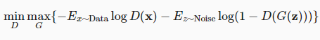
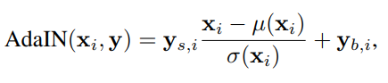
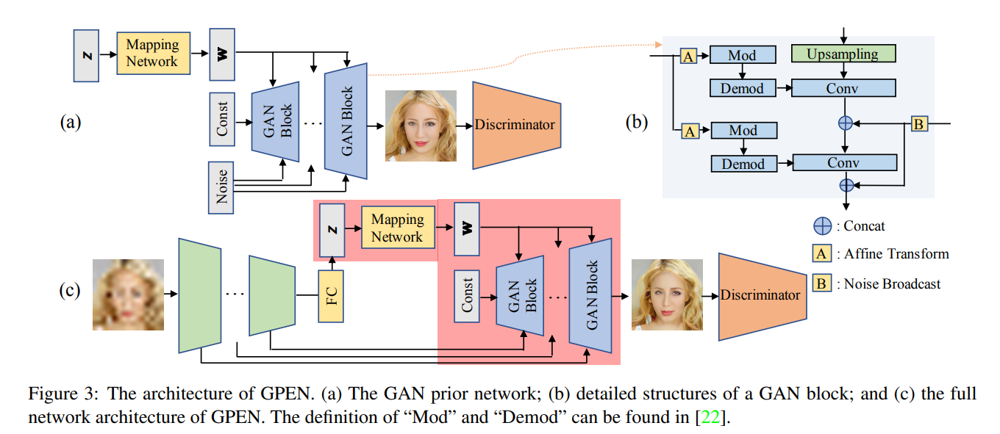
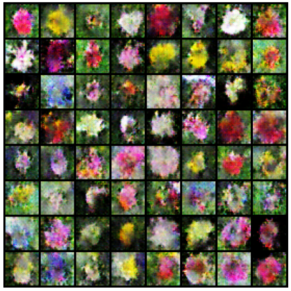
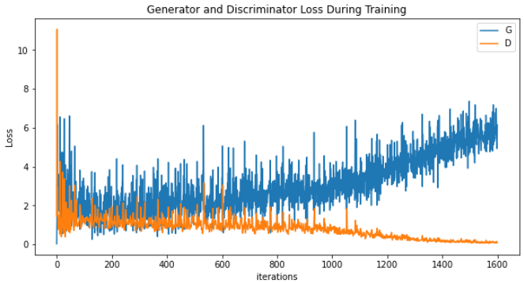

> Analyzing the Application of Generative Adversarial Networks For Face Restoration

<!--more-->
{: class="table-of-content"}

{:toc}

## Main Content
My project is to study the usage of Generative Adversarial Networks, and in particular the style-based GAN architecture, in order to generate photorealistic images with some noise involved, that allows it to be utilized in the application of face restoration. The models we will analyze will have been trained particularly on the human face, allowing it to enhance the image quality of real-world inputs. 

### Algorithms

This section will focus on the algorithms within each generative adversarial network, along with diagrams of their architectures. Since GPEN uses previous GAN models as a prior, the section will start with the DCGAN model as the foundation of a simple GAN leading into StyleGAN2-ADA, then illustrating how GPEN is able to take the previously mentioned GAN models and build upon it to work on the issue of Blind Face Restoration in the Wild.

#### DCGAN

DCGAN (and in general most GAN's) make use of the max-min loss function concept, where the generator focuses on maximizing the cross-entropy loss while the discriminator focuses on minimizing the cross-entropy loss. Therefore, we are pitting the generator and discriminator against one another in the hopes that as both get better, the discriminator will be able to tell generated models from real models, but our generator becomes so good at generating fake models that appear real. Depending on the end application use, we can either take the generator model and use it to create fake images based around the dataset it had been trained on, or we can take the discriminator model and possibly use it to test if images are real or fake (of course depending on if the GAN was trained on such similar images). 

Below is a picture of the min-max loss function where it details how the generator is looking to maximizing the cross-entropy function while the discriminator is looking to minimize it.

#### StyleGAN2-ADA

#### GPEN

### Examples of Output

#### DCGAN model

Below is an image of several images that my DCGAN model created when trained on the flowers102 dataset. The input and output of the images are only 32x32, and so limits how much the latent vector is able to capture/control of the outputted image. Due to the low resolution of my model in comparison to StyleGAN which can handle 1024x1024 images, this DCGAN implementation can only capture very broad characteristics, not the minute details/features in the dataset.

Due to several factors such as simplicity of the model, lack of features to help loss convergence, and not enough training time, I noticed that while training my model on the flowers102 dataset, that the discriminator is converging swiftly towards 0 while the generator continues to increase in loss without stopping. Logically this makes sense, as the discriminator is trained to better recognize between generated images and real images, the generator will in turn struggle to trick the discriminator into believing that its own generated outputs are real. However, what we don't want is for the discriminator to swiftly converge towards 0, which means that the discriminator is near perfect when distinguishing real from fake, and so no learning is occurring for the discriminator. Below is an image of the loss between the generator and discriminator when training on the flowers102 dataset.

Looking up online, multiple additional methods are suggested that could help the discriminator not converge towards 0, but towards some loss greater than 0, such as implementing dropout into the discriminator architecture, and other methods to fix (or help alleviate) the vanishing gradient problem, mode collapse problem, and other issues that appear in other machine learning architectures. If time permits, perhaps implementing several of these methods into my GAN and observing the results will be interesting. It would also be interesting to study if StyleGAN2-ADA and GPEN also account for these issues, and if so, how do they solve it and how does it differ from conventional methods.

#### StyleGAN2-ADA Model

Below is a gif/mp4 of linear interpolation over the z-space of StyleGAN2-ADA and how we can see the change over the different features of the face such as hair, facial expression, clothing, and even the direction of which the person is facing. Throughout the different frames of the GIF, we can see that the output from the model can be considered as generally close to actual human faces (at a quick glance due to the high frame rate of the GIF). However, we can also see issues within each image, especially of blurry splotches around the hair and background. The StyleGAN2 paper addresses these issues and talks about splitting their Adaptive Instance Normalization block/method into separate parts and introducing weights/latent space will be effective at helping erase the blurs, at least better than StyleGAN1 did. These generated frames were based on a pretrained model from this [github repo](https://github.com/justinpinkney/awesome-pretrained-stylegan2/#faces-FFHQ-config-e-256x256) and the specific dataset and weights used were based on the FFHQ dataset but with a 256x256 resolution. 

### Codebase 

This [google colab file](https://colab.research.google.com/drive/1VblHwExiZdwkeRgAYNCQRfXnmWNqRduL?usp=sharing) is a self-implementation of the DCGAN architecture which was heavily based off of d2l's [own implementation of DCGAN](https://d2l.ai/chapter_generative-adversarial-networks/dcgan.html). I created this notebook to better help my understanding on how Generative Adversarial Networks work and also to understand how the different componenents work with on another in order to generate the final images. I had downscaled my architecture from d1l's 64x64 resolution to 32x32 in order to reduce computational time.

This [google colab file](https://colab.research.google.com/drive/1480gFVbJpARX_RBYZHHWccSFJW1iSvdA?usp=sharing) is another individual (@Derrick Schultz) implementation of StyleGAN2-ADA which applies a slight modification in the StyleGANv2 architecture and how the Adaptive Instance Normalization is built in. Pretrained weights were loaded into this model taken from this github repo (https://github.com/justinpinkney/awesome-pretrained-stylegan2/#faces-FFHQ-config-e-256x256) where the weights were trained on the FFHQ dataset but with a resolution of 256x256 rather than the original 1024x1024 (once again to save on computation time). 

This [google colab file](https://colab.research.google.com/drive/1lO3QKY0uCHAGMWSij_GUCw1pRhVEHTzc#scrollTo=_81kxZFFlwGM) is a google colab file that contains a pretrained model of GPEN. This google colab file will (hopefully) be the focus of the project and will also assist in ablation studies along with StyleGAN2-ADA.

## Three Most Relevant Research Papers

1. This [paper](https://openaccess.thecvf.com/content/CVPR2021/papers/Wang_Towards_Real-World_Blind_Face_Restoration_With_Generative_Facial_Prior_CVPR_2021_paper.pdf) talks about utilizing a pre-trained GAN along with "rich and diverse priors" to be restore low-quality inputs.(1)

2. This [paper](https://openaccess.thecvf.com/content/CVPR2021/papers/Yang_GAN_Prior_Embedded_Network_for_Blind_Face_Restoration_in_the_CVPR_2021_paper.pdf) explains how their GAN prior network is capable of being embedded into a U-Shaped DNN, and how their model is capable of restoring images that have degraded over time.(2)

3. This [paper](https://openaccess.thecvf.com/content_CVPR_2020/papers/Karras_Analyzing_and_Improving_the_Image_Quality_of_StyleGAN_CVPR_2020_paper.pdf) talks about the redesigns of the original StyleGAN in order to improve upon its generative image modeling capabilities.

### Most Relevant Code
This [github repository](https://github.com/lucidrains/stylegan2-pytorch) implements a simple Pytorch implementation of StyleGan2, which is the style-based GAN Architecture. This repository will be used as a baseline to compare StyleGan architecture to GPEN architecture, and it is also used as the prior GAN for GPEN. 

This [github repository](https://github.com/justinpinkney/awesome-pretrained-stylegan2/#faces-FFHQ-config-e-256x256) contains a list of pretrained weights for the StyleGAN2-ADA model on different datasets.

## Reference
[1] MWang, Xintao, et al. "Towards real-world blind face restoration with generative facial prior." Proceedings of the IEEE/CVF Conference on Computer Vision and Pattern Recognition. 2021.

[2] Yang, Tao, et al. "Gan prior embedded network for blind face restoration in the wild." Proceedings of the IEEE/CVF Conference on Computer Vision and Pattern Recognition. 2021.

[3] Karras, Tero, et al. "Analyzing and improving the image quality of stylegan." Proceedings of the IEEE/CVF conference on computer vision and pattern recognition. 2020.

[4] Brownlee, Jason. “A Gentle Introduction to Stylegan the Style Generative Adversarial Network.” MachineLearningMastery.com, 10 May 2020, machinelearningmastery.com/introduction-to-style-generative-adversarial-network-stylegan/. 

[5] Karras, Tero, Samuli Laine, and Timo Aila. "A style-based generator architecture for generative adversarial networks." Proceedings of the IEEE/CVF conference on computer vision and pattern recognition. 2019.

[6] Radford, Alec, Luke Metz, and Soumith Chintala. "Unsupervised representation learning with deep convolutional generative adversarial networks." arXiv preprint arXiv:1511.06434 (2015).

[7] Dwivedi, Harshit. “Understanding Gan Loss Functions.” Neptune.ai, 30 Jan. 2023, https://neptune.ai/blog/gan-loss-functions. 

---
